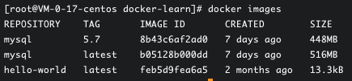

# Docker

> 学前准备

- linux（常用命令如：cd  mkdir）
- SpringBoot

> 学习内容

基础内容：

- Docker概述
- Docker安装
- Docker命令
  - 镜像命令
  - 容器命令
  - 操作命令
  - ...
- Docker镜像
- 容器数据卷
- DockerFile
- Docker网络原理
- IDEA整合Docker

企业级内容：

- Docker Compose
- Docker Swarm
- CI\CD Jenkins

------

## 一、Docker概述

### 1.1 Docker为什么出现？

常规来说，一款产品从开发到上线，一般需要两套应用环境。在不同的环境下需要进行不同的应用配置。

开发和运维工作过程中常遇到问题：

- 软件在自己的电脑上可以运行但在别的电脑环境下不能运行。
- 版本更新，导致服务不可用。

这对运维工作来说考验很大。

此外：

- 环境配置十分麻烦，每一台机器都要部署环境（集群、ES、Hadoop），费时费力！
- 例如在服务器配置一个应用环境：Redis MySQL jdk ES Hadoop，配置超麻烦，而且不能跨平台

**因此，能否有一种方案使得项目在发布的时候带上环境安装打包？**

传统开发模式：开发人员开发jar，运维人员来进行部署

现在开发模式：开发人员直接打包部署上线，一套流程做完！

例如：

原来：Java -- apk -- 发布（应用商店） --- 张三使用apk -- 安装即可用

现在：Java -- jar(环境) ---- 打包项目带上环境（镜像） -- （Docker仓库：商店） -- 下载我们发布的镜像，直接运行即可！


**Docker给以上问题，提出了解决方案！**

Docker 的思想就来源于集装箱！他是一种隔离的思想：

将各种应用的环境进行隔离，然后打包装箱，因此每个箱子都是隔离的！

Docker通过隔离机制，可以将服务器利用到极致！


**本质：所有的技术都是因为出现了一些问题需要解决，才去学习！**


### 1.2 Docker的历史

> 历史介绍

2020年，几个搞IT的年轻人在美国成立了一家公司`dotCloud`。主要做pass的云计算服务！LXC有关的容器技术！他们将自己的容器化技术命名为Docker！Docker刚诞生的时候，没有引起行业的注意！dotCloud就无法生存！


2013年，Docker开源。越来越多的人发现了 docker的优点。docker火了，每个月都会更新一个版本！


2014年4月9日，Docker1.0版本发布！


Docker为什么这么火？因为它十分轻巧！

在容器技术出现之前，开发者都用的虚拟机技术！


对比：

虚拟机：在window中装一个Vmvare，通过这个软件我们可以虚拟一台或者多台电脑。但这样十分笨重！

虚拟机也属于虚拟化技术，Docker容器技术，也是一种虚拟化技术！

```
vm： linux cenntos 原生镜像（一个电脑！） 隔离，需要开启多个 虚拟！通常需要几个G，消耗几分钟开启！
docker：隔离 ，镜像（只包含最核心的环境：4m+jdk+mysql）,十分小巧，运行镜像就可以了！可能只需要几M，KB！秒级启动！
```


到现在，所有的开发人员都需要docker！


> 聊聊Docker

Docker是基于 Go语言开发的！是一个开源项目！

官网：https://www.docker.com/

Docker的文档在官网的最下方：


文档地址：https://docs.docker.com/

Docker的文档超级详细，好好研读！

Docker远程仓库：https://hub.docker.com/


### 1.3 Docker的功能

> 之前的虚拟机技术

 

虚拟机技术的缺点：

- 资源占用十分的多
- 冗余步骤多
- 启动很慢


> 容器化技术

**容器化技术不是模拟一个完整的操作系统**


> 比较虚拟机技术和Docker技术的不同：

- 传统虚拟机，虚拟出一条硬件，运行一个完整的操作系统，然后在这个系统上安装和运行软件
- 同期内的应用直接运行在宿主机内，容器没有自己的内核，也没有虚拟我们的硬件，所以就轻便了
- 每个容器间是相互隔离的，每个容器都有一个属于自己的文件系统，互不影响


> DevOps（开发和运维）

**应用更快速的交付和部署**

传统：一堆帮助文档，安装程序

Docker：打包镜像发布测试，一键运行

**更便捷的升级和扩容缩容**

使用了Docker之后，我们部署应用就和搭积木一样

项目打包为一个镜像，扩展服务器A，服务器B！

**更便捷的运维**

在容器化之后，我们的开发、测试环境都是高度一致的。

**更高效的计算资源利用**

Docker是内核级别的虚拟化，可以在一个物理机上运行很多的容器实例！服务器的性能可以被压榨到极致。


------

## 二、Docker安装

### 2.1 Docker的基本组成

架构图如下：


下面先来简单了解以下几个名词。


**镜像(Image):**

docker镜像就好比是一个模板，可以通过这个模板来创建容器服务，例如一个Tomcat镜像===》run===》tomcat01容器（提供服务器），通过这个镜像可以创建多个容器（最终服务运行或者项目运行就是在容器中的）。

**容器(container):**

Docker利用容器技术，独立运行一个或者一个组应用，通过镜像来创建的。

启动，停止，删除，基本命令！

目前就可以把这个容器理解为一个简易的linux系统。

**仓库(repository):**

仓库就是存放镜像的地方！

仓库分为公有仓库和私有仓库！

Docker hub这个仓库默认是国外的。

阿里云...都有容器服务器（配置镜像加速！）


### 2.2 安装Docker

> 环境准备

1. 需要会一些Linux基础
2. CentOS 7：将Docker安装到云服务器中
3. 使用远程控制软件，连接远程服务器进行操作!  (Xshell在macos不能使用，因此下载FinallShell)

> 环境查看

查看云服务器系统内核版本信息：

```
3.10.0-1160.11.1.el7.x86_64   #系统内核是3.10以上的
```

系统版本：

```
[root@VM-24-12-centos ~]# cat /etc/os-release
NAME="CentOS Linux"
VERSION="7 (Core)"
ID="centos"
ID_LIKE="rhel fedora"
VERSION_ID="7"
PRETTY_NAME="CentOS Linux 7 (Core)"
ANSI_COLOR="0;31"
CPE_NAME="cpe:/o:centos:centos:7"
HOME_URL="https://www.centos.org/"
BUG_REPORT_URL="https://bugs.centos.org/"

CENTOS_MANTISBT_PROJECT="CentOS-7"
CENTOS_MANTISBT_PROJECT_VERSION="7"
REDHAT_SUPPORT_PRODUCT="centos"
REDHAT_SUPPORT_PRODUCT_VERSION="7"
```

> 具体安装

将Docker安装到自己的云服务器中，帮助文档中有详细的安装步骤。


上面这张图像开始就是正式的安装过程了。根据其说明，步骤总结如下：

1. 首先卸载旧的版本 Uninstall old versions。下面的命令中我们实际操作时不加sudo：

   ```
   sudo yum remove docker \
                     docker-client \
                     docker-client-latest \
                     docker-common \
                     docker-latest \
                     docker-latest-logrotate \
                     docker-logrotat
   ```

2. 然后选择一种方法进行安装。文档中目前有三种安装方法，我们选择其中通过仓库安装的方法：Install using the repository：

   - 首先安装基本环境——仓库：

     ```cmake
     安装仓库需要的安装包：
     (sudo) yum install -y yum-utils
     
     设置仓库的镜像：
     yum-config-manager \
         --add-repo \ https://download.docker.com/linux/centos/docker-ce.repo    # [这个地址是国外的，不推荐]
     
      yum-config-manager --add-repo http://mirrors.aliyun.com/docker-ce/linux/centos/docker-ce.repo  #[这个镜像是国内的可以使用，这我们使用这个]
     ```

     

   - 然后更新yum软件包索引

     ```
     yum makecache fast
     ```

   - 接下来安装docker—— Install Docker Engine：

     ```cmake
     # PS：docker-ce是社区版，ee是企业版。这里我们安装社区版
     yum install docker-ce docker-ce-cli containerd.io
     ```

3. 安装完毕，下面启动docker并测试：

   启动：

   ```cmake
   # 启动docker
   systemctl start docker
   # 查看版本信息
   docker version
   ```

   测试“hello world”：

   ```cmake
   docker run hello-world
   ```

   

   在上面的运行结果图中：

   - 红色的表示运行命令
   - 蓝色的表示没有在本地找到图像，所以去拉取镜像
   - 黄色的表示成功执行的结果（此时就表示docker安装成功了）

   下面验证镜像是否被下载成功？即查看一下下载的hello-world镜像：

   ```
   docker images
   ```

   


### 2.3 阿里云镜像加速

- 进入阿里云官网，注册并登录阿里云账号。找到“容器镜像服务”。

- 然后在此服务的控制台处找到镜像加速器地址。

  

- 然后用上图中的四个命令进行配置:

  ```cmake
  sudo mkdir -p /etc/docker
  
  sudo tee /etc/docker/daemon.json <<-'EOF'
  {
   "registry-mirrors": ["https://d109z3as.mirror.aliyuncs.com"]
  }
  EOF
  
  sudo systemctl daemon-reload
  
  sudo systemctl restart docker
  ```
  
  第一个命令：创建一个docker目录；
  
  第二个文件：在docker目录中有一个.json文件，给这个文件配置了一个阿里云的地址
  
  第三个命令：重启镜像
  
  第四个命令：重启docker
  
  
  
  这样就配置好了！
  
   

### 2.4 卸载docker

完全卸载docker需要以下手动操作。

```
# 第一步：卸载依赖
yum remove docker-ce docker-ce-cli containerd.io

# 第二步：卸载资源环境
rm -rf /var/lib/docker
rm -rf /var/lib/containerd
```

上面的命令中：`/var/lib/docker` 是docker的默认工作路径。


### 2.5 回顾HelloWorld


`docker run helloworld` 后，是怎么一步步启动寻找镜像的呢？我们来理清楚：


### 2.6 docker底层原理

**- docker 是怎么工作的？**

Docker 是一个 Client - Server 结构的系统，Docker 的守护进程(服务)运行在主机上。通过Scoket从客户端访问！

Docker Server 接收到 Docker Client的指令，就会执行这个命令！


**- Docker 为什么比 VM 快？**

1. Docker有比虚拟机更少的抽象层
2. Docker 利用的是宿主机的内核，VM 需要 Guest OS。


所以，新建一个容器的时候，Docker 不需要像虚拟机一样重新加载一个操作系统内核，避免引导操作；虚拟机是加载 Guest OS，分钟级别的，而Docker是利用宿主机的操作系统，省略了复杂的过程，秒级！


## 三、Docker 常用命令

### 3.1 帮助命令

```shell
docker version  # 显示docker的版本信息
docker info     # docker系统信息，包括镜像和容器的数量
docker 命令 --help  # 帮助命令（万能命令）	
```

帮助文档的地址：https://docs.docker.com/engine/reference


### 3.2 镜像命令

**docker images : 查看所有本地主机上的镜像**

```shell
[root@VM-24-12-centos ~]# docker images
REPOSITORY    TAG       IMAGE ID       CREATED        SIZE
hello-world   latest    feb5d9fea6a5   5 months ago   13.3kB
==================================解释===============================
# 解释
REPOSITORY	镜像的仓库源(镜像的名字、搜索时镜像的名字)
TAG					镜像标签（版本信息）
IMAGE ID		镜像的id
CREATED			镜像的创建时间
SIZE				镜像大小

# 可选项
 -a, --all             # 列出所有镜像
      --digests         Show digests
  -f, --filter filter   Filter output based on conditions provided
      --format string   Pretty-print images using a Go template
      --no-trunc        Don't truncate output
  -q, --quiet           # 只显示镜像id
=================================举例=================================
[root@VM-24-12-centos ~]# docker images -a
REPOSITORY    TAG       IMAGE ID       CREATED        SIZE
hello-world   latest    feb5d9fea6a5   5 months ago   13.3kB
[root@VM-24-12-centos ~]# docker images --all
REPOSITORY    TAG       IMAGE ID       CREATED        SIZE
hello-world   latest    feb5d9fea6a5   5 months ago   13.3kB
[root@VM-24-12-centos ~]# docker images --quiet
feb5d9fea6a5
[root@VM-24-12-centos ~]# docker images -q
feb5d9fea6a5

```

**docker search 搜索镜像**

```shell
[root@VM-24-12-centos ~]# docker search mysql
NAME                             DESCRIPTION                                     STARS     OFFICIAL   AUTOMATED
mysql                            MySQL is a widely used, open-source relation…   12218     [OK]       
mariadb                          MariaDB Server is a high performing open sou…   4690      [OK]       
mysql/mysql-server               Optimized MySQL Server Docker images. Create…   907                  [OK]
percona                          Percona Server is a fork of the MySQL relati…   571       [OK]       
phpmyadmin                       phpMyAdmin - A web interface for MySQL and M…   465       [OK]       
====================================================================  
搜索mysql镜像可以得到以上结果。
# 可选项
-f, --filter filter   Filter output based on conditions provided
      --format string   Pretty-print search using a Go template
      --limit int       Max number of search results (default 25)
      --no-trunc        Don't truncate output
====================================================================
# 通过收藏数stars来过滤，比如搜索收藏数大于3000的镜像： --filter=stars=3000
[root@VM-24-12-centos ~]# docker search mysql --filter=stars=3000
NAME      DESCRIPTION                                     STARS     OFFICIAL   AUTOMATED
mysql     MySQL is a widely used, open-source relation…   12218     [OK]       
mariadb   MariaDB Server is a high performing open sou…   4690      [OK]   
```

**docker pull 下载镜像**

```shell
# 下载镜像 docker pull 镜像名[:tag]
[root@VM-0-17-centos docker-learn]# docker pull mysql
Using default tag: latest  # 如果不写 tag，默认就是latest
latest: Pulling from library/mysql
a10c77af2613: Pull complete  # 分层下载，docker images的核心！联合文件系统！
b76a7eb51ffd: Pull complete 
258223f927e4: Pull complete 
2d2c75386df9: Pull complete 
63e92e4046c9: Pull complete 
f5845c731544: Pull complete 
bd0401123a9b: Pull complete 
3ef07ec35f1a: Pull complete 
c93a31315089: Pull complete 
3349ed800d44: Pull complete 
6d01857ca4c1: Pull complete 
4cc13890eda8: Pull complete 
Digest: sha256:aeecae58035f3868bf4f00e5fc623630d8b438db9d05f4d8c6538deb14d4c31b  # 签名
Status: Downloaded newer image for mysql:latest
docker.io/library/mysql:latest  # Docker Hub上的真实地址


# 等价
docker pull mysql == docker pull docker.io/library/mysql:latest

# 指定版本下载
[root@VM-0-17-centos docker-learn]# docker pull mysql:5.7
5.7: Pulling from library/mysql
a10c77af2613: Already exists 
b76a7eb51ffd: Already exists 
258223f927e4: Already exists 
2d2c75386df9: Already exists 
63e92e4046c9: Already exists 
f5845c731544: Already exists 
bd0401123a9b: Already exists  # 分层下载的优势，已下载的不会重复下载，节省空间
2724b2da64fd: Pull complete 
d10a7e9e325c: Pull complete 
1c5fd9c3683d: Pull complete 
2e35f83a12e9: Pull complete 
Digest: sha256:7a3a7b7a29e6fbff433c339fc52245435fa2c308586481f2f92ab1df239d6a29
Status: Downloaded newer image for mysql:5.7
docker.io/library/mysql:5.7
```




##### docker rmi 删除镜像

```shell
docker rmi -f 镜像id  						 	# 删除指定镜像
docker rmi -f 镜像id 镜像id 镜像id   	# 删除多个镜像
docker rmi -f $(docker images -aq)  # 删除全部镜像
```


#### 3.3 容器命令

**说明：有了镜像才可以创建容器，下载一个 centos 镜像测试学习。**

```shell
docker pull centos
```

##### 新建容器并启动

```shell
docker run [可选参数] image

# 参数说明
--name="Name"  容器名字，用来区分容器，比如 tomcat01,tomcat02
-d						 后台方式运行，nohup
-it						 使用交互方式运行，进入容器查看内容
-p						 指定容器的端口
	-p  主机端口:容器端口（常用）
  -p  容器端口
	-p  ip:主机端口:容器端口  
  
-P						 随机指定端口

# 测试，启动并进入容器（主机名称变化！）
[root@VM-0-17-centos docker-learn]# docker run -it centos /bin/bash
[root@85618df812ed /]# 

# 查看容器内的centos（基础版本）
[root@85618df812ed /]# ls
bin  dev  etc  home  lib  lib64  lost+found  media  mnt  opt  proc  root  run  sbin  srv  sys  tmp  usr  var

# 从容器退回主机
[root@85618df812ed /]# exit
exit
```

##### 列出所有运行的容器

```shell
# docker ps 命令
   # 列出当前正在运行的容器
-a # 列出当前正在运行的容器 + 带出历史运行过的容器
-n=? # 显示最近创建的容器
-q # 只显示容器的编号

[root@VM-0-17-centos docker-learn]# docker ps
CONTAINER ID   IMAGE     COMMAND   CREATED   STATUS    PORTS     NAMES
[root@VM-0-17-centos docker-learn]# docker ps -a
CONTAINER ID   IMAGE          COMMAND       CREATED          STATUS                          PORTS     NAMES
85618df812ed   centos         "/bin/bash"   2 minutes ago    Exited (0) About a minute ago             sweet_vaughan
05744de3872f   feb5d9fea6a5   "/hello"      56 minutes ago   Exited (0) 56 minutes ago                 cranky_kirch
```

##### 退出容器

```shell
exit  # 直接容器停止并退出
Ctrl + P + Q # 容器不停止，退出
```

##### 删除容器 

```shell
docker rm 容器id  # 删除指定容器，不能删除正在运行的容器，如要强制删除 rm -f
docker rm -f $(docker ps -aq)  # 删除所有容器
docker ps -a -q|xargs docker rm  # 删除所有容器
```

##### 启动和停止容器的操作

```shell
docker start 容器id  # 启动
docker restart 容器id  # 重启
docker stop 容器id  # 停止当前正在运行的
docker kill 容器id  # 强制停止
```

#### 

#### 3.4 常用其他命令

##### 后台启动容器

```shell
# 命令：docker run -d 镜像名
ducker run -d centos

# 问题：docker ps后，发现centos停止了

# 常见的坑：docker 容器使用后台运行，就必须要有一个前台进程，如果docker发现没有应用，就会自动停止
# nginx，容器启动后，发现自己没有提供服务，就会立刻停止，就是没有程序了
```

##### 查看日志

```shell
docker logs -f -t --tail 10 容器ID

# 写一段shell脚本造日志
[root@VM-0-17-centos docker-learn]# docker run -d centos /bin/sh -c "while true;do echo sugar;sleep 1;done"
dde1a464c083e2615d97517b3422db856a6a6a4b179cbf2e74d1d6f5a2b40e01

# 查看容器进程
[root@VM-0-17-centos docker-learn]# docker ps
CONTAINER ID   IMAGE     COMMAND                  CREATED         STATUS         PORTS     NAMES
dde1a464c083   centos    "/bin/sh -c 'while t…"   3 seconds ago   Up 2 seconds             objective_thompson
3cfa50084690   centos    "/bin/bash"              3 minutes ago   Up 3 minutes             upbeat_hopper

# 显示日志
 -tf
 --tail number # 显示日志的条数
[root@VM-0-17-centos docker-learn]# docker logs -tf --tail 10 dde1a464c083
2021-11-25T02:04:12.468373400Z sugar
2021-11-25T02:04:13.471361637Z sugar
2021-11-25T02:04:14.474283575Z sugar
2021-11-25T02:04:15.477498546Z sugar
2021-11-25T02:04:16.480691335Z sugar
2021-11-25T02:04:17.485561677Z sugar
2021-11-25T02:04:18.486116685Z sugar
2021-11-25T02:04:19.489059797Z sugar
2021-11-25T02:04:20.492309173Z sugar
```

##### 查看容器中的进程信息 ps

```shell
# 命令：docker top 容器ID
[root@VM-0-17-centos docker-learn]# docker top dde1a464c083
UID                 PID                 PPID                C                   STIME               TTY                 TIME                CMD
root                19991               19972               0                   10:02               ?                   00:00:00            /bin/sh -c while true;do echo sugar;sleep 1;done
root                26821               19991               0                   10:07               ?                   00:00:00            /usr/bin/coreutils --coreutils-prog-shebang=sleep /usr/bin/sleep 1
```

##### 查看镜像的元数据

```shell
# 命令
docker inspect 容器ID

# 测试
[root@VM-0-17-centos docker-learn]# docker inspect dde1a464c083
[
    {
        "Id": "dde1a464c083e2615d97517b3422db856a6a6a4b179cbf2e74d1d6f5a2b40e01",
        "Created": "2021-11-25T02:02:29.726179688Z",
        "Path": "/bin/sh",
        "Args": [
            "-c",
            "while true;do echo sugar;sleep 1;done"
        ],
        "State": {
            "Status": "running",
            "Running": true,
            "Paused": false,
            "Restarting": false,
            "OOMKilled": false,
            "Dead": false,
            "Pid": 19991,
            "ExitCode": 0,
            "Error": "",
            "StartedAt": "2021-11-25T02:02:30.174630959Z",
            "FinishedAt": "0001-01-01T00:00:00Z"
        },
        "Image": "sha256:5d0da3dc976460b72c77d94c8a1ad043720b0416bfc16c52c45d4847e53fadb6",
        "ResolvConfPath": "/var/lib/docker/containers/dde1a464c083e2615d97517b3422db856a6a6a4b179cbf2e74d1d6f5a2b40e01/resolv.conf",
        "HostnamePath": "/var/lib/docker/containers/dde1a464c083e2615d97517b3422db856a6a6a4b179cbf2e74d1d6f5a2b40e01/hostname",
        "HostsPath": "/var/lib/docker/containers/dde1a464c083e2615d97517b3422db856a6a6a4b179cbf2e74d1d6f5a2b40e01/hosts",
        "LogPath": "/var/lib/docker/containers/dde1a464c083e2615d97517b3422db856a6a6a4b179cbf2e74d1d6f5a2b40e01/dde1a464c083e2615d97517b3422db856a6a6a4b179cbf2e74d1d6f5a2b40e01-json.log",
        "Name": "/objective_thompson",
        "RestartCount": 0,
        "Driver": "overlay2",
        "Platform": "linux",
        "MountLabel": "",
        "ProcessLabel": "",
        "AppArmorProfile": "",
        "ExecIDs": null,
        "HostConfig": {
            "Binds": null,
            "ContainerIDFile": "",
            "LogConfig": {
                "Type": "json-file",
                "Config": {}
            },
            "NetworkMode": "default",
            "PortBindings": {},
            "RestartPolicy": {
                "Name": "no",
                "MaximumRetryCount": 0
            },
            "AutoRemove": false,
            "VolumeDriver": "",
            "VolumesFrom": null,
            "CapAdd": null,
            "CapDrop": null,
            "CgroupnsMode": "host",
            "Dns": [],
            "DnsOptions": [],
            "DnsSearch": [],
            "ExtraHosts": null,
            "GroupAdd": null,
            "IpcMode": "private",
            "Cgroup": "",
            "Links": null,
            "OomScoreAdj": 0,
            "PidMode": "",
            "Privileged": false,
            "PublishAllPorts": false,
            "ReadonlyRootfs": false,
            "SecurityOpt": null,
            "UTSMode": "",
            "UsernsMode": "",
            "ShmSize": 67108864,
            "Runtime": "runc",
            "ConsoleSize": [
                0,
                0
            ],
            "Isolation": "",
            "CpuShares": 0,
            "Memory": 0,
            "NanoCpus": 0,
            "CgroupParent": "",
            "BlkioWeight": 0,
            "BlkioWeightDevice": [],
            "BlkioDeviceReadBps": null,
            "BlkioDeviceWriteBps": null,
            "BlkioDeviceReadIOps": null,
            "BlkioDeviceWriteIOps": null,
            "CpuPeriod": 0,
            "CpuQuota": 0,
            "CpuRealtimePeriod": 0,
            "CpuRealtimeRuntime": 0,
            "CpusetCpus": "",
            "CpusetMems": "",
            "Devices": [],
            "DeviceCgroupRules": null,
            "DeviceRequests": null,
            "KernelMemory": 0,
            "KernelMemoryTCP": 0,
            "MemoryReservation": 0,
            "MemorySwap": 0,
            "MemorySwappiness": null,
            "OomKillDisable": false,
            "PidsLimit": null,
            "Ulimits": null,
            "CpuCount": 0,
            "CpuPercent": 0,
            "IOMaximumIOps": 0,
            "IOMaximumBandwidth": 0,
            "MaskedPaths": [
                "/proc/asound",
                "/proc/acpi",
                "/proc/kcore",
                "/proc/keys",
                "/proc/latency_stats",
                "/proc/timer_list",
                "/proc/timer_stats",
                "/proc/sched_debug",
                "/proc/scsi",
                "/sys/firmware"
            ],
            "ReadonlyPaths": [
                "/proc/bus",
                "/proc/fs",
                "/proc/irq",
                "/proc/sys",
                "/proc/sysrq-trigger"
            ]
        },
        "GraphDriver": {
            "Data": {
                "LowerDir": "/var/lib/docker/overlay2/dcbea1d94c059acde681543ffcfe367fa6391602d1f8bc97e138484648e333e9-init/diff:/var/lib/docker/overlay2/6d4efc15839f256ed426b3ec82335096641c716514feebb5dfd7fd7de88528b6/diff",
                "MergedDir": "/var/lib/docker/overlay2/dcbea1d94c059acde681543ffcfe367fa6391602d1f8bc97e138484648e333e9/merged",
                "UpperDir": "/var/lib/docker/overlay2/dcbea1d94c059acde681543ffcfe367fa6391602d1f8bc97e138484648e333e9/diff",
                "WorkDir": "/var/lib/docker/overlay2/dcbea1d94c059acde681543ffcfe367fa6391602d1f8bc97e138484648e333e9/work"
            },
            "Name": "overlay2"
        },
        "Mounts": [],
        "Config": {
            "Hostname": "dde1a464c083",
            "Domainname": "",
            "User": "",
            "AttachStdin": false,
            "AttachStdout": false,
            "AttachStderr": false,
            "Tty": false,
            "OpenStdin": false,
            "StdinOnce": false,
            "Env": [
                "PATH=/usr/local/sbin:/usr/local/bin:/usr/sbin:/usr/bin:/sbin:/bin"
            ],
            "Cmd": [
                "/bin/sh",
                "-c",
                "while true;do echo sugar;sleep 1;done"
            ],
            "Image": "centos",
            "Volumes": null,
            "WorkingDir": "",
            "Entrypoint": null,
            "OnBuild": null,
            "Labels": {
                "org.label-schema.build-date": "20210915",
                "org.label-schema.license": "GPLv2",
                "org.label-schema.name": "CentOS Base Image",
                "org.label-schema.schema-version": "1.0",
                "org.label-schema.vendor": "CentOS"
            }
        },
        "NetworkSettings": {
            "Bridge": "",
            "SandboxID": "d1873391aa1c91dd40d5a80f93e812f57f8b8200a70225e2bef764c98002d7a1",
            "HairpinMode": false,
            "LinkLocalIPv6Address": "",
            "LinkLocalIPv6PrefixLen": 0,
            "Ports": {},
            "SandboxKey": "/var/run/docker/netns/d1873391aa1c",
            "SecondaryIPAddresses": null,
            "SecondaryIPv6Addresses": null,
            "EndpointID": "6658e90b1f6b840486c02593324e995bf31316560d6fc31e6e884654768e7be3",
            "Gateway": "172.18.0.1",
            "GlobalIPv6Address": "",
            "GlobalIPv6PrefixLen": 0,
            "IPAddress": "172.18.0.3",
            "IPPrefixLen": 16,
            "IPv6Gateway": "",
            "MacAddress": "02:42:ac:12:00:03",
            "Networks": {
                "bridge": {
                    "IPAMConfig": null,
                    "Links": null,
                    "Aliases": null,
                    "NetworkID": "1b6db0658c7167d94ffde4681cda5b3c7e119bcaf07557f25d738741be0f54c7",
                    "EndpointID": "6658e90b1f6b840486c02593324e995bf31316560d6fc31e6e884654768e7be3",
                    "Gateway": "172.18.0.1",
                    "IPAddress": "172.18.0.3",
                    "IPPrefixLen": 16,
                    "IPv6Gateway": "",
                    "GlobalIPv6Address": "",
                    "GlobalIPv6PrefixLen": 0,
                    "MacAddress": "02:42:ac:12:00:03",
                    "DriverOpts": null
                }
            }
        }
    }
]
```

##### 进入当前正在运行的容器

docker exec 和 docker attach 的区别：

- exec：进入容器后开启一个新的终端，可以在里面操作（常用）
- attach：进入容器正在执行的终端，不会启动新的进程

```shell
# 通常容器都是使用后台方式运行的，需要进入容器，修改一些配置

# 命令
docker exec -it 容器ID bashShell

# 测试
[root@VM-0-17-centos docker-learn]# docker ps
CONTAINER ID   IMAGE     COMMAND                  CREATED          STATUS          PORTS     NAMES
dde1a464c083   centos    "/bin/sh -c 'while t…"   10 minutes ago   Up 10 minutes             objective_thompson
3cfa50084690   centos    "/bin/bash"              13 minutes ago   Up 13 minutes             upbeat_hopper
[root@VM-0-17-centos docker-learn]# docker exec -it dde1a464c083 /bin/bash
[root@dde1a464c083 /]# ps -ef
UID        PID  PPID  C STIME TTY          TIME CMD
root         1     0  0 02:02 ?        00:00:00 /bin/sh -c while true;do echo sugar;sleep 1;done
root       666     0  0 02:13 pts/0    00:00:00 /bin/bash
root       703     1  0 02:13 ?        00:00:00 /usr/bin/coreutils --coreutils-prog-shebang=sleep /usr/bin/sl
root       704   666  0 02:13 pts/0    00:00:00 ps -ef

# 命令二
docker attach 容器ID

# 测试
[root@VM-0-17-centos docker-learn]# docker exec dde1a464c083 
正在执行的代码...
```

##### 从容器拷贝文件到主机

```shell
命令：docker cp 容器ID:容器内路径 目的主机路径

# 测试
# 进入容器
[root@VM-0-17-centos docker-learn]# docker attach 16c532b210a0

# 容器内创建文件
[root@16c532b210a0 /]# cd /home/
[root@16c532b210a0 home]# ls
[root@16c532b210a0 home]# touch test.java
[root@16c532b210a0 home]# exit
exit

# 关闭容器也可以复制，查看容器ID
[root@VM-0-17-centos docker-learn]# docker ps -a
CONTAINER ID   IMAGE     COMMAND       CREATED         STATUS                     PORTS     NAMES
16c532b210a0   centos    "/bin/bash"   2 minutes ago   Exited (0) 7 seconds ago             stoic_sutherland

# 从容器中复制出来
[root@VM-0-17-centos docker-learn]# docker cp 16c532b210a0:/home/test.java /mnt/docker-learn
[root@VM-0-17-centos docker-learn]# ll
总用量 0
-rw-r--r-- 1 root root 0 11月 25 10:22 sugar.java
-rw-r--r-- 1 root root 0 11月 25 10:23 test.java

# 拷贝是一个手动过程，未来可以使用 -v 卷的技术，实现自动同步。
```

##### 查看容器内存占用

```shell
命令：docker stats
```

#### 3.5 小结


上述学的都是最常用的容器和镜像命令，还有很多其他命令需要学习！


### 4 实践练习

#### 4.1 安装Nginx

```shell
# 1、搜索镜像 seach，建议docker hub看版本号


# 2、下载镜像 pull
docker pull nginx

# 3、运行测试
[root@VM-0-17-centos docker-learn]# docker images
REPOSITORY   TAG       IMAGE ID       CREATED        SIZE
nginx        latest    ea335eea17ab   7 days ago     141MB
centos       latest    5d0da3dc9764   2 months ago   231MB

# -d 后台运行
# --name 给容器命名
# -p 宿主机端口：容器内部端口，建立映射
[root@VM-0-17-centos docker-learn]# docker run -d --name nginx01 -p 3344:80 nginx
823afc203db781304da10e5293c58e940f5dc101034d07b91517d34891220fc4

[root@VM-0-17-centos docker-learn]# docker ps
CONTAINER ID   IMAGE     COMMAND                  CREATED         STATUS         PORTS                                   NAMES
823afc203db7   nginx     "/docker-entrypoint.…"   3 seconds ago   Up 2 seconds   0.0.0.0:3344->80/tcp, :::3344->80/tcp   nginx01

[root@VM-0-17-centos docker-learn]# curl localhost:3344

# 4、进入容器
[root@VM-0-17-centos docker-learn]# docker exec -t nginx01 /bin/bash
root@823afc203db7:/# whereis nginx
```

端口暴露的概念


**问题：每次修改nginx配置文件，都需要进入容器内部？十分麻烦，可以在容器外部提供一个映射路径，达到在容器外部修改文件，容器内部自动修改 ===>> 数据卷！**

**挂载出来** `**-v /usr/share/nginx /usr/nginx**` **，只需要在本地修改科技，容器内会自动同步。**

**Nginx配置文件在 /etc/nginx/nginx.conf**


