# Docker

> 学前准备

- linux（常用命令如：cd  mkdir）
- SpringBoot

> 学习内容

基础内容：

- Docker概述
- Docker安装
- Docker命令
  - 镜像命令
  - 容器命令
  - 操作命令
  - ...
- Docker镜像
- 容器数据卷
- DockerFile
- Docker网络原理
- IDEA整合Docker

企业级内容：

- Docker Compose
- Docker Swarm
- CI\CD Jenkins

------

## 一、Docker概述

### 1.1 Docker为什么出现？

常规来说，一款产品从开发到上线，一般需要两套应用环境。在不同的环境下需要进行不同的应用配置。

开发和运维工作过程中常遇到问题：

- 软件在自己的电脑上可以运行但在别的电脑环境下不能运行。
- 版本更新，导致服务不可用。

这对运维工作来说考验很大。

此外：

- 环境配置十分麻烦，每一台机器都要部署环境（集群、ES、Hadoop），费时费力！
- 例如在服务器配置一个应用环境：Redis MySQL jdk ES Hadoop，配置超麻烦，而且不能跨平台

**因此，能否有一种方案使得项目在发布的时候带上环境安装打包？**

传统开发模式：开发人员开发jar，运维人员来进行部署

现在开发模式：开发人员直接打包部署上线，一套流程做完！

例如：

原来：Java -- apk -- 发布（应用商店） --- 张三使用apk -- 安装即可用

现在：Java -- jar(环境) ---- 打包项目带上环境（镜像） -- （Docker仓库：商店） -- 下载我们发布的镜像，直接运行即可！


**Docker给以上问题，提出了解决方案！**

Docker 的思想就来源于集装箱！他是一种隔离的思想：

将各种应用的环境进行隔离，然后打包装箱，因此每个箱子都是隔离的！

Docker通过隔离机制，可以将服务器利用到极致！


**本质：所有的技术都是因为出现了一些问题需要解决，才去学习！**


### 1.2 Docker的历史

> 历史介绍

2020年，几个搞IT的年轻人在美国成立了一家公司`dotCloud`。主要做pass的云计算服务！LXC有关的容器技术！他们将自己的容器化技术命名为Docker！Docker刚诞生的时候，没有引起行业的注意！dotCloud就无法生存！


2013年，Docker开源。越来越多的人发现了 docker的优点。docker火了，每个月都会更新一个版本！


2014年4月9日，Docker1.0版本发布！


Docker为什么这么火？因为它十分轻巧！

在容器技术出现之前，开发者都用的虚拟机技术！


对比：

虚拟机：在window中装一个Vmvare，通过这个软件我们可以虚拟一台或者多台电脑。但这样十分笨重！

虚拟机也属于虚拟化技术，Docker容器技术，也是一种虚拟化技术！

```
vm： linux cenntos 原生镜像（一个电脑！） 隔离，需要开启多个 虚拟！通常需要几个G，消耗几分钟开启！
docker：隔离 ，镜像（只包含最核心的环境：4m+jdk+mysql）,十分小巧，运行镜像就可以了！可能只需要几M，KB！秒级启动！
```


到现在，所有的开发人员都需要docker！


> 聊聊Docker

Docker是基于 Go语言开发的！是一个开源项目！

官网：https://www.docker.com/

Docker的文档在官网的最下方：

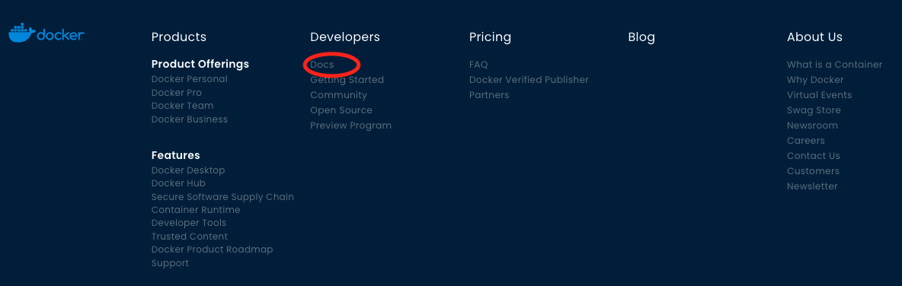

文档地址：https://docs.docker.com/

Docker的文档超级详细，好好研读！

Docker远程仓库：https://hub.docker.com/


### 1.3 Docker的功能

> 之前的虚拟机技术

 

虚拟机技术的缺点：

- 资源占用十分的多
- 冗余步骤多
- 启动很慢


> 容器化技术

**容器化技术不是模拟一个完整的操作系统**


> 比较虚拟机技术和Docker技术的不同：

- 传统虚拟机，虚拟出一条硬件，运行一个完整的操作系统，然后在这个系统上安装和运行软件
- 同期内的应用直接运行在宿主机内，容器没有自己的内核，也没有虚拟我们的硬件，所以就轻便了
- 每个容器间是相互隔离的，每个容器都有一个属于自己的文件系统，互不影响


> DevOps（开发和运维）

**应用更快速的交付和部署**

传统：一堆帮助文档，安装程序

Docker：打包镜像发布测试，一键运行

**更便捷的升级和扩容缩容**

使用了Docker之后，我们部署应用就和搭积木一样

项目打包为一个镜像，扩展服务器A，服务器B！

**更便捷的运维**

在容器化之后，我们的开发、测试环境都是高度一致的。

**更高效的计算资源利用**

Docker是内核级别的虚拟化，可以在一个物理机上运行很多的容器实例！服务器的性能可以被压榨到极致。


------

## 二、Docker安装

### 2.1 Docker的基本组成

架构图如下：


下面先来简单了解以下几个名词。


**镜像(Image):**

docker镜像就好比是一个模板，可以通过这个模板来创建容器服务，例如一个Tomcat镜像===》run===》tomcat01容器（提供服务器），通过这个镜像可以创建多个容器（最终服务运行或者项目运行就是在容器中的）。

**容器(container):**

Docker利用容器技术，独立运行一个或者一个组应用，通过镜像来创建的。

启动，停止，删除，基本命令！

目前就可以把这个容器理解为一个简易的linux系统。

**仓库(repository):**

仓库就是存放镜像的地方！

仓库分为公有仓库和私有仓库！

Docker hub这个仓库默认是国外的。

阿里云...都有容器服务器（配置镜像加速！）


### 2.2 安装Docker

> 环境准备

1. 需要会一些Linux基础
2. CentOS 7：将Docker安装到云服务器中
3. 使用远程控制软件，连接远程服务器进行操作!  (Xshell在macos不能使用，因此下载FinallShell)

> 环境查看

查看云服务器系统内核版本信息：

```
3.10.0-1160.11.1.el7.x86_64   #系统内核是3.10以上的
```

系统版本：

```
[root@VM-24-12-centos ~]# cat /etc/os-release
NAME="CentOS Linux"
VERSION="7 (Core)"
ID="centos"
ID_LIKE="rhel fedora"
VERSION_ID="7"
PRETTY_NAME="CentOS Linux 7 (Core)"
ANSI_COLOR="0;31"
CPE_NAME="cpe:/o:centos:centos:7"
HOME_URL="https://www.centos.org/"
BUG_REPORT_URL="https://bugs.centos.org/"

CENTOS_MANTISBT_PROJECT="CentOS-7"
CENTOS_MANTISBT_PROJECT_VERSION="7"
REDHAT_SUPPORT_PRODUCT="centos"
REDHAT_SUPPORT_PRODUCT_VERSION="7"
```

> 具体安装

将Docker安装到自己的云服务器中，帮助文档中有详细的安装步骤。


上面这张图像开始就是正式的安装过程了。根据其说明，步骤总结如下：

1. 首先卸载旧的版本 Uninstall old versions。下面的命令中我们实际操作时不加sudo：

   ```
   sudo yum remove docker \
                     docker-client \
                     docker-client-latest \
                     docker-common \
                     docker-latest \
                     docker-latest-logrotate \
                     docker-logrotat
   ```

2. 然后选择一种方法进行安装。文档中目前有三种安装方法，我们选择其中通过仓库安装的方法：Install using the repository：

   - 首先安装基本环境——仓库：

     ```cmake
     安装仓库需要的安装包：
     (sudo) yum install -y yum-utils
     
     设置仓库的镜像：
     yum-config-manager \
         --add-repo \ https://download.docker.com/linux/centos/docker-ce.repo    # [这个地址是国外的，不推荐]
     
      yum-config-manager --add-repo http://mirrors.aliyun.com/docker-ce/linux/centos/docker-ce.repo  #[这个镜像是国内的可以使用，这我们使用这个]
     ```

     

   - 然后更新yum软件包索引

     ```
     yum makecache fast
     ```

   - 接下来安装docker—— Install Docker Engine：

     ```cmake
     # PS：docker-ce是社区版，ee是企业版。这里我们安装社区版
     yum install docker-ce docker-ce-cli containerd.io
     ```

3. 安装完毕，下面启动docker并测试：

   启动：

   ```cmake
   # 启动docker
   systemctl start docker
   # 查看版本信息
   docker version
   ```

   测试“hello world”：

   ```cmake
   docker run hello-world
   ```

   

   在上面的运行结果图中：

   - 红色的表示运行命令
   - 蓝色的表示没有在本地找到图像，所以去拉取镜像
   - 黄色的表示成功执行的结果（此时就表示docker安装成功了）

   下面验证镜像是否被下载成功？即查看一下下载的hello-world镜像：

   ```
   docker images
   ```

   


### 2.3 阿里云镜像加速

- 进入阿里云官网，注册并登录阿里云账号。找到“容器镜像服务”。

- 然后在此服务的控制台处找到镜像加速器地址。

  

- 然后用上图中的四个命令进行配置:

  ```cmake
  sudo mkdir -p /etc/docker
  
  sudo tee /etc/docker/daemon.json <<-'EOF'
  {
   "registry-mirrors": ["https://d109z3as.mirror.aliyuncs.com"]
  }
  EOF
  
  sudo systemctl daemon-reload
  
  sudo systemctl restart docker
  ```
  
  第一个命令：创建一个docker目录；
  
  第二个文件：在docker目录中有一个.json文件，给这个文件配置了一个阿里云的地址
  
  第三个命令：重启镜像
  
  第四个命令：重启docker
  
  
  
  这样就配置好了！
  
   

### 2.4 卸载docker

完全卸载docker需要以下手动操作。

```
# 第一步：卸载依赖
yum remove docker-ce docker-ce-cli containerd.io

# 第二步：卸载资源环境
rm -rf /var/lib/docker
rm -rf /var/lib/containerd
```

上面的命令中：`/var/lib/docker` 是docker的默认工作路径。


### 2.5 回顾HelloWorld


`docker run helloworld` 后，是怎么一步步启动寻找镜像的呢？我们来理清楚：


### 2.6 docker底层原理

**- docker 是怎么工作的？**

Docker 是一个 Client - Server 结构的系统，Docker 的守护进程(服务)运行在主机上。通过Scoket从客户端访问！

Docker Server 接收到 Docker Client的指令，就会执行这个命令！

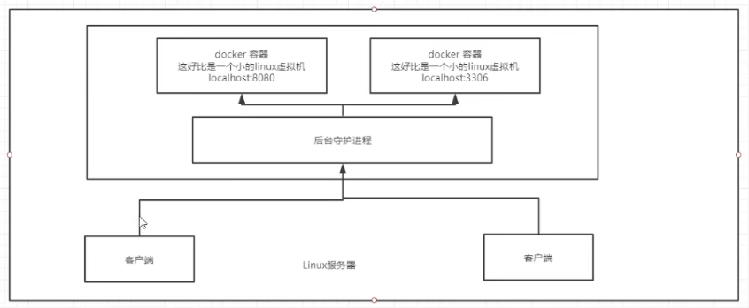

**- Docker 为什么比 VM 快？**

1. Docker有比虚拟机更少的抽象层
2. Docker 利用的是宿主机的内核，VM 需要 Guest OS。


所以，新建一个容器的时候，Docker 不需要像虚拟机一样重新加载一个操作系统内核，避免引导操作；虚拟机是加载 Guest OS，分钟级别的，而Docker是利用宿主机的操作系统，省略了复杂的过程，秒级！

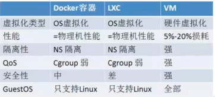


------

## 三、Docker 常用命令

### 3.1 帮助命令

```shell
docker version  # 显示docker的版本信息
docker info     # docker系统信息，包括镜像和容器的数量
docker 命令 --help  # 帮助命令（万能命令）	
```

帮助文档的地址：https://docs.docker.com/engine/reference


### 3.2 镜像命令

#### **docker images : 查看所有本地主机上的镜像**

```shell
[root@VM-24-12-centos ~]# docker images
REPOSITORY    TAG       IMAGE ID       CREATED        SIZE
hello-world   latest    feb5d9fea6a5   5 months ago   13.3kB
==================================解释===============================
# 解释
REPOSITORY	镜像的仓库源(镜像的名字、搜索时镜像的名字)
TAG					镜像标签（版本信息）
IMAGE ID		镜像的id
CREATED			镜像的创建时间
SIZE				镜像大小

# 可选项
 -a, --all             # 列出所有镜像
      --digests         Show digests
  -f, --filter filter   Filter output based on conditions provided
      --format string   Pretty-print images using a Go template
      --no-trunc        Don't truncate output
  -q, --quiet           # 只显示镜像id
=================================举例=================================
[root@VM-24-12-centos ~]# docker images -a
REPOSITORY    TAG       IMAGE ID       CREATED        SIZE
hello-world   latest    feb5d9fea6a5   5 months ago   13.3kB
[root@VM-24-12-centos ~]# docker images --all
REPOSITORY    TAG       IMAGE ID       CREATED        SIZE
hello-world   latest    feb5d9fea6a5   5 months ago   13.3kB
[root@VM-24-12-centos ~]# docker images --quiet
feb5d9fea6a5
[root@VM-24-12-centos ~]# docker images -q
feb5d9fea6a5

```


#### **docker search 搜索镜像**

```shell
[root@VM-24-12-centos ~]# docker search mysql
NAME                             DESCRIPTION                                     STARS     OFFICIAL   AUTOMATED
mysql                            MySQL is a widely used, open-source relation…   12218     [OK]       
mariadb                          MariaDB Server is a high performing open sou…   4690      [OK]       
mysql/mysql-server               Optimized MySQL Server Docker images. Create…   907                  [OK]
percona                          Percona Server is a fork of the MySQL relati…   571       [OK]       
phpmyadmin                       phpMyAdmin - A web interface for MySQL and M…   465       [OK]       
====================================================================  
搜索mysql镜像可以得到以上结果。
# 可选项
-f, --filter filter   Filter output based on conditions provided
      --format string   Pretty-print search using a Go template
      --limit int       Max number of search results (default 25)
      --no-trunc        Don't truncate output
====================================================================
# 通过收藏数stars来过滤，比如搜索收藏数大于3000的镜像： --filter=stars=3000
[root@VM-24-12-centos ~]# docker search mysql --filter=stars=3000
NAME      DESCRIPTION                                     STARS     OFFICIAL   AUTOMATED
mysql     MySQL is a widely used, open-source relation…   12218     [OK]       
mariadb   MariaDB Server is a high performing open sou…   4690      [OK]   
```


#### **docker pull 下载镜像**

```shell
# 下载镜像 docker pull 镜像名[:tag]
[root@VM-0-17-centos docker-learn]# docker pull mysql
Using default tag: latest  # 如果不写 tag，默认就是latest
latest: Pulling from library/mysql
a10c77af2613: Pull complete  # 分层下载，docker images的核心！联合文件系统！
b76a7eb51ffd: Pull complete 
258223f927e4: Pull complete 
2d2c75386df9: Pull complete 
63e92e4046c9: Pull complete 
f5845c731544: Pull complete 
bd0401123a9b: Pull complete 
3ef07ec35f1a: Pull complete 
c93a31315089: Pull complete 
3349ed800d44: Pull complete 
6d01857ca4c1: Pull complete 
4cc13890eda8: Pull complete 
Digest: sha256:aeecae58035f3868bf4f00e5fc623630d8b438db9d05f4d8c6538deb14d4c31b  # 签名(防伪)
Status: Downloaded newer image for mysql:latest
docker.io/library/mysql:latest  # Docker Hub上的真实地址


# 下载镜像的名字  等价于  直接从 Hub上真实地址下载
docker pull mysql == docker pull docker.io/library/mysql:latest 

# 下载指定版本（这个版本必须是Docker Hub上有的版本）
[root@VM-0-17-centos docker-learn]# docker pull mysql:5.7
5.7: Pulling from library/mysql
a10c77af2613: Already exists 
b76a7eb51ffd: Already exists 
258223f927e4: Already exists 
2d2c75386df9: Already exists 
63e92e4046c9: Already exists 
f5845c731544: Already exists 
bd0401123a9b: Already exists  # 分层下载的优势，已下载(Already)的不会重复下载，节省空间
2724b2da64fd: Pull complete 
d10a7e9e325c: Pull complete 
1c5fd9c3683d: Pull complete 
2e35f83a12e9: Pull complete 
Digest: sha256:7a3a7b7a29e6fbff433c339fc52245435fa2c308586481f2f92ab1df239d6a29 # 签名
Status: Downloaded newer image for mysql:5.7      # 下载状态成功                          
docker.io/library/mysql:5.7                       # 镜像的下载地址
```


#### **docker rmi 删除镜像**

说明：这里rmi可以理解为remove images

```shell
docker rmi -f 镜像id  						 	# 通过镜像id来删除指定镜像
docker rmi -f 镜像id 镜像id 镜像id   	# 删除多个镜像
docker rmi -f $(docker images -aq)  # 删除全部镜像，$()是一个查询语句表示查询所有镜像，然后再使用rmi命令递归删除所有的镜像
```

```shell
[root@VM-24-12-centos ~]# docker images         【查看下载到本地的所有镜像】
REPOSITORY    TAG       IMAGE ID       CREATED        SIZE
mysql         5.7       c20987f18b13   2 months ago   448MB
mysql         latest    3218b38490ce   2 months ago   516MB
hello-world   latest    feb5d9fea6a5   5 months ago   13.3kB
[root@VM-24-12-centos ~]# docker rmi -f c20987f18b13  【根据ID删除镜像】
Untagged: mysql:5.7
Untagged: mysql@sha256:f2ad209efe9c67104167fc609cca6973c8422939491c9345270175a300419f94
Deleted: sha256:c20987f18b130f9d144c9828df630417e2a9523148930dc3963e9d0dab302a76
Deleted: sha256:6567396b065ee734fb2dbb80c8923324a778426dfd01969f091f1ab2d52c7989
Deleted: sha256:0910f12649d514b471f1583a16f672ab67e3d29d9833a15dc2df50dd5536e40f
Deleted: sha256:6682af2fb40555c448b84711c7302d0f86fc716bbe9c7dc7dbd739ef9d757150
Deleted: sha256:5c062c3ac20f576d24454e74781511a5f96739f289edaadf2de934d06e910b92
[root@VM-24-12-centos ~]# docker images               【验证是否真的删除】
REPOSITORY    TAG       IMAGE ID       CREATED        SIZE
mysql         latest    3218b38490ce   2 months ago   516MB
hello-world   latest    feb5d9fea6a5   5 months ago   13.3kB
[root@VM-24-12-centos ~]# docker rmi -f $(docker images -aq) 【递归删除下载到本地的所有镜像】
Untagged: mysql:latest
Untagged: mysql@sha256:e9027fe4d91c0153429607251656806cc784e914937271037f7738bd5b8e7709
Deleted: sha256:3218b38490cec8d31976a40b92e09d61377359eab878db49f025e5d464367f3b
Deleted: sha256:aa81ca46575069829fe1b3c654d9e8feb43b4373932159fe2cad1ac13524a2f5
Deleted: sha256:0558823b9fbe967ea6d7174999be3cc9250b3423036370dc1a6888168cbd224d
Deleted: sha256:a46013db1d31231a0e1bac7eeda5ad4786dea0b1773927b45f92ea352a6d7ff9
Deleted: sha256:af161a47bb22852e9e3caf39f1dcd590b64bb8fae54315f9c2e7dc35b025e4e3
Deleted: sha256:feff1495e6982a7e91edc59b96ea74fd80e03674d92c7ec8a502b417268822ff
Deleted: sha256:8805862fcb6ef9deb32d4218e9e6377f35fb351a8be7abafdf1da358b2b287ba
Deleted: sha256:872d2f24c4c64a6795e86958fde075a273c35c82815f0a5025cce41edfef50c7
Deleted: sha256:6fdb3143b79e1be7181d32748dd9d4a845056dfe16ee4c827410e0edef5ad3da
Deleted: sha256:b0527c827c82a8f8f37f706fcb86c420819bb7d707a8de7b664b9ca491c96838
Deleted: sha256:75147f61f29796d6528486d8b1f9fb5d122709ea35620f8ffcea0e0ad2ab0cd0
Deleted: sha256:2938c71ddf01643685879bf182b626f0a53b1356138ef73c40496182e84548aa
Deleted: sha256:ad6b69b549193f81b039a1d478bc896f6e460c77c1849a4374ab95f9a3d2cea2
Untagged: hello-world:latest
Untagged: hello-world@sha256:97a379f4f88575512824f3b352bc03cd75e239179eea0fecc38e597b2209f49a
Deleted: sha256:feb5d9fea6a5e9606aa995e879d862b825965ba48de054caab5ef356dc6b3412
[root@VM-24-12-centos ~]# docker images                【查看并验证是否所有的镜像都删除了】
REPOSITORY   TAG       IMAGE ID   CREATED   SIZE
```


### 3.3 容器命令

*说明：有了镜像才可以创建容器，下载一个 centos 镜像作为例子进行测试学习*

```shell
docker pull centos
```


#### **1: 新建容器并启动**

> 镜像和容器的区别：可以理解为1对多的关系，基于一个镜像可以创建多个容器，容器与容器之间相互隔离。镜像包括具体的应用及环境，容器是镜像安装后的结果，只不过不同的容器之间互不干扰。

创建容器并启动的命令公式：

```shell
# 命令公式（容器来源于image）:
docker run [可选参数] image名字

# [可选参数]说明
--name="Name"  容器名字，用来区分容器，比如 tomcat01,tomcat02
-d						 后台方式运行，nohup
-it						 使用交互方式运行，进入容器查看内容(常用这个)
-p						 指定容器的端口
	-p  主机端口:容器端口（常用）
  -p  容器端口
	-p  ip:主机端口:容器端口  
-P						 随机指定端口
```

测试创建镜像centos的容器：

```shell
# 启动并进入容器（启动后主机名称变化，变成了docker ID！）
# run启动docker， -it以交互方式打开一个终端， /bin/bash表示shell工具运行地址或Linux控制台地址
[root@VM-24-12-centos ~]# docker run -it centos /bin/bash
[root@e711af76d16f /]# 

# 查看容器内的centos系统（此时的centos是基础版本，很多命令都不完善）
[root@0f5722faa978 /]# ls
bin  etc   lib    lost+found  mnt  proc  run   srv  tmp  var dev  home  lib64  media  opt  root  sbin  sys  usr

# 从容器退回主机,主机名称
[root@0f5722faa978 /]# exit
exit
[root@VM-24-12-centos ~]# 
```


#### **2: 列出所有容器**

命令公式：

```shell
docker ps [可选参数]
# docker ps： 列出当前正在运行的容器
# [可选参数]
#  -a    列出当前正在运行的容器 + 带出历史运行过的容器
#  -n=？ 显示最近创建的容器,例如-n=2表示最近运行过的2个容器
#  -q    只显示容器的编号
```

命令测试及结果：

```shell
[root@VM-24-12-centos ~]# docker ps
CONTAINER ID   IMAGE     COMMAND   CREATED   STATUS    PORTS     NAMES

[root@VM-24-12-centos ~]# docker ps -a
CONTAINER ID   IMAGE          COMMAND       CREATED         STATUS                       PORTS     NAMES
47d7257f28eb   centos         "/bin/bash"   4 minutes ago   Exited (127) 4 minutes ago             n1
0f5722faa978   centos         "/bin/bash"   7 minutes ago   Exited (0) 7 minutes ago               wizardly_ritchie
e711af76d16f   centos         "/bin/bash"   2 hours ago     Exited (0) 2 hours ago                 trusting_einstein
0e591d9ac45a   feb5d9fea6a5   "/hello"      3 days ago      Exited (0) 3 days ago                  objective_davinci

# 先查找所有运行过的容器，然后选择其中前1个显示
[root@VM-24-12-centos ~]# docker ps -a -n=1
CONTAINER ID   IMAGE     COMMAND       CREATED          STATUS                        PORTS     NAMES
47d7257f28eb   centos    "/bin/bash"   59 minutes ago   Exited (127) 59 minutes ago             n1

# 查找容器编号，只使用-q啥都没查到，因此需要和其他可选参数组合使用
[root@VM-24-12-centos ~]# docker ps -q
[root@VM-24-12-centos ~]# 

# 查找所有容器编号，以下命令等价于 docker ps -aq
[root@VM-24-12-centos ~]# docker ps -a -q
47d7257f28eb
0f5722faa978
e711af76d16f
0e591d9ac45a

# 查找前两个历史容器的编号
[root@VM-24-12-centos ~]# docker ps -aq -n=2
47d7257f28eb
0f5722faa978
[root@VM-24-12-centos ~]# docker ps -q -n=2
47d7257f28eb
0f5722faa978
```


#### **3: 退出容器**

命令或操作：

```shell
exit  # 直接容器停止并退出
Ctrl + P + Q # 容器不停止，退出
```

测试命令及操作：

```shell
# 1、查看现有运行容器：没有
[root@VM-24-12-centos ~]# docker ps
CONTAINER ID   IMAGE     COMMAND   CREATED   STATUS    PORTS     NAMES
# 2、创建并启动一个容器
[root@VM-24-12-centos ~]# docker run -it centos /bin/bash
# 3、使用exit命令停止容器并退出
[root@786fe3aa5d8a /]# exit
exit
# 4、查看此时正在运行的容器：没有
[root@VM-24-12-centos ~]# docker ps
CONTAINER ID   IMAGE     COMMAND   CREATED   STATUS    PORTS     NAMES
# 5、重新创建并启动一个容器
[root@VM-24-12-centos ~]# docker run -it centos /bin/bash
# 6、使用Ctrl+P+Q的方式退出容器（但不停止容器），直接查看现有运行容器
[root@44f67d9ee8f2 /]# [root@VM-24-12-centos ~]# docker ps
CONTAINER ID   IMAGE     COMMAND       CREATED          STATUS          PORTS     NAMES
44f67d9ee8f2   centos    "/bin/bash"   11 seconds ago   Up 11 seconds             sweet_swanson
[root@VM-24-12-centos ~]# 
```


#### **4: 删除容器** 

命令公式：

```shell
docker rm 容器id  # 删除指定容器，不能删除正在运行的容器，如要强制删除 rm -f
docker rm -f $(docker ps -aq)  # 删除所有容器
docker ps -a -q|xargs docker rm  # 删除所有容器
```

测试命令：

```shell
======================测试第一个删除命令======================
# 1、先查看所有容器的编号：其中第一个是正在运行的容器，第二个是已经停止的容器
[root@VM-24-12-centos ~]# docker ps -aq
44f67d9ee8f2
786fe3aa5d8a
# 2、删除第一个正在运行的容器，删除失败，说明只使用rm删除无效
[root@VM-24-12-centos ~]# docker rm 44f67d9ee8f2
Error response from daemon: You cannot remove a running container 44f67d9ee8f2ca34f857e1fd1375d84add79ae10430012e58adaa8be0ee4143d. Stop the container before attempting removal or force remove
# 3、删除第二个停止运行的容器
[root@VM-24-12-centos ~]# docker rm 786fe3aa5d8a
786fe3aa5d8a
# 4、查看正在运行的容器：只有一个
[root@VM-24-12-centos ~]# docker ps
CONTAINER ID   IMAGE     COMMAND       CREATED         STATUS         PORTS     NAMES
44f67d9ee8f2   centos    "/bin/bash"   8 minutes ago   Up 8 minutes             sweet_swanson
# 5、查看所有容器：停止运行的已经被删除了
[root@VM-24-12-centos ~]# docker ps -aq
44f67d9ee8f2
======================测试第二个删除命令======================
# 1、查看所有正在运行的容器编号
[root@VM-24-12-centos ~]# docker ps -q
7f22e5b75e7c
44f67d9ee8f2
# 2、查看所有容器编号：运行+停止运行的
[root@VM-24-12-centos ~]# docker ps -aq
7f22e5b75e7c
71bd115cf6e5
44f67d9ee8f2
# 3、使用第二个命令删除所有的容器
[root@VM-24-12-centos ~]# docker rm -f $(docker ps -aq)
7f22e5b75e7c
71bd115cf6e5
44f67d9ee8f2
# 4、查看删除操作后存在的容器：没有了
[root@VM-24-12-centos ~]# docker ps -aq
[root@VM-24-12-centos ~]# 
======================测试第三个删除命令======================
# 1、查看所有正在运行的容器编号：没有
[root@VM-24-12-centos ~]# docker ps -q
# 2、查看所有容器编号,包括运行和停止运行的：2个
[root@VM-24-12-centos ~]# docker ps -aq
c59ce4749a88
e55b42b0f46a
# 3、使用第三个命令删除所有的容器
[root@VM-24-12-centos ~]# docker ps -a -q|xargs docker rm
c59ce4749a88
e55b42b0f46a
# 4、查看删除操作后所有的容器编号：都没有了
[root@VM-24-12-centos ~]# docker ps -aq
[root@VM-24-12-centos ~]#
```


#### **5: 启动和停止容器**

命令公式：

```shell
docker start 容器id    # 启动
docker restart 容器id  # 重启
docker stop 容器id     # 停止当前正在运行的
docker kill 容器id     # 强制停止
```

测试命令：

```shell
# 1、查看正在运行的容器编号：无
[root@VM-24-12-centos ~]# docker ps -q
# 2、查看所有容器编号：有1个停止的
[root@VM-24-12-centos ~]# docker ps -aq
480d92e31e35
# 3、启动这个停止的容器编号
[root@VM-24-12-centos ~]# docker start 480d92e31e35
480d92e31e35
# 4、查看正在运行的容器：判断id说明停止的容器开始运行了
[root@VM-24-12-centos ~]# docker ps
CONTAINER ID   IMAGE     COMMAND       CREATED         STATUS         PORTS     NAMES
480d92e31e35   centos    "/bin/bash"   3 minutes ago   Up 7 seconds             hardcore_yalow
# 5、停止上面正在运行的容器
[root@VM-24-12-centos ~]# docker stop 480d92e31e35
480d92e31e35
# 6、重新查看正在运行的容器：没有查到，说明容器成功停止运行了
[root@VM-24-12-centos ~]# docker ps
CONTAINER ID   IMAGE     COMMAND   CREATED   STATUS    PORTS     NAMES
[root@VM-24-12-centos ~]# 
```


### 3.4 常用其他命令

#### **1: 后台启动容器**

命令公式：

```shell
docker run -d 镜像名
```

命令测试：

```shell
# 1、查看所有的容器id：0个
[root@VM-24-12-centos ~]# docker ps -aq
# 2、使用后台创建容器的命令创建一个新的容器：返回值啥意思没查到
[root@VM-24-12-centos ~]# docker run -d centos
2ede706765d3fe0c2de04b17a7f4a91670a78fd3bb76fc4bb8c81383b1e6368f
# 3、查看此时正在运行的容器：竟然没有！！！！
[root@VM-24-12-centos ~]# docker ps
CONTAINER ID   IMAGE     COMMAND   CREATED   STATUS    PORTS     NAMES
# 4、查看所有容器id：有一个，说明后台创建的容器停止运行了
[root@VM-24-12-centos ~]# docker ps -aq
2ede706765d3
[root@VM-24-12-centos ~]# 

========================
# 问题：我们会发现以上第2步->第3步存在问题：后台创建容器后没有手动退出或停止时，容器竟然自动停止了

# 原因：docker 容器使用后台运行，就必须要有一个前台进程，如果docker发现没有应用，就会自动停止
# nginx，容器启动后，发现自己没有提供服务，就会立刻停止，就是没有程序了
```


#### **2: 查看日志**

命令公式：

```shell
docker logs --help  # 使用万能公式查看logs命令的使用方法和可选参数
docker logs -f -t --tail 10 容器ID   # 显示某个容器的10条日志

# 显示日志
 -tf
 --tail number # 显示日志的条数
```

命令测试：

```shell
==============================案例一=================================
# 1、创建一个容器
[root@VM-24-12-centos ~]# docker run -it centos /bin/bash
# 2、停止运行容器
[root@d234bdacc6c7 /]# exit  
exit
# 3、查看所有容器的id：可以看到刚刚创建的容器id
[root@VM-24-12-centos ~]# docker ps -aq
d234bdacc6c7
# 4、查看上面这个容器的一条日志
[root@VM-24-12-centos ~]# docker logs -f -t --tail 1 d234bdacc6c7
2022-03-08T07:29:20.937540945Z exit

==============================案例二=================================
# 写一段shell脚本造日志，让系统每秒都打印输出
[root@VM-24-12-centos ~]# docker run -d centos /bin/sh -c "while true;do echo nini;sleep 1;done"
923678468c6495d25448e86b4ee129319327d2e7464655284e7626ed257b5944

# 查看容器进程
[root@VM-24-12-centos ~]# docker ps
CONTAINER ID   IMAGE     COMMAND                  CREATED         STATUS         PORTS     NAMES
923678468c64   centos    "/bin/sh -c 'while t…"   7 seconds ago   Up 6 seconds             optimistic_newton

# 显示日志
# -tf 等价于 -t -f
# --tail number # 显示日志的条数
[root@VM-24-12-centos ~]# docker logs -t -f --tail 10 923678468c64
2022-03-08T07:45:14.937767622Z nini
2022-03-08T07:45:15.939084958Z nini
2022-03-08T07:45:16.940490740Z nini
2022-03-08T07:45:17.942026414Z nini
2022-03-08T07:45:18.943536170Z nini
2022-03-08T07:45:19.945165678Z nini
2022-03-08T07:45:20.946529752Z nini
2022-03-08T07:45:21.947905478Z nini
2022-03-08T07:45:22.949281865Z nini
2022-03-08T07:45:23.950678739Z nini
```


#### **3: 查看容器内的进程信息**

命令公式：

```shell
# 命令：docker top 容器ID
[root@VM-0-17-centos docker-learn]# docker top 容器id
```

命令测试：

```shell
# 1、创建一个新的容器
[root@VM-24-12-centos ~]# docker run -it centos /bin/bash
# 2、停止并退出容器
[root@513d500cc743 /]# exit  
exit
# 3、查看容器id
[root@VM-24-12-centos ~]# docker ps -aq
513d500cc743
# 4、top命令根据id查看这个容器进行的信息：没有查到，说明容器进程必须运行中才行
[root@VM-24-12-centos ~]# docker top 513d500cc743
Error response from daemon: Container 513d500cc743f0c358b3e566d385390b9235a5ec529e17790970fee4cfa9c862 is not running
# 5、启动这个容器：此时容器是运行的，可以看做一个进程
[root@VM-24-12-centos ~]# docker start 513d500cc743
513d500cc743
# 6、使用top命令查看容器中的进程信息
[root@VM-24-12-centos ~]# docker top 513d500cc743
UID     PID     PPID     C     STIME     TTY     TIME     CMD
root    21147   21126    0     15:53     pts/0   00:00:00 /bin/bash
```


#### **4: 查看镜像的元数据**

命令公式：

```shell
# 命令
docker inspect 容器ID
```

命令测试：

```shell
# 查看正在运行的容器
[root@VM-24-12-centos ~]# docker ps
CONTAINER ID  IMAGE   COMMAND     CREATED         STATUS         PORTS  NAMES
513d500cc743  centos  "/bin/bash" 11 minutes ago  Up 10 minutes         reverent_cray

# 根据容器id查看镜像的元数据
[root@VM-24-12-centos ~]# docker inspect 513d500cc743
[
    {
        "Id": "513d500cc743f0c358b3e566d385390b9235a5ec529e17790970fee4cfa9c862",
        "Created": "2022-03-08T07:52:01.305514169Z",
        "Path": "/bin/bash",
        "Args": [],
        "State": {
            "Status": "running",
            "Running": true,
            "Paused": false,
            "Restarting": false,
            "OOMKilled": false,
            "Dead": false,
            "Pid": 21147,
            "ExitCode": 0,
            "Error": "",
            "StartedAt": "2022-03-08T07:53:11.7798336Z",
            "FinishedAt": "2022-03-08T07:52:11.624987369Z"
        },
        "Image": "sha256:5d0da3dc976460b72c77d94c8a1ad043720b0416bfc16c52c45d4847e53fadb6",
        "ResolvConfPath": "/var/lib/docker/containers/513d500cc743f0c358b3e566d385390b9235a5ec529e17790970fee4cfa9c862/resolv.conf",
        "HostnamePath": "/var/lib/docker/containers/513d500cc743f0c358b3e566d385390b9235a5ec529e17790970fee4cfa9c862/hostname",
        "HostsPath": "/var/lib/docker/containers/513d500cc743f0c358b3e566d385390b9235a5ec529e17790970fee4cfa9c862/hosts",
        "LogPath": "/var/lib/docker/containers/513d500cc743f0c358b3e566d385390b9235a5ec529e17790970fee4cfa9c862/513d500cc743f0c358b3e566d385390b9235a5ec529e17790970fee4cfa9c862-json.log",
        "Name": "/reverent_cray",
        "RestartCount": 0,
        "Driver": "overlay2",
        "Platform": "linux",
        "MountLabel": "",
        "ProcessLabel": "",
        "AppArmorProfile": "",
        "ExecIDs": null,
        "HostConfig": {
            "Binds": null,
            "ContainerIDFile": "",
            "LogConfig": {
                "Type": "json-file",
                "Config": {}
            },
            "NetworkMode": "default",
            "PortBindings": {},
            "RestartPolicy": {
                "Name": "no",
                "MaximumRetryCount": 0
            },
            "AutoRemove": false,
            "VolumeDriver": "",
            "VolumesFrom": null,
            "CapAdd": null,
            "CapDrop": null,
            "CgroupnsMode": "host",
            "Dns": [],
            "DnsOptions": [],
            "DnsSearch": [],
            "ExtraHosts": null,
            "GroupAdd": null,
            "IpcMode": "private",
            "Cgroup": "",
            "Links": null,
            "OomScoreAdj": 0,
            "PidMode": "",
            "Privileged": false,
            "PublishAllPorts": false,
            "ReadonlyRootfs": false,
            "SecurityOpt": null,
            "UTSMode": "",
            "UsernsMode": "",
            "ShmSize": 67108864,
            "Runtime": "runc",
            "ConsoleSize": [
                0,
                0
            ],
            "Isolation": "",
            "CpuShares": 0,
            "Memory": 0,
            "NanoCpus": 0,
            "CgroupParent": "",
            "BlkioWeight": 0,
            "BlkioWeightDevice": [],
            "BlkioDeviceReadBps": null,
            "BlkioDeviceWriteBps": null,
            "BlkioDeviceReadIOps": null,
            "BlkioDeviceWriteIOps": null,
            "CpuPeriod": 0,
            "CpuQuota": 0,
            "CpuRealtimePeriod": 0,
            "CpuRealtimeRuntime": 0,
            "CpusetCpus": "",
            "CpusetMems": "",
            "Devices": [],
            "DeviceCgroupRules": null,
            "DeviceRequests": null,
            "KernelMemory": 0,
            "KernelMemoryTCP": 0,
            "MemoryReservation": 0,
            "MemorySwap": 0,
            "MemorySwappiness": null,
            "OomKillDisable": false,
            "PidsLimit": null,
            "Ulimits": null,
            "CpuCount": 0,
            "CpuPercent": 0,
            "IOMaximumIOps": 0,
            "IOMaximumBandwidth": 0,
            "MaskedPaths": [
                "/proc/asound",
                "/proc/acpi",
                "/proc/kcore",
                "/proc/keys",
                "/proc/latency_stats",
                "/proc/timer_list",
                "/proc/timer_stats",
                "/proc/sched_debug",
                "/proc/scsi",
                "/sys/firmware"
            ],
            "ReadonlyPaths": [
                "/proc/bus",
                "/proc/fs",
                "/proc/irq",
                "/proc/sys",
                "/proc/sysrq-trigger"
            ]
        },
        "GraphDriver": {
            "Data": {
                "LowerDir": "/var/lib/docker/overlay2/1fab3489287d213023b3203cf9e33fa7b14f86f70e35bff492407f78cc98b270-init/diff:/var/lib/docker/overlay2/38894aaa355a60161a07dcc9afc07c642d90295c2b46527ee6eef00e619f1b61/diff",
                "MergedDir": "/var/lib/docker/overlay2/1fab3489287d213023b3203cf9e33fa7b14f86f70e35bff492407f78cc98b270/merged",
                "UpperDir": "/var/lib/docker/overlay2/1fab3489287d213023b3203cf9e33fa7b14f86f70e35bff492407f78cc98b270/diff",
                "WorkDir": "/var/lib/docker/overlay2/1fab3489287d213023b3203cf9e33fa7b14f86f70e35bff492407f78cc98b270/work"
            },
            "Name": "overlay2"
        },
        "Mounts": [],
        "Config": {
            "Hostname": "513d500cc743",
            "Domainname": "",
            "User": "",
            "AttachStdin": true,
            "AttachStdout": true,
            "AttachStderr": true,
            "Tty": true,
            "OpenStdin": true,
            "StdinOnce": true,
            "Env": [
                "PATH=/usr/local/sbin:/usr/local/bin:/usr/sbin:/usr/bin:/sbin:/bin"
            ],
            "Cmd": [
                "/bin/bash"
            ],
            "Image": "centos",
            "Volumes": null,
            "WorkingDir": "",
            "Entrypoint": null,
            "OnBuild": null,
            "Labels": {
                "org.label-schema.build-date": "20210915",
                "org.label-schema.license": "GPLv2",
                "org.label-schema.name": "CentOS Base Image",
                "org.label-schema.schema-version": "1.0",
                "org.label-schema.vendor": "CentOS"
            }
        },
        "NetworkSettings": {
            "Bridge": "",
            "SandboxID": "7474d5c2dfeb9910862f8d143e6d8b760db3ff7179cfa9f9c2a5cb66acfe7f73",
            "HairpinMode": false,
            "LinkLocalIPv6Address": "",
            "LinkLocalIPv6PrefixLen": 0,
            "Ports": {},
            "SandboxKey": "/var/run/docker/netns/7474d5c2dfeb",
            "SecondaryIPAddresses": null,
            "SecondaryIPv6Addresses": null,
            "EndpointID": "f3bd31288c8256d5a016b64fd404b794fa24df0246fd79dff521a432c844dd96",
            "Gateway": "172.17.0.1",
            "GlobalIPv6Address": "",
            "GlobalIPv6PrefixLen": 0,
            "IPAddress": "172.17.0.2",
            "IPPrefixLen": 16,
            "IPv6Gateway": "",
            "MacAddress": "02:42:ac:11:00:02",
            "Networks": {
                "bridge": {
                    "IPAMConfig": null,
                    "Links": null,
                    "Aliases": null,
                    "NetworkID": "5759c613bf374fc13dd5c7c97e092e24c0873fb63b2c9a270d3aafa0d27f2f84",
                    "EndpointID": "f3bd31288c8256d5a016b64fd404b794fa24df0246fd79dff521a432c844dd96",
                    "Gateway": "172.17.0.1",
                    "IPAddress": "172.17.0.2",
                    "IPPrefixLen": 16,
                    "IPv6Gateway": "",
                    "GlobalIPv6Address": "",
                    "GlobalIPv6PrefixLen": 0,
                    "MacAddress": "02:42:ac:11:00:02",
                    "DriverOpts": null
                }
            }
        }
    }
]
[root@VM-24-12-centos ~]# 
```


#### **5: 进入当前正在运行的容器**

有两种方式可以进入当前正在运行的容器，`docker exec` 和 `docker attach`，区别：

- exec：进入容器后开启一个新的终端，可以在里面操作（常用）
- attach：进入容器正在执行的终端，不会启动新的进程

> 第一种方式

exec命令公式：

```shell
# 通常容器都是使用后台方式运行的，需要进入容器，修改一些配置
docker exec -it 容器ID bashShell
# bashShell: 如/bin/bash
```

测试命令：

```shell
# 1、首先查看正在运行的容器
[root@VM-24-12-centos ~]# docker ps
CONTAINER ID   IMAGE     COMMAND       CREATED          STATUS          PORTS     NAMES
513d500cc743   centos    "/bin/bash"   42 minutes ago   Up 41 minutes             reverent_cray

# 2、使用exec -it以交互的方式进入这个容器
[root@VM-24-12-centos ~]# docker exec -it 513d500cc743 /bin/bash

# 3、此时发现主机名变了，成功进入容器。查看容器目录
[root@513d500cc743 /]# ls
bin  etc   lib    lost+found  mnt  proc  run   srv  tmp  var
dev  home  lib64  media       opt  root  sbin  sys  usr

# 4、容器内的操作
[root@513d500cc743 /]# ps -ef
UID        PID  PPID  C STIME TTY          TIME CMD
root         1     0  0 07:53 pts/0    00:00:00 /bin/bash
root        16     0  0 08:35 pts/1    00:00:00 /bin/bash
root        31    16  0 08:35 pts/1    00:00:00 ps -ef
```

> 第二种方式

命令公式：

```shell
docker attach 容器ID
```

命令测试：

```shell
# 1、查看正在运行的容器
[root@VM-24-12-centos ~]# docker ps
CONTAINER ID   IMAGE     COMMAND       CREATED          STATUS          PORTS     NAMES
513d500cc743   centos    "/bin/bash"   48 minutes ago   Up 47 minutes             reverent_cray
# 2、用attach命令进入容器：主机号变化了
[root@VM-24-12-centos ~]# docker attach 513d500cc743
[root@513d500cc743 /]# 
```


#### **6: 从容器拷贝文件到主机**

命令公式:

```shell
docker cp 容器ID:容器内路径 目的主机路径
# 拷贝是一个手动过程，未来可以使用 -v 卷的技术，实现自动同步。
```

命令测试：

```shell
# 1、查看安装的镜像：centos
[root@VM-24-12-centos ~]# docker images
REPOSITORY   TAG       IMAGE ID       CREATED        SIZE
centos       latest    5d0da3dc9764   5 months ago   231MB
# 2、在镜像中创建一个容器
[root@VM-24-12-centos ~]# docker run -it centos /bin/bash
# 3、使用ctrl+P+Q操作退出容器但不结束容器运行，然后查看正在运行的容器
[root@06d8501403aa /]# [root@VM-24-12-centos ~]# docker ps
CONTAINER ID  IMAGE   COMMAND     CREATED         STATUS        PORTS   NAMES
06d8501403aa  centos  "/bin/bash" 29 seconds ago  Up 28 seconds         suspicious_ritchie

# 4、在本地电脑创建一个 nini.java 文件
[root@VM-24-12-centos ~]# cd /home
[root@VM-24-12-centos home]# ls
lighthouse
[root@VM-24-12-centos home]# touch nini.java
[root@VM-24-12-centos home]# ls
lighthouse  nini.java

# 5、进入容器内部并在home目录下创建一个test.java文件
[root@VM-24-12-centos home]# docker ps
CONTAINER ID  IMAGE  COMMAND     CREATED       STATUS     PORTS NAMES
06d8501403aa  centos "/bin/bash" 3 minutes ago Up 3 minutes     suspicious_ritchie
[root@VM-24-12-centos home]# docker attach 06d8501403aa
[root@06d8501403aa /]# cd /home
[root@06d8501403aa home]# ls
[root@06d8501403aa home]# touch test.java
[root@06d8501403aa home]# ls
test.java

# 6、退出容器
[root@06d8501403aa home]# exit
exit

# 7、将容器home目录下的test.java文件下载到本地home目录下
[root@VM-24-12-centos home]# docker cp 06d8501403aa:/home/test.java /home
[root@VM-24-12-centos home]# ls
lighthouse  nini.java  test.java
```


#### **7: 查看容器内存占用**

```shell
命令：docker stats
```


### 3.5 小结

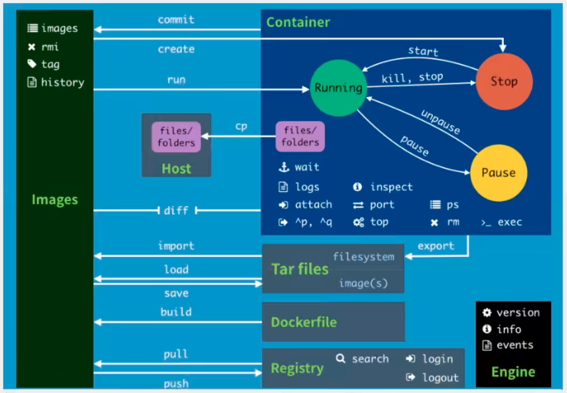

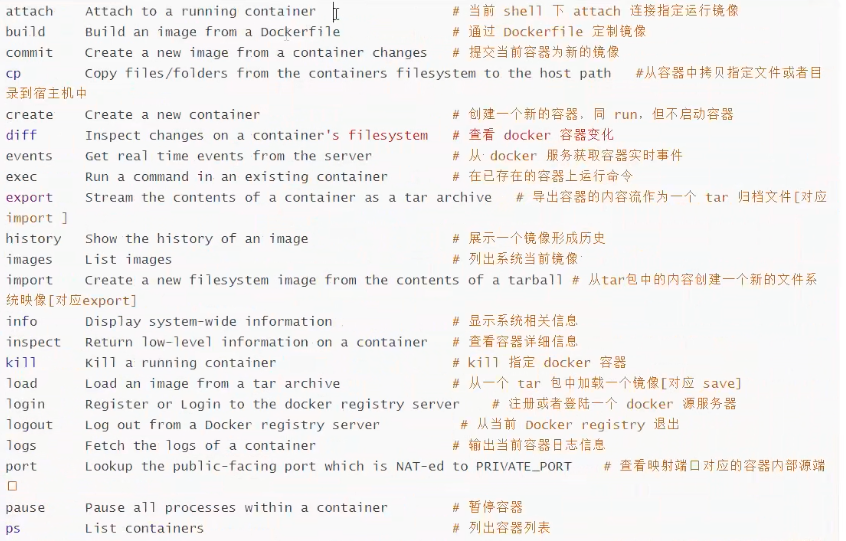

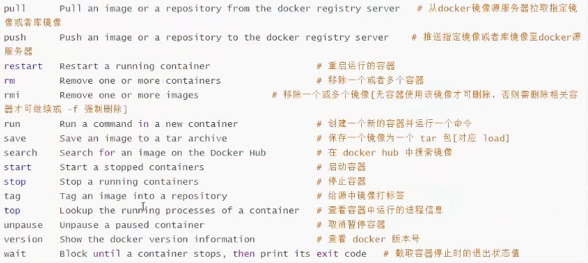

上述学的都是最常用的容器和镜像命令，还有很多其他命令需要学习！


------

## 四、实践练习

### 4.1 Docker安装Nginx

查看nginx版本号：


```shell
# 1、可以docker搜索镜像查看是否存在nginx，然后进入docker hub网站看版本号
[root@VM-24-12-centos ~]# docker search nginx
NAME          DESCRIPTION                STARS   OFFICIAL   AUTOMATED
nginx         Official build of Nginx.   16439   [OK]       
bitnami/nginx Bitnami nginx Docker Image 120                [OK]


# 2、下载镜像：pull命令
[root@VM-24-12-centos ~]# docker pull nginx
Using default tag: latest
latest: Pulling from library/nginx
a2abf6c4d29d: Pull complete 
a9edb18cadd1: Pull complete 
589b7251471a: Pull complete 
186b1aaa4aa6: Pull complete 
b4df32aa5a72: Pull complete 
a0bcbecc962e: Pull complete 
Digest: sha256:0d17b565c37bcbd895e9d92315a05c1c3c9a29f762b011a10c54a66cd53c9b31
Status: Downloaded newer image for nginx:latest
docker.io/library/nginx:latest


# 3、查看下载到本地的镜像
[root@VM-24-12-centos ~]# docker images
REPOSITORY   TAG       IMAGE ID       CREATED        SIZE
nginx        latest    605c77e624dd   2 months ago   141MB
centos       latest    5d0da3dc9764   5 months ago   231MB

# 4、以后台方式运行一个容器
# -d 后台运行
# --name 给容器命名为nginx01
# -p 宿主机端口：容器内部端口，建立映射(也就是说从宿主机公网3344端口可以访问到容器内的80端口)
# 最后面的nginx是镜像名称
[root@VM-24-12-centos ~]# docker run -d --name nginx01 -p 3344:80 nginx
a7c27690811f24694af9c8478beeca64d3df2aa260e192ffb8741fd1eb160035

# 5、查看此时正在运行的容器
[root@VM-24-12-centos ~]# docker ps
CONTAINER ID IMAGE  COMMAND                CREATED       STATUS       PORTS            NAMES
a7c27690811f nginx  "/docker-entrypoint.…" 5 minutes ago Up 5 minutes 0.0.0.0:3344->80/tcp, :::3344->80/tcp   nginx01

# 6、查看宿主机端口
[root@VM-24-12-centos ~]# curl localhost:3344
<!DOCTYPE html>
<html>
<head>
<title>Welcome to nginx!</title>   【映射到了nginx容器内的80端口，所以可以显示nginx信息】
<style>
html { color-scheme: light dark; }
body { width: 35em; margin: 0 auto;
font-family: Tahoma, Verdana, Arial, sans-serif; }
</style>
</head>
<body>
<h1>Welcome to nginx!</h1>
<p>If you see this page, the nginx web server is successfully installed and
working. Further configuration is required.</p>

<p>For online documentation and support please refer to
<a href="http://nginx.org/">nginx.org</a>.<br/>
Commercial support is available at
<a href="http://nginx.com/">nginx.com</a>.</p>

<p><em>Thank you for using nginx.</em></p>
</body>
</html>

# 4、进入容器看看
[root@VM-24-12-centos ~]# docker ps
CONTAINER ID   IMAGE     COMMAND                  CREATED       STATUS       PORTS                                   NAMES
a7c27690811f   nginx     "/docker-entrypoint.…"   2 hours ago   Up 2 hours   0.0.0.0:3344->80/tcp, :::3344->80/tcp   nginx01
[root@VM-24-12-centos ~]# docker ps -aq
a7c27690811f
06d8501403aa
[root@VM-24-12-centos ~]# docker exec -it a7c27690811f /bin/bash
root@a7c27690811f:/# whereis nginx 
nginx: /usr/sbin/nginx /usr/lib/nginx /etc/nginx /usr/share/nginx
root@a7c27690811f:/# cd /etc/nginx
root@a7c27690811f:/etc/nginx# ls
conf.d          mime.types  nginx.conf   uwsgi_params
fastcgi_params  modules     scgi_params
root@a7c27690811f:/etc/nginx# 

# 5、上面容器运行相当于一个服务，通过宿主机与容器端口映射，可以在公网访问容器。
# 但是如果服务停止了，那么久无法从浏览器中访问到服务器的3344端口了，进而也就无法访问到容器内了。
```


**端口暴露的概念**

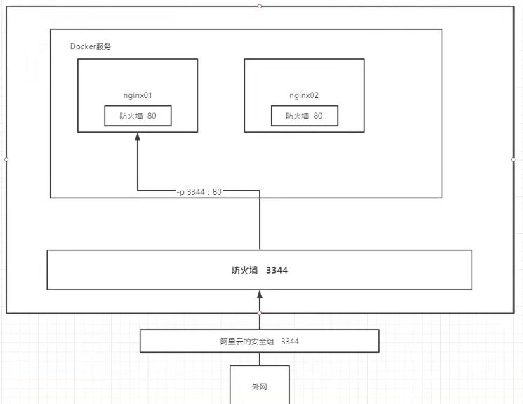


**问题：每次修改nginx配置文件，都需要进入容器内部？十分麻烦，可以在容器外部提供一个映射路径，达到在容器外部修改文件，容器内部自动修改 ===>> 数据卷！**

**挂载出来** `**-v /usr/share/nginx /usr/nginx**` **，只需要在本地修改科技，容器内会自动同步。**

**Nginx配置文件在 /etc/nginx/nginx.conf**


### 4.2 Docker安装Tomcat镜像

dockerhub 官方文档中，即用即删的安装方式：

```shell
[root@VM-24-12-centos ~]# docker run -it --rm tomcat:9.0
........
........
# --rm  用完就删除，一般用来测试

# 之前启动都是后台，停止了容器之后，容器还是可以查到，
# 但是ctrl+c退出Tomcat容器后，查看所有的容器没有找到tomcat的。
# 说明--rm将用完的tomcat容器删除了
[root@VM-24-12-centos ~]# docker ps -a
CONTAINER ID   IMAGE     COMMAND                  CREATED        STATUS                      PORTS     NAMES
a7c27690811f   nginx     "/docker-entrypoint.…"   3 hours ago    Exited (0) 14 minutes ago             nginx01
06d8501403aa   centos    "/bin/bash"              21 hours ago   Exited (0) 21 hours ago               suspicious_ritchie

```

下载安装镜像的方式：

```shell
# 1、下载启动最新版的tomcat镜像
[root@VM-24-12-centos ~]# docker pull tomcat
Using default tag: latest
latest: Pulling from library/tomcat
0e29546d541c: Already exists 
9b829c73b52b: Already exists 
cb5b7ae36172: Already exists 
6494e4811622: Already exists 
668f6fcc5fa5: Already exists 
dc120c3e0290: Already exists 
8f7c0eebb7b1: Already exists 
77b694f83996: Already exists 
0f611256ec3a: Pull complete 
4f25def12f23: Pull complete 
Digest: sha256:9dee185c3b161cdfede1f5e35e8b56ebc9de88ed3a79526939701f3537a52324
Status: Downloaded newer image for tomcat:latest
docker.io/library/tomcat:latest
[root@VM-24-12-centos ~]# 

# 2、以后台的方式启动运行一个tomcat容器
[root@VM-24-12-centos ~]# docker run -d -p 3355:8080 --name tomcat01 tomcat
dad320eab175ed1976217b2a16a0546147c4e2ff4738e8f0a956930e7c744490
# -d后台方式， -p 3355:8080宿主机端口与容器内端口映射，用于外部访问， 容器名字是tomcat01

# 3、如果服务器公网可见，使用浏览器测试访问一下
http://服务器ip:3355/
应该可以显示tomcat的相关信息
# 访问没有问题，进入tomcat容器看一下
[root@VM-24-12-centos ~]# docker exec -it tomcat01 /bin/bash
root@dad320eab175:/usr/local/tomcat# ls
BUILDING.txt     README.md      conf            temp
CONTRIBUTING.md  RELEASE-NOTES  lib             webapps
LICENSE          RUNNING.txt    logs            webapps.dist
NOTICE           bin            native-jni-lib  work
root@dad320eab175:/usr/local/tomcat# ll
bash: ll: command not found
root@dad320eab175:/usr/local/tomcat# ls  -l
total 160
-rw-r--r-- 1 root root 18994 Dec  2 22:01 BUILDING.txt
-rw-r--r-- 1 root root  6210 Dec  2 22:01 CONTRIBUTING.md
-rw-r--r-- 1 root root 60269 Dec  2 22:01 LICENSE
-rw-r--r-- 1 root root  2333 Dec  2 22:01 NOTICE
-rw-r--r-- 1 root root  3378 Dec  2 22:01 README.md
-rw-r--r-- 1 root root  6905 Dec  2 22:01 RELEASE-NOTES
-rw-r--r-- 1 root root 16517 Dec  2 22:01 RUNNING.txt
drwxr-xr-x 2 root root  4096 Dec 22 17:07 bin
drwxr-xr-x 1 root root  4096 Mar  9 06:24 conf
drwxr-xr-x 2 root root  4096 Dec 22 17:06 lib
drwxrwxrwx 1 root root  4096 Mar  9 06:24 logs
drwxr-xr-x 2 root root  4096 Dec 22 17:07 native-jni-lib
drwxrwxrwx 2 root root  4096 Dec 22 17:06 temp
drwxr-xr-x 2 root root  4096 Dec 22 17:06 webapps
drwxr-xr-x 7 root root  4096 Dec  2 22:01 webapps.dist
drwxrwxrwx 2 root root  4096 Dec  2 22:01 work
root@dad320eab175:/usr/local/tomcat# cd webapps
root@dad320eab175:/usr/local/tomcat/webapps# ls
root@dad320eab175:/usr/local/tomcat/webapps# 
 
# 发现问题：1、linux命令少了 2、没有webapps ==>> 阿里云镜像的原因：默认是最小的镜像，所有不必要的都剔除了，保证最小可运行的环境。
```

**问题：当要部署项目时，每次进入容器修改十分麻烦。应在容器外部提供一个映射路径，webapps，外部放置项目，自动同步到内部即可。**


### 4.3 ES + Kibana

- es 暴露的端口很多！
- es 十分耗内存！
- es 的数据一般需要放置到安全目录！挂载

```shell
# --net somenetwork ? 网络配置

# 1、启动 elasticsearch
# hub文档中的启动命令：
# $ docker run -d --name elasticsearch --net somenetwork -p 9200:9200 -p 9300:9300 -e "discovery.type=single-node" elasticsearch:tag
[root@VM-24-12-centos ~]# docker run -d --name elasticsearch -p 9200:9200 -p 9300:9300 -e "discovery.type=single-node" elasticsearch:7.6.2
Unable to find image 'elasticsearch:7.6.2' locally
7.6.2: Pulling from library/elasticsearch
ab5ef0e58194: Pull complete 
c4d1ca5c8a25: Pull complete 
941a3cc8e7b8: Pull complete 
43ec483d9618: Pull complete 
c486fd200684: Pull complete 
1b960df074b2: Pull complete 
1719d48d6823: Pull complete 
Digest: sha256:1b09dbd93085a1e7bca34830e77d2981521a7210e11f11eda997add1c12711fa
Status: Downloaded newer image for elasticsearch:7.6.2
af9b2399dd2efc49922fcbb5fbe635092c312d89d930f1794e175004006f3f0b


# 2、测试
[root@VM-24-12-centos ~]# curl localhost:9200
{
  "name" : "e0fc22f2eb06",
  "cluster_name" : "docker-cluster",
  "cluster_uuid" : "VPxDbAjQRy6h_rXL5Cvz6w",
  "version" : {
    "number" : "7.6.2",
    "build_flavor" : "default",
    "build_type" : "docker",
    "build_hash" : "ef48eb35cf30adf4db14086e8aabd07ef6fb113f",
    "build_date" : "2020-03-26T06:34:37.794943Z",
    "build_snapshot" : false,
    "lucene_version" : "8.4.0",
    "minimum_wire_compatibility_version" : "6.8.0",
    "minimum_index_compatibility_version" : "6.0.0-beta1"
  },
  "tagline" : "You Know, for Search"
}


# 3、查看 docker stats
# es很耗内存，3.7G占用了1.23G
[root@VM-24-12-centos ~]# docker stats
CONTAINER ID   NAME            CPU %     MEM USAGE / LIMIT   MEM %     NET I/O     BLOCK I/O        PIDS
af9b2399dd2e   elasticsearch   0.32%     1.23GiB / 3.7GiB    33.24%    656B / 0B   49.2kB / 696kB   43

# 由于耗内存，所以需要增加内存的限制，在命令中修改配置文件
# -e 环境配置修改
# -e ES_JAVA_OPTS="-Xms64m -Xms512m"
[root@VM-24-12-centos ~]# docker run -d --name elasticsearch02 -p 9200:9200 -p 9300:9300 -e "discovery.type=single-node" -e ES_JAVA_OPTS="-Xms64m -Xmx512m" elasticsearch:7.6.2
1410133b851589e379ee974f2cada870fa296dc644f92455187e2790811ed2ce

# 重新查看容器占用的内存: 变成了354.2M
[root@VM-24-12-centos ~]# docker stas
CONTAINER ID  NAME            CPU %  MEM USAGE/LIMIT  MEM %  NET I/O   BLOCK I/O  PIDS
1410133b8515  elasticsearch02 0.18%  354.2MiB/3.7GiB  9.35%  656B / 0B 0B / 696kB 43

```

如何使用 Kibana 连接 es。**问题：如何跨容器实现网络连接？**

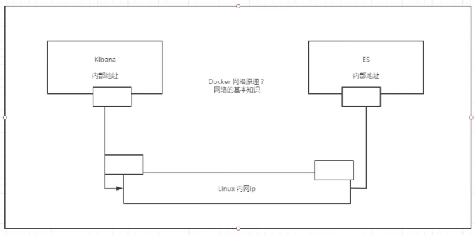


## 五、可视化

管理镜像的工具：

- portainer（先用这个）

  ```
  docker run -d -p 8088:9000 --restart=always -v /var/run/docker.sock:/var/run/docker.sock --privileged=true portainer/portainer
  ```

- Rancher（CI/CD再用）


### 5.1 portainer

Portainer 是一个Docker图形化界面管理工具，提供后台面板操作。

--restart 自启动

--v  挂载到本地，实现同步

--privileged  设置权限

```shell
# 1、下载启动
[root@VM-24-12-centos ~]# docker run -d -p 8088:9000 --restart=always -v /var/run/docker.sock:/var/run/docker.sock --privileged=true portainer/portainer
Unable to find image 'portainer/portainer:latest' locally

latest: Pulling from portainer/portainer
94cfa856b2b1: Pull complete 
49d59ee0881a: Pull complete 
a2300fd28637: Pull complete 
Digest: sha256:fb45b43738646048a0a0cc74fcee2865b69efde857e710126084ee5de9be0f3f
Status: Downloaded newer image for portainer/portainer:latest
5b6092d804f8ec1de2cdf5654547b2bf791d6826e5519f38dd057f282492a142


# 2、内网测试访问
[root@VM-24-12-centos ~]# curl localhost:8088
<!DOCTYPE html
><html lang="en" ng-app="portainer">
  <head>
    <meta charset="utf-8" />
    <title>Portainer</title>
    <meta name="description" content="" />
    <meta name="author" content="Portainer.io" />

    <!-- HTML5 shim, for IE6-8 support of HTML5 elements -->
    <!--[if lt IE 9]>
      <script src="//html5shim.googlecode.com/svn/trunk/html5.js"></script>
....太长了，省略....


# 3、外网访问测试
浏览器搜索：http://服务器ip：8088/
```


上面第三步，外网访问成功时，浏览器会显示如下一系列页面：

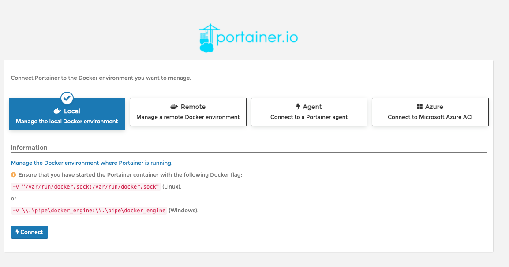

选择Local，进入可视化管理页面。

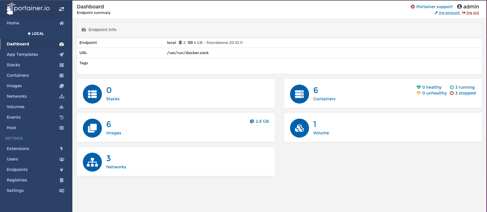


------

## 六、Docker镜像讲解

### 6.1 镜像是什么

镜像是一种轻量级、可执行的独立软件包，用来打包软件运行环境和基于运行环境开发的软件，它包含运行某个软件所需的所有内容，包括代码、运行时、库、环境变量和配置文件。

**==> 所有的应用，直接打包docker镜像，就可以直接跑起来！**

如何得到镜像：

- 从远程仓库下载
- 朋友拷贝
- 自己制作一个镜像 DockerFile


### 6.2 Docker镜像加载原理

> UnionFS（联合文件系统）

UnionFS（联合文件系统）：Union文件系统（UnionFS）是一种分层、轻量级并且高性能的文件系统，它支持对文件系统的修改作为一次提交来一层层的叠加，同时，可以将不同目录挂载到同一个虚拟文件系统下（unite serveral directories into a single virtual filesystem）。Union文件系统是 Docker 镜像的基础。镜像可以通过分层来进行集成，基于基础镜像（没有父镜像），可以制作各种具体的应用镜像。

**特性**：一次同时加载多个文件系统，但从外面看起来，只能看到一个文件系统，联合加载会把各层文件系统叠加起来，这样最终的文件系统会包含所有底层的文件和目录。


> Docker镜像加载原理

Docker 的镜像实际上由一层一层的文件系统组成，这样的层级文件系统UnionFS。


**bootfs**（boot file system，引导加载器）主要包含bootloader和kernel。bootloader主要是引导加载kernel，Linux刚启动时会加载bootfs文件系统，在Docker镜像的最底层是bootfs。这一层与我们典型的Linux/Unix系统是一样的，包含boot加载器和内核。当boot加载完成之后，整个内核就都在内存中了。此时内存的使用权已由bootfs转交给内核，此时系统也会卸载bootfs。


**rootfs**（root file system），在bootfs之上。包含的就是典型的Linux系统中的/dev、/proc、/bin、/etc等标准目录和文件。rootfs就是各种不同的操作系统发行版，比如Ubuntu、Centos等。


平时安装虚拟机的CentOS都是几个G，为什么Docker这里只有200M？

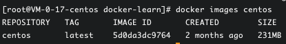

对于一个精简的OS，rootfs可以很小，只需要包含最基本的命令、工具和程序库即可。因为底层直接用Host（宿主机）的kernel，自己只需要提供rootfs就可以了。由此可见对于不同的linux发行版，bootfs基本是一致的，rootfs会有差别，因此不同的发行版可以公用bootfs。


### 6.3 分层理解

> 分层的镜像

下载一个镜像，观察下载的日志输出，可以看到是一层一层的在下载。


**问题：为什么Docker镜像要采用这种分层的结构？**

最大的好处，莫过于**资源共享**！比如有多个镜像都是从相同的Base镜像构建而来的，那么宿主机只需在磁盘上保留一份Base镜像，同时内存中也只需要加载一份Base镜像，这样就可以为所有的容器服务了，而且镜像的每一层都可以被共享。

> 通过 docker image inspect 命令查看镜像分层

```shell
[root@VM-24-12-centos ~]# docker image inspect redis:latest
[
    {
				// ...
        "RootFS": {
            "Type": "layers",
            "Layers": [ 【这里每一层对应这一个安装步骤】
                "sha256:e1bbcf243d0e7387fbfe5116a485426f90d3ddeb0b1738dca4e3502b6743b325",
                "sha256:58e6a16139eebebf7f6f0cb15f9cb3c2a4553a062d2cbfd1a782925452ead433",
                "sha256:503a5c57d9786921c992b7b2216ae58f69dcf433eedb28719ddea3606b42ce26",
                "sha256:277199a0027e044f64ef3719a6d7c3842e99319d6e0261c3a5190249e55646cf",
                "sha256:d0d567a1257963b9655dfceaddc76203c8544fbf6c8672b372561a3c8a3143d4",
                "sha256:a7115aa098139866d7073846e4321bafb8d5ca0d0f907a3c9625f877311bee7c"
            ]
        },
        "Metadata": {
            "LastTagTime": "0001-01-01T00:00:00Z"
        }
    }
]
```

**理解：**

所有的 Docker 镜像都起始于一个基础镜像层，当进行修改或增加新的内容时，就会在当前镜像层之上，创建新的镜像层。

举一个简单的例子，假如基于 Ubuntu Linux 16.04 创建一个新的镜像，这就是新镜像的第一层；如果在该镜像中添加 Python 包，就会在基础镜像层之上创建第二个镜像层；如果继续添加一个安全补丁，就会创建第三个镜像层。

该镜像当前已经包含 3 个镜像层，如下图所示。

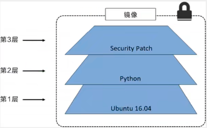

在添加额外的镜像层的同时，镜像始终保持是当前所有镜像的组合，理解这一点非常重要。下图中举了一个简单的例子，每个镜像层包含 3 个文件，而镜像包含了来自两个镜像层的 6 个文件。

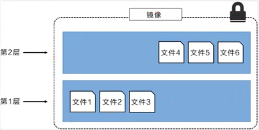

上图中的镜像层跟之前图中的略有区别，主要目的是便于展示文件。

下图中展示了一个稍微复杂的三层镜像，在外部看来整个镜像只有6个文件，这是因为最上层的文件 7 是 文件 5 的一个更新版本。

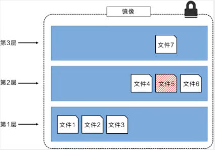

这种情况下，上层镜像层中的文件覆盖了底层镜像层中的文件。这样就使得文件的更新版本作为一个新镜像层添加到镜像当中。

Docker 通过存储引擎（新版本采用快照机制）的方式来实现镜像层堆栈，并保证多镜像层对外展示为统一的文件系统。

Linux上可用的存储引擎有 AUFS、Overlay2、Device Mapper、Btrfs以及 ZFS。顾名思义，每种存储引擎都基于Linux中对应的文件系统或块设备技术，并且每种存储引擎都有其独有的性能特点。

Docker 在Windows上仅支持 windowsfilter 一种存储引擎。该引擎基于 NTFS 文件系统之上实现了分层和CoW。

下图展示了域系统显示相同的三层镜像。所有镜像层堆叠并合并，对外提供统一的视图。

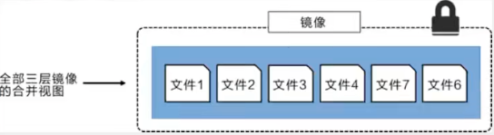

> 特点

Docker镜像都是只读的，当容器启动时，一个新的可写层被加载到镜像的顶部！

这一层就是通常说的**容器层**，容器之下都叫镜像层！


### 6.4 commit镜像（提交自己的镜像）

> 命令公式

```shell
docker commit 提交容器成为一个新的副本

# 命令和git原理类似
docker commit -m="提交的描述信息" -a="作者" 容器id 目标镜像名:[TAG]
```

如果需要保存某个容器当前的状态，就可以通过commit来提交，将此时的容器当做一个新的镜像，以后自己使用。


> 命令测试

下面实践的步骤：

- 第一步，打开一个窗口启动tomcat容器
- 第二步，再打开第二个窗口查看tomcat容器目录，发现webapps目录下没有文件（这是官方镜像的问题）
- 第三步，将webapps.dist目录下的文件拷贝到webapps中
- 第四步，之后想继续使用webapps中包含文件的镜像，而不是官方镜像，那么将此时的镜像进行提交

```shell
# 第一步：启动一个默认的tomcat
# 在finalshell中的一个窗口中输入以下命令启动tomcat：
[root@VM-24-12-centos ~]# docker run -it -p 8080:8080 tomcat
...启动了,此处省略一堆英文...
```

```shell
# 第二步：重新打开一个窗口，查看tomcat目录。发现这个默认的tomcat 是没有webapps应用的（镜像原因，官方镜像默认webapps下没有文件）
# 查看运行中的容器
[root@VM-24-12-centos ~]# docker ps
CONTAINER ID IMAGE  COMMAND           CREATED         STATUS        PORTS                                     NAMES
113b868169cf tomcat "catalina.sh run" 45 seconds ago  Up 45 seconds 0.0.0.0:8080->8080/tcp, :::8080->8080/tcp modest_jones
# 进入tomcat容器
[root@VM-24-12-centos ~]# docker exec -it 113b868169cf /bin/bash
# 进入并查看webapps目录
root@113b868169cf:/usr/local/tomcat# cd webapps
root@113b868169cf:/usr/local/tomcat/webapps# ls
root@113b868169cf:/usr/local/tomcat/webapps# cd ..
root@113b868169cf:/usr/local/tomcat# ls
BUILDING.txt     README.md      conf            temp
CONTRIBUTING.md  RELEASE-NOTES  lib             webapps
LICENSE          RUNNING.txt    logs            webapps.dist
NOTICE           bin            native-jni-lib  work

# 第三步：将webapps.dist目录下的所有文件复制到webapps目录下
root@113b868169cf:/usr/local/tomcat# cp -r webapps.dist/* webapps
root@113b868169cf:/usr/local/tomcat# cd webapps
root@113b868169cf:/usr/local/tomcat/webapps# ls
ROOT  docs  examples  host-manager  manager
root@113b868169cf:/usr/local/tomcat/webapps# 

# 第四步：提交镜像
# 首先退出容器
root@113b868169cf:/usr/local/tomcat/webapps# exit
exit
# 查看运行中的容器，发现tomcat容器还在运行
[root@VM-24-12-centos ~]# docker ps
CONTAINER ID   IMAGE     COMMAND             CREATED          STATUS          PORTS                                       NAMES
113b868169cf   tomcat    "catalina.sh run"   18 minutes ago   Up 18 minutes   0.0.0.0:8080->8080/tcp, :::8080->8080/tcp   modest_jones
#【下面命令是镜像提交】
# -a 发布者名字
# -m 一些说明
# tomcat02:1.0  tomcat02是镜像的名字，1.0是版本号
[root@VM-24-12-centos ~]# docker commit -a="nini" -m="add files to dir:webapps" 113b868169cf tomcat02:1.0
sha256:47b197b5e3d46bfcf1434cf66a49cd74c8eb3d3bd833bdb9cf61b393782d2f47
# 查看服务器上的镜像：新增了tomcat02这个镜像
[root@VM-24-12-centos ~]# docker images
REPOSITORY            TAG       IMAGE ID       CREATED          SIZE
tomcat02              1.0       47b197b5e3d4   20 seconds ago   684MB
nginx                 latest    605c77e624dd   2 months ago     141MB
tomcat                9.0       b8e65a4d736d   2 months ago     680MB
tomcat                latest    fb5657adc892   2 months ago     680MB
redis                 latest    7614ae9453d1   2 months ago     113MB
centos                latest    5d0da3dc9764   5 months ago     231MB
portainer/portainer   latest    580c0e4e98b0   11 months ago    79.1MB
elasticsearch         7.6.2     f29a1ee41030   23 months ago    791MB
```

如果需要保存当前容器的状态，就可以通过commit来提交，获得一个镜像。


------

## 七、容器数据卷

### 7.1 什么是容器数据卷

> docker的理念回顾

将应用和环境打包成一个镜像！

那么数据如何处理呢？如果数据都在容器中，那么容器删除，数据就会丢失！

因此提出新的需求：**数据可以持久化**

例如：MySQL，容器删了，数据也没了！需求：MySQL数据可以存储在本地！

解决方法：卷技术==>容器之间可以有一个数据共享的技术！Docker容器中产生的数据，同步到本地！（本质上是目录的挂载，将容器的目录，挂载到Linux上）

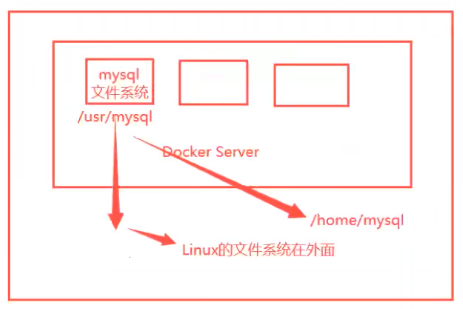

**总结：容器的持久化和同步操作！容器间也是可以数据共享的。**


### 7.2 使用数据卷

挂载：将容器中产生的数据同步到本地（防止容器数据丢失）

> 方式一：直接使用命令来挂载  -v

命令公式：

```shell
docker run -it -v 主机目录:容器内目录 镜像名称 /bin/bash
```

命令测试：

```shell
# 1、打开第一个窗口，进行容器数据挂载
[root@VM-24-12-centos ~]# cd /home
[root@VM-24-12-centos home]# ls
lighthouse  nini.java  test.java
[root@VM-24-12-centos home]# docker run -it -v /home/ceshi:/home centos /bin/bash
[root@75d4bfb1f8b3 /]# 

# 2、打开第二个窗口查看是否成功挂载：本机home目录下出现了测试文件夹这个数据，说明挂载操作成功
[root@VM-24-12-centos ~]# cd /home
[root@VM-24-12-centos home]# ls
ceshi  lighthouse  nini.java  test.java
[root@VM-24-12-centos home]# 
```

以上容器启动后，通过 docker inspect 查看挂载信息：

```shell
# 3、打开第三个窗口（不能在容器内部查看，在新窗口本机中查看）查看挂载信息，通过inspect命令
[root@VM-24-12-centos home]# docker ps
CONTAINER ID   IMAGE     COMMAND       CREATED         STATUS         PORTS     NAMES
75d4bfb1f8b3   centos    "/bin/bash"   6 minutes ago   Up 6 minutes             busy_thompson
[root@VM-24-12-centos home]# docker inspect 75d4bfb1f8b3
.....信息太长，此处省略......
```

省略的部分中，注意如下内容，说明挂载映射成功：

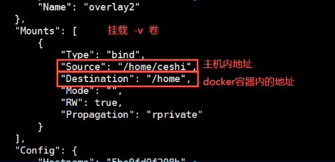


测试文件同步，无论是从容器写数据，还是在宿主机写数据，数据都会即时同步，因为容器用的就是这块目录。

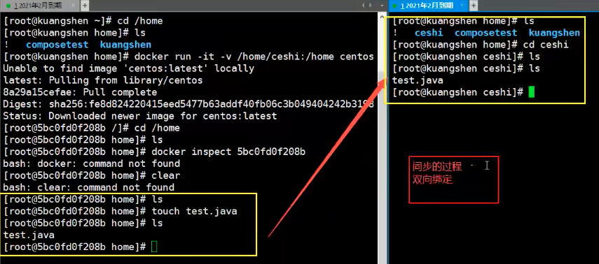

容器停止后，主机上的数据不会被删除；

容器未启动，主机上修改数据，两个目录依旧会同步。此时启动容器，可以看到数据同步了。

**好处：以后只需要在本地修改即可，容器内会自动同步。**


> 方式二：DockerFile


### 7.3 实战：安装MySQL（解决数据持久化问题）

> 远程服务器上MySQ容器的数据持久化方法，具体步骤如下：

```shell
# 1、获取mysql5.7版本镜像
[root@VM-24-12-centos ~]# docker pull mysql:5.7
5.7: Pulling from library/mysql
72a69066d2fe: Pull complete 
93619dbc5b36: Pull complete 
99da31dd6142: Pull complete 
626033c43d70: Pull complete 
37d5d7efb64e: Pull complete 
ac563158d721: Pull complete 
d2ba16033dad: Pull complete 
0ceb82207cd7: Pull complete 
37f2405cae96: Pull complete 
e2482e017e53: Pull complete 
70deed891d42: Pull complete 
Digest: sha256:f2ad209efe9c67104167fc609cca6973c8422939491c9345270175a300419f94
Status: Downloaded newer image for mysql:5.7
docker.io/library/mysql:5.7
# 查看镜像
[root@VM-24-12-centos ~]# docker images
REPOSITORY            TAG       IMAGE ID       CREATED         SIZE
mysql                 5.7       c20987f18b13   2 months ago    448MB
centos                latest    5d0da3dc9764   5 months ago    231MB

# 2、运行mysql容器并进行容器数据挂载
# 安装启动MySQL，需要配置密码的，注意！
-d 后台运行
-p 端口映射
-v 数据卷挂载(可以挂载多个数据，下面命令中先挂载了配置文件然后挂载了数据)
-e 环境配置（在后面配置了密码）
--name 容器名字
[root@VM-24-12-centos ~]# docker run -d -p 3310:3306 -v /home/mysql/conf:/etc/mysql/conf.d -v /home/mysql/data:/var/lib/mysql -e MYSQL_ROOT_PASSWORD=123456 --name mysql01 mysql:5.7
005bf613e4ebfae21d81f17a301f489207d60f7f4e31a07a2e383bea504cf296


# 3、使用本地 Navicat连接远程服务器
# 如果服务器端口没有开放那么无法连接成功，需要做以下操作：
首先在云服务器官网配置安全组来添加端口；
systemctl start firewalld                    # 打开centos服务器防火墙
firewall-cmd --query-port=3306/tcp           # 查询3306和3310端口是否打开？如果没打开显示No
firewall-cmd --add-port=3306/tcp --permanent # 打开3306和3310端口
firewall-cmd --reload                        # 重载入添加的端口
firewall-cmd --query-port=3306/tcp           # 重新查看3306和3310端口是否打开？此时显示Yes
接下来就可成功使用Navicat连接远程服务器进行测试     # 此时可以成功连接（密码是123456）
```


```shell
# 4、先查看服务器挂载目录下的文件:
# 进入服务器内/home/mysql/data下查看包含的文件：此时还没有test目录
[root@VM-24-12-centos ~]# cd /home
[root@VM-24-12-centos home]# ls
ceshi  lighthouse  mysql  nini.java  test.java
[root@VM-24-12-centos home]# cd mysql
[root@VM-24-12-centos mysql]# ls
conf  data
[root@VM-24-12-centos mysql]# cd data
[root@VM-24-12-centos data]# ls
auto.cnf         client-key.pem  ib_logfile1         private_key.pem  sys
ca-key.pem       ib_buffer_pool  ibtmp1              public_key.pem
ca.pem           ibdata1         mysql               server-cert.pem
client-cert.pem  ib_logfile0     performance_schema  server-key.pem

# 然后使用Navicat在远程数据库中创建新数据库test，如下图：
```


```shell
# 然后分别查看服务器上，mysql挂载数据时的宿主机目录 /home/mysql/data 和mysql容器目录/var/lib/mysql，是否出现了test目录？
# 下面第一个图是宿主机目录：/home/mysql/data
# 下面第二个图是容器目录：/var/lib/mysql

可以看到两个目录中最后都出现了test数据库目录，说明数据挂载成功！
```


**以上操作流程总结：**

- 首先获取mysql对应版本的镜像
- 运行mysql容器并进行服务器目录和容器目录的数据挂载
- 使用本地 Navicat连接远程服务器的挂载端口：3310
- 使用服务器命令行或本地Navicat工具在服务器中创建数据库
- 验证是否挂载成功：查看本地和容器对应目录中的文件是否更新

```shell
# 上面Navicat操作的流程分析：
# 在Navicat中输入远程服务器的ip，用户密码，先连接到服务器的3310端口
# 服务器3310端口和mysql容器的3306端口是挂载映射的，
# 所以Navicat中给服务器创建数据库test就相当于在服务器中使用命令行创建数据库test
```


如果删除mysql01容器，其中的数据是否会保留呢？

```shell
# 删除mysql01容器
[root@VM-24-12-centos /]# docker rm -f mysql01
mysql01
# 查看本地挂载目录 /home/mysql/data 中新建的test数据库是否存在?
# 发现data目录中最后一个test数据库仍然存在
[root@VM-24-12-centos /]# cd /home/mysql/data
[root@VM-24-12-centos data]# ls
auto.cnf         client-key.pem  ib_logfile1         private_key.pem  sys
ca-key.pem       ib_buffer_pool  ibtmp1              public_key.pem   test
ca.pem           ibdata1         mysql               server-cert.pem
client-cert.pem  ib_logfile0     performance_schema  server-key.pem
```

**以上结果说明即使删除容器，数据依然存在！**


### 7.4 具名和匿名挂载

具名和匿名挂载类似，都不指定宿主机路径（包含宿主机路径的是指定路径挂载）

> 匿名挂载

-v之后只写容器内路径，不写宿主机路径。会自动生成一个宿主机内的数据存储路径。

```shell
-v 容器内路径
-P 随机映射端口  （或者-p 3344:80）
# 匿名挂载：
[root@VM-24-12-centos /]# docker run -d -P --name nginx01 -v /ect/nginx nginx
45e9823ab1d4fb7d1c2eaab6b37450f28fc0fb4363627ea4835847d53446c095

# 查看所有数据卷的情况：
# 查询结果中VOLUME NAME都是一串数字，没有名字
# 这种都是匿名挂载，我们在 -v时只写了容器内的路径，没有写容器外的路径！
[root@VM-24-12-centos /]# docker volume ls
DRIVER    VOLUME NAME
local     27e34d001891244471395c85d271cdbce7a9645f51008a6253523ea4f0c3d010
local     38cbe6f70cd745fd5732e2f08b4e07bbaf54862badcd89eddc943f3ac8d2ec5f
local     b3ce648270d4a4140d06bcb9c98041d9db0b8a9db5cba2af95692dbef10fc6a9local     b642ae113ea02ab01f2cca1405795a7bc417f929cd6d3f9da99acbd87821c427
```

> 具名挂载

```shell
# -v 卷名:容器内路径
# -P 随机端口映射
[root@VM-24-12-centos /]# docker run -d -P --name nginx02 -v juming-nginx:/ect/nginx nginx
5ac08dd77ec5e973952982b70e6d074bf3a827ab7ea6454b38c02be145f06722

# 查看所有的卷，可以看到具名挂载的卷名不是随机数字了而是我们指定的名字：juming-nginx
[root@VM-24-12-centos /]# docker volume ls
DRIVER    VOLUME NAME
local     27e34d001891244471395c85d271cdbce7a9645f51008a6253523ea4f0c3d010
local     38cbe6f70cd745fd5732e2f08b4e07bbaf54862badcd89eddc943f3ac8d2ec5f
local     b3ce648270d4a4140d06bcb9c98041d9db0b8a9db5cba2af95692dbef10fc6a9
local     b642ae113ea02ab01f2cca1405795a7bc417f929cd6d3f9da99acbd87821c427
local     juming-nginx

# 查看具名挂载的数据卷位置
[root@VM-24-12-centos /]# docker volume inspect juming-nginx
[
    {
        "CreatedAt": "2022-03-10T16:08:00+08:00",
        "Driver": "local",
        "Labels": null,
        "Mountpoint": "/var/lib/docker/volumes/juming-nginx/_data",
        "Name": "juming-nginx",
        "Options": null,
        "Scope": "local"
    }
]
```


> 说明

docker的默认目录是`/var/lib/docker`.

所有的 Docker容器内的卷，没有指定目录的情况下都是在 `/var/lib/docker/volumes/xxx/_data`

通过具名挂载，可以方便的找到对应的数据卷，大多数情况都推荐使用`具名挂载`

```shell
# 如何确定是具名挂载还是匿名挂载，还是指定路径挂载？
-v 容器内路径             # 匿名挂载
-v 卷名: 容器内路径        # 具名挂载
-v /宿主机路径:容器内路径   # 指定路径挂载
```

拓展：

```shell
# 通过 -v 容器内路径， ro rw改变读写权限
ro readonly  # 只读
rw readwrite # 可读可写
# 一旦设定了容器权限，容器对我们挂载出来的内容就有限定了！

docker run -d -P --name nginx02 -v juming-nginx:/etc/nginx:ro nginx
docker run -d -P --name nginx02 -v juming-nginx:/etc/nginx:rw nginx

# ro：只要看到ro，就说明这个路径只能通过宿主机来操作容器内部是无法操作的！
```


### 7.5 DockerFile数据卷

DockerFile 就是用来构建 docker 镜像的构造文件！就是一段命令脚本！

通过这个脚本，可以生成镜像，镜像是一层层的，脚本是一个个的命令。

> 使用DockerFile创建自己的镜像

```shell
# 1、创建并进入 /home/docker-test-volume 目录
[root@VM-24-12-centos /home]mkdir docker-test-volume
[root@VM-24-12-centos /home]cd docker-test-volume
[root@VM-24-12-centos /docker-test-volume]#

# 2、在这个目录中创建编写DockerFile文件：命名为dockerfile1  （建议命名为 DockerFile）
[root@VM-24-12-centos /docker-test-volume]# vim dockerfile1
```

```shell
#【dockerfile1 文件中的内容】
# 指令（大写） 参数
FROM centos   # 表示这个镜像是基于centos的

VOLUME ["volume01", "volume02"]  # 这里只写了容器内的目录，说明是匿名挂载

CMD echo "-----end------"        # 一段结束提示语
CMD /bin/bash
# 这里的每个命令，就是镜像的一层
```

```shell
# 以上dockerfile1文件中的内容编辑完成后，先按esc进入命令模式，然后输入:wq保存并退出


# 3、接下来生成镜像：使用build命令
# -f 表示DockerFile文件（可以写成全路径）
# -t 目标生成路径
# 从下面的文字可知，生成过程也是一层一层（一句一句）来的。文件中有几句就有几层（或几步）
[root@VM-24-12-centos docker-test-volume]# docker build -f dockerfile1 -t nini/centos:1.0 .
Sending build context to Docker daemon  2.048kB
Step 1/4 : FROM centos  
 ---> 5d0da3dc9764
Step 2/4 : VOLUME ["volume01", "volume02"]
 ---> Running in d4860376a76c
Removing intermediate container d4860376a76c
 ---> 6c000fa96c42
Step 3/4 : CMD echo "-----end------"
 ---> Running in 72ef2f64ef13
Removing intermediate container 72ef2f64ef13
 ---> b9b466e7f01e
Step 4/4 : CMD /bin/bash
 ---> Running in 250a30fd56a8
Removing intermediate container 250a30fd56a8
 ---> dd321b01ee56
Successfully built dd321b01ee56
Successfully tagged nini/centos:1.0
```

```shell
# 4、最后查看我们发布的镜像 nini/centos:1.0
[root@VM-24-12-centos /]# docker images
REPOSITORY    TAG       IMAGE ID       CREATED         SIZE
nini/centos   1.0       dd321b01ee56   5 minutes ago   231MB
centos        latest    5d0da3dc9764   5 months ago    231MB

# 启动自己写的容器:测试发现只能用镜像id dd321b01ee56来启动
[root@VM-24-12-centos /]# docker run -it dd321b01ee56 /bin/bash

# 查看容器目录：最后面两个"volume01""volume02"是我们在dockerfile中创建的数据卷目录
[root@ba6f6a7592ab /]# ls -l
lrwxrwxrwx   1 root root    7 Nov  3  2020 bin -> usr/bin
drwxr-xr-x   5 root root  360 Mar 10 09:19 dev
drwxr-xr-x   1 root root 4096 Mar 10 09:19 etc
drwxr-xr-x   2 root root 4096 Nov  3  2020 home
lrwxrwxrwx   1 root root    7 Nov  3  2020 lib -> usr/lib
lrwxrwxrwx   1 root root    9 Nov  3  2020 lib64 -> usr/lib64
drwx------   2 root root 4096 Sep 15 14:17 lost+found
drwxr-xr-x   2 root root 4096 Nov  3  2020 media
drwxr-xr-x   2 root root 4096 Nov  3  2020 mnt
drwxr-xr-x   2 root root 4096 Nov  3  2020 opt
dr-xr-xr-x 137 root root    0 Mar 10 09:19 proc
dr-xr-x---   2 root root 4096 Sep 15 14:17 root
drwxr-xr-x  11 root root 4096 Sep 15 14:17 run
lrwxrwxrwx   1 root root    8 Nov  3  2020 sbin -> usr/sbin
drwxr-xr-x   2 root root 4096 Nov  3  2020 srv
dr-xr-xr-x  13 root root    0 Mar 10 09:19 sys
drwxrwxrwt   7 root root 4096 Sep 15 14:17 tmp
drwxr-xr-x  12 root root 4096 Sep 15 14:17 usr
drwxr-xr-x  20 root root 4096 Sep 15 14:17 var
drwxr-xr-x   2 root root 4096 Mar 10 09:19 volume01
drwxr-xr-x   2 root root 4096 Mar 10 09:19 volume02
```

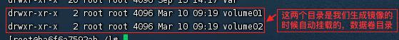

```shell
# 上面的两个目录和外部一定有一个同步的目录！我们可以查看以下挂载的路径！

# 5、查看匿名挂载的数据卷的位置
# 在容器中进入挂载目录volume01，然后在里面创建一个txt文件
[root@b69229da7818 /]# cd volume01
[root@b69229da7818 volume01]touch container.txt
[root@b69229da7818 volume01]# ls
container.txt
# 然后在另外一个窗口中容器(root@b69229da7818)外查看容器信息：使用inspect命令
# 找到Mounts标签，里面显示了volume01和volume02两个数据卷的本地位置
[root@VM-24-12-centos ~]# docker inspect b69229da7818
    .........
        "Mounts": [
        ],
    .........
```

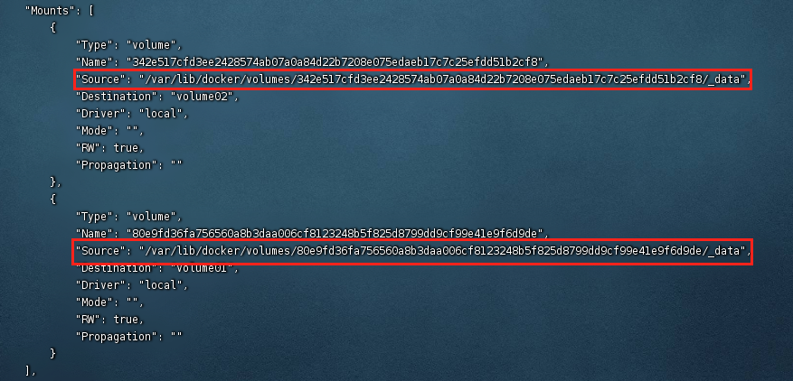


```shell
# 测试以下数据挂载是否成功：即txt文件是否成功在本机和容器内同步生成
[root@VM-24-12-centos _data]# cd /var/lib/docker/volumes/80e9fd36fa756560a8b3daa006cf8123248b5f825d8799dd9cf99e41e9f6d9de/_data
[root@VM-24-12-centos _data]# ls
container.txt


# 以上结果说明挂载成功了！
```


未来这种方式使用的十分多，因为通常会构建自己的镜像！

假设构建镜像时候没有挂载卷，要手动镜像挂载，-v 卷名:容器内路径！


### 7.6 数据卷容器

就是让容器和容器之间同步！

两个MySQL同步数据！

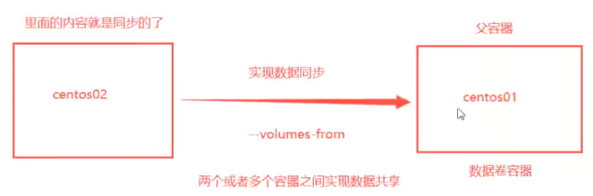


启动docker01

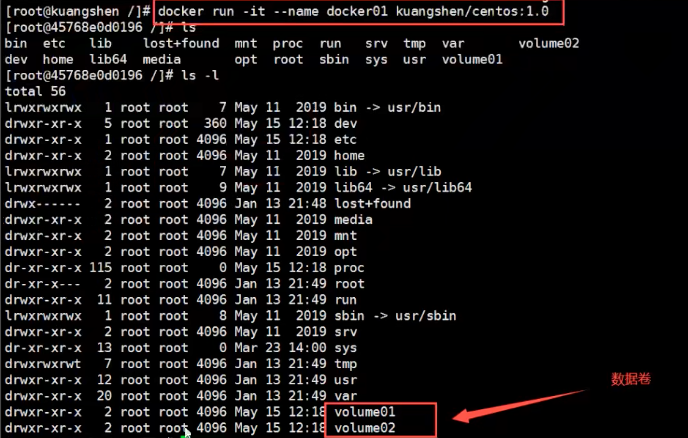

启动docker02，设置volumes-from docker01。

在docker01中，到volume01下创建文件docker01，在docker02中同样可见，容器间挂载成功。

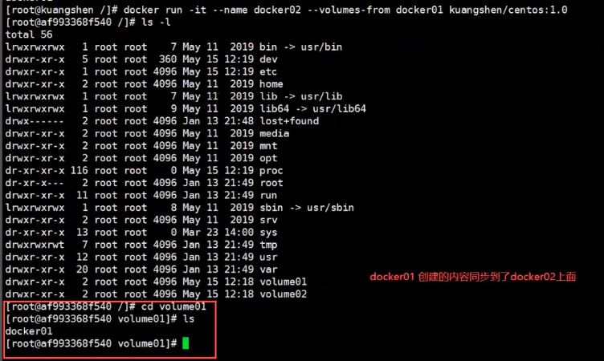

容器间的挂载类似于Java的继承关系。

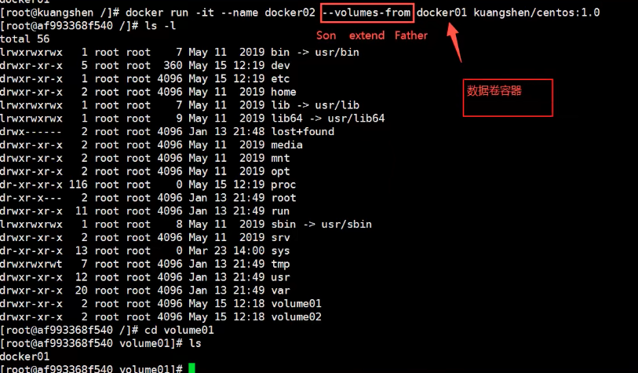

再运行一个docker03，挂载docker01，文件也能够同步过来。

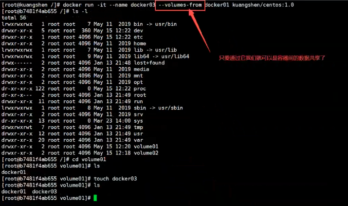

```shell
# 测试：删除docker01，查看一下docker02和docker03，是否还可以访问这个文件

# 结果：依旧可以访问
```

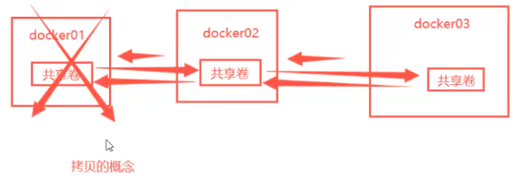

### 7.7 多个MySQL实现数据共享

```shell
# 启动mysql01
docker run -d -p 3310:3306 -v /mnt/docker-learn/mysql/conf:/etc/mysql/conf.d -v /mnt/docker-learn/mysql/data:/var/lib/mysql -e MYSQL_ROOT_PASSWORD=123456 --name mysql01 mysql:5.7

# 启动mysql02，挂载到mysql01
docker run -d -p 3310:3306 -e MYSQL_ROOT_PASSWORD=123456 --name mysql02 --volumes-from mysql01 mysql:5.7

# 此时，可以实现两个容器数据同步
```


### 7.8 小结

容器之间配置信息的传递，数据卷容器的生命周期一直持续到没有容器使用为止。

一旦持久化了本地，本地的数据是不会被删除的！


## 八、DockerFile

### 8.1 DockerFile介绍

DockerFile 是用来构建Docker镜像的文件！命令参数脚本！

构建步骤：

1. 编写一个 dockerfile 文件
2. `docker build`构建成为一个镜像
3. `docker run`运行镜像
4. `docker push`发布镜像（DockerHub、阿里云镜像仓库）


官方做法：

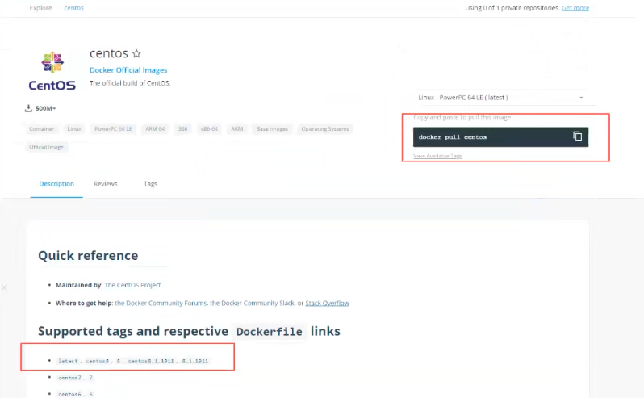

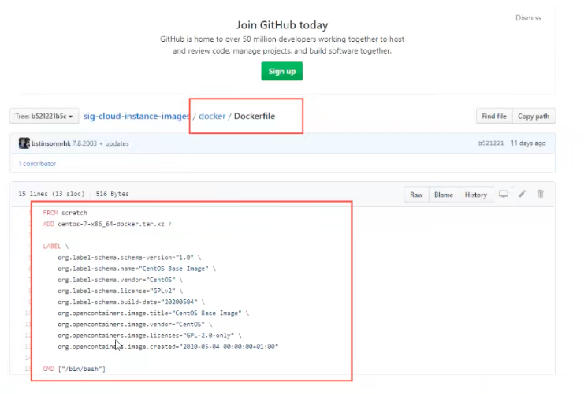

官方镜像都是基础包，很多功能没有，需要自己搭建自己的镜像。

一般 centos + jdk + tomcat + MySQL + redis。


### 8.2 DockerFile构建过程

**基础知识：**

1. 每个保留关键字（指令）都必须是大写字母
2. 按照从上到下顺序执行
3. \#表示注释
4. 每一个指令都会创建提交一个新的镜像层，并提交！

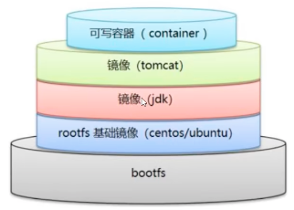


dockerfile是面向开发的，以后要发布项目，做镜像，就需要编写dockerfile文件。十分简单！

Docker镜像成为企业交付的标准。

**步骤：开发、部署、运维**

DockerFile：构建文件，定义了一些的步骤，源代码

Docker Images：通过 DockerFile 构建生成的镜像，最终发布和运行的产品，原来是jar、war包

Docker容器：容器就是镜像运行起来提供服务器


### 8.3 DockerFile指令

```shell
FROM     			# 基础镜像，一切从这里开始构建
MAINTAINER		# 镜像是谁写的，姓名+邮箱
RUN						# 镜像构建的时候需要运行的命令
ADD						# 步骤，tomcat镜像，这个tomcat压缩包，就是添加内容
WORDDIR				# 镜像的工作目录
VOLUME				# 挂载的目录
EXPOSE				# 暴露端口
RUN					
CMD						# 指定这个容器启动的时候要运行的命令，只有最后一个会生效，可被替代
ENTRYPOINT		# 指定这个容器启动的时候要运行的命令，可以追加命令
ONBUILD				# 当构建一个被继承 DockerFile 这个时候就会执行 ONBUILD 的指令。（触发指令）
COPY					# 类似ADD，将文件拷贝到镜像中
ENV						# 构建的时候设置环境变量
```


### 8.4 实战：Centos镜像

`FROM scratch` Docker Hub中 99% 镜像都是从这个基础镜像过来的，然后配置需要的软件和配置来进行构建的。

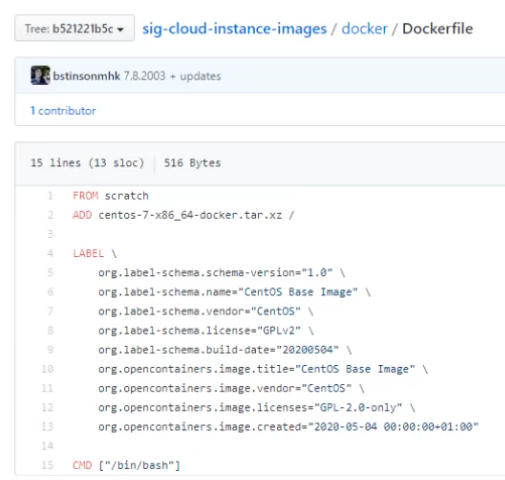

创建一个自己的centos

```shell
# 1、编写 dockerfile 文件
[root@VM-0-17-centos docker-test-volume]# cat dockerfile-centos
FROM centos
MAINTAINER sugar<406857586@qq.com>

ENV MYPATH /usr/local
WORKDIR $MYPATH

RUN yum -y install vim
RUN yum -y install net-tools

EXPOSE 80

CMD echo $MYPATH
CMD echo "---end---"
CMD /bin/bash

# 2、构建镜像
[root@VM-0-17-centos docker-test-volume]# docker build -f dockerfile1 -t sugar/centos:1.0 .
// ....
Successfully built 3e201d4dfcf1
Successfully tagged mycentos:0.1

# 3、测试运行
[root@VM-0-17-centos dockerfile]# docker run -it mycentos:0.1
# 工作目录变为了 /usr/local
[root@0ffcc43c66c2 local]# pwd
/usr/local
# ifconfig命令可用了
[root@0ffcc43c66c2 local]# ifconfig
eth0: flags=4163<UP,BROADCAST,RUNNING,MULTICAST>  mtu 1500
        inet 172.18.0.5  netmask 255.255.0.0  broadcast 172.18.255.255
        ether 02:42:ac:12:00:05  txqueuelen 0  (Ethernet)
        RX packets 8  bytes 656 (656.0 B)
        RX errors 0  dropped 0  overruns 0  frame 0
        TX packets 0  bytes 0 (0.0 B)
        TX errors 0  dropped 0 overruns 0  carrier 0  collisions 0

lo: flags=73<UP,LOOPBACK,RUNNING>  mtu 65536
        inet 127.0.0.1  netmask 255.0.0.0
        loop  txqueuelen 1000  (Local Loopback)
        RX packets 0  bytes 0 (0.0 B)
        RX errors 0  dropped 0  overruns 0  frame 0
        TX packets 0  bytes 0 (0.0 B)
        TX errors 0  dropped 0 overruns 0  carrier 0  collisions 0

# 4、通过 docker history 查看镜像构建历史
[root@VM-0-17-centos dockerfile]# docker history mycentos:0.1
IMAGE          CREATED         CREATED BY                                      SIZE      COMMENT
3e201d4dfcf1   4 minutes ago   /bin/sh -c #(nop)  CMD ["/bin/sh" "-c" "/bin…   0B        
641edfbfbd91   4 minutes ago   /bin/sh -c #(nop)  CMD ["/bin/sh" "-c" "echo…   0B        
4df1f95bb0ec   4 minutes ago   /bin/sh -c #(nop)  CMD ["/bin/sh" "-c" "echo…   0B        
42e158a18f95   4 minutes ago   /bin/sh -c #(nop)  EXPOSE 80                    0B        
fe827f5bd8a0   4 minutes ago   /bin/sh -c yum -y install net-tools             26.9MB    
9a37001535fc   4 minutes ago   /bin/sh -c yum -y install vim                   63.9MB    
dfb3d3861248   4 minutes ago   /bin/sh -c #(nop) WORKDIR /usr/local            0B        
f4f2026165e4   4 minutes ago   /bin/sh -c #(nop)  ENV MYPATH=/usr/local        0B        
6aa45f68d085   4 minutes ago   /bin/sh -c #(nop)  MAINTAINER sugar<40685758…   0B        
5d0da3dc9764   2 months ago    /bin/sh -c #(nop)  CMD ["/bin/bash"]            0B        
<missing>      2 months ago    /bin/sh -c #(nop)  LABEL org.label-schema.sc…   0B        
<missing>      2 months ago    /bin/sh -c #(nop) ADD file:805cb5e15fb6e0bb0…   231MB    
```

### 8.5 CMD 和 ENTRYPOINT 区别

```shell
CMD						# 指定这个容器启动的时候要运行的命令，只有最后一个会生效，可被替代
ENTRYPOINT		# 指定这个容器启动的时候要运行的命令，可以追加命令
```

测试CMD

```shell
# 编写 dockerfile 文件
[root@VM-0-17-centos dockerfile]# cat dockerfile-cmd-test 
FROM centos
CMD ["ls", "-a"]

# 构建镜像
[root@VM-0-17-centos dockerfile]# docker build -f dockerfile-cmd-test -t cmdtest .

# 运行，发现 ls -a生效
[root@VM-0-17-centos dockerfile]# docker run 2217d88957de
.
..
.dockerenv
bin
dev
etc
home

# 想追加一个命令 -l（ls -al），失败
[root@VM-0-17-centos dockerfile]# docker run 2217d88957de -l
docker: Error response from daemon: OCI runtime create failed: container_linux.go:380: starting container process caused: exec: "-l": executable file not found in $PATH: unknown.
ERRO[0000] error waiting for container: context canceled 

# cmd的清理下， -l 替换了CMD ["ls", "-a"]命令，-l 不是命令，所以报错。
# 以下命令可以执行
[root@VM-0-17-centos dockerfile]# docker run 2217d88957de ls -al
```

测试ENTRYPOINT

```shell
# 编写文件
[root@VM-0-17-centos dockerfile]# cat dockerfile-cmd-entrypoint 
FROM centos
ENTRYPOINT ["ls", "-a"]

# 构建镜像
[root@VM-0-17-centos dockerfile]# docker build -f dockerfile-cmd-entrypoint -t entrypoint-test .

# 运行
[root@VM-0-17-centos dockerfile]# docker run 18c29b6e837b
.
..
.dockerenv
bin
dev
etc

# 追加命令 -l 生效
[root@VM-0-17-centos dockerfile]# docker run 18c29b6e837b -l
total 56
drwxr-xr-x   1 root root 4096 Nov 26 02:54 .
drwxr-xr-x   1 root root 4096 Nov 26 02:54 ..
-rwxr-xr-x   1 root root    0 Nov 26 02:54 .dockerenv
lrwxrwxrwx   1 root root    7 Nov  3  2020 bin -> usr/bin
drwxr-xr-x   5 root root  340 Nov 26 02:54 dev
drwxr-xr-x   1 root root 4096 Nov 26 02:54 etc
```

DockerFile中很多命令十分相似，需要了解区别。


### 8.6 实战：Tomcat镜像

1. 准备镜像文件 tomcat压缩包、jdk压缩包
   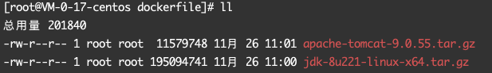
2. 编写 dockerfile 文件，官方命令 `Dockerfile`，build 会自动寻找这个文件，就不需要 -f 指定了！

```shell
[root@VM-0-17-centos build_tomcat]# cat Dockerfile 
FROM centos
MAINTAINER sugar<406857586@qq.com>

COPY readme.txt /usr/local/readme.txt

ADD jdk-8u221-linux-x64.tar.gz /usr/local/
ADD apache-tomcat-9.0.55.tar.gz /usr/local/

RUN yum -y install vim

ENV MYPATH /usr/local
WORKDIR $MYPATH

ENV JAVA_HOME /usr/local/jdk1.8.0_221
ENV CLASSPATH $JAVA_HOME/lib/dt.jar:$JAVA_HOME/lib/tools.jar
ENV CATALINA_HOME /usr/local/apache-tomcat-9.0.55
ENV CATALINA_BASH /usr/local/apache-tomcat-9.0.55
ENV PATH $PATH:$JAVA_HOME/bin:$CATALINA_HOME/lib:$CATALINA_HOME/bin

EXPOSE 8080

CMD /usr/local/apache-tomcat-9.0.55/bin/startup.sh && tail -F /url/local/apache-tomcat-9.0.55/bin/logs/catalina.out
```

1. 构建镜像

```shell
docker build -t diytomcat .
```

1. 运行镜像

```shell
docker run -d -p 9090:8080 --name sugartomcat -v /mnt/docker-learn/dockerfile/build_tomcat/test:/usr/local/apache-tomcat-9.0.55/webapps/test -v /mnt/docker-learn/dockerfile/build_tomcat/logs:/usr/local/apache-tomcat-9.0.55/logs diytomcat
```

1. 访问测试

```shell
# 访问生效
docker ps
curl localhost:9191/api?
```

1. 在Tomcat发布项目（由于做了卷挂载，所以可直接在本地编写项目，放到挂载路径下就可以发布了！）

web.xml

```shell
<?xml version="1.0" encoding="UTF-8"?>
<web-app xmlns="http://xmlns.jcp.org/xml/ns/javaee"
         xmlns:xsi="http://www.w3.org/2001/XMLSchema-instance"
         xsi:schemaLocation="http://xmlns.jcp.org/xml/ns/javaee http://xmlns.jcp.org/xml/ns/javaee/web-app_4_0.xsd"
         version="4.0">

</web-app>
```

index.jsp

```html
<%@ page contentType="text/html;charset=UTF-8" language="java" %>
<html>
<head>
    <title>主页</title>
</head>
<body>
  Hello World
  <%
     out.println("IP:" + request.getRemoteAddr());
  %>
</body>
</html>
```

1. 访问 ip:9090/test，可以访问


以后的开发步骤：掌握Dockerfile的编写。之后的一切都是使用docker镜像来发布运行！

#### 

### 8.7 发布镜像到DockerHub

1. 地址：https://hub.docker.com
2. 注册账号，并确定可以登录
3. 在服务器上提交自己的镜像

```html
# 登录命令
[root@VM-0-17-centos build_tomcat]# docker login --help

Usage:  docker login [OPTIONS] [SERVER]

Log in to a Docker registry.
If no server is specified, the default is defined by the daemon.

Options:
  -p, --password string   Password
      --password-stdin    Take the password from stdin
  -u, --username string   Username

[root@VM-0-17-centos build_tomcat]# docker login -u sugarbabyzz
Password: 
WARNING! Your password will be stored unencrypted in /root/.docker/config.json.
Configure a credential helper to remove this warning. See
https://docs.docker.com/engine/reference/commandline/login/#credentials-store

Login Succeeded
```

1. 登录完毕后，就可以提交镜像了 docker push

```html
# push自己的镜像到服务器上
[root@VM-0-17-centos build_tomcat]# docker push diytomcat
Using default tag: latest
The push refers to repository [docker.io/library/diytomcat]
e1346aad6f14: Preparing 
c4d20380c6a8: Preparing 
cef8323f5b7f: Preparing 
57d2ad337b34: Preparing 
74ddd0ec08fa: Preparing 
denied: requested access to the resource is denied   # 被拒绝，没有带发布者信息

# push镜像出现的问题
[root@VM-0-17-centos build_tomcat]# docker push sugarbabyzz/diytomcat:1.0
The push refers to repository [docker.io/sugarbabyzz/diytomcat]
An image does not exist locally with the tag: sugarbabyzz/diytomcat

# 解决：增加tag，注意用户名与/前的用户名一定要一致
[root@VM-0-17-centos build_tomcat]# docker tag ad611843cdae sugarbabyzz/tomcat:1.0
[root@VM-0-17-centos build_tomcat]# docker images
REPOSITORY            TAG       IMAGE ID       CREATED         SIZE
diytomcat             latest    ad611843cdae   2 hours ago     718MB
sugarbabyzz/tomcat          1.0       ad611843cdae   2 hours ago     718MB

# 再发布
[root@VM-0-17-centos build_tomcat]# docker push sugarbabyzz/tomcat:1.0
```


### 8.8 发布镜像到阿里云容器服务

1. 登录阿里云
2. 找到 控制台-容器镜像服务
3. 创建命名空间
   
4. 创建容器镜像
   
5. 浏览仓库页面信息
   
   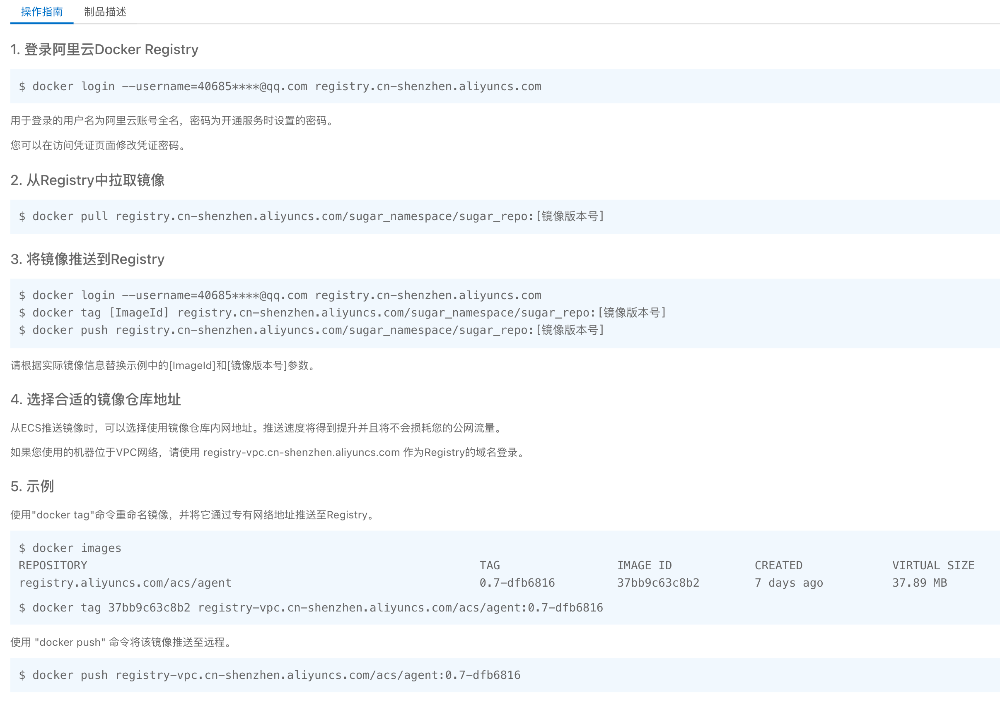
6. 按步骤操作，将镜像push到阿里云仓库


### 8.9 Docker所有流程小结


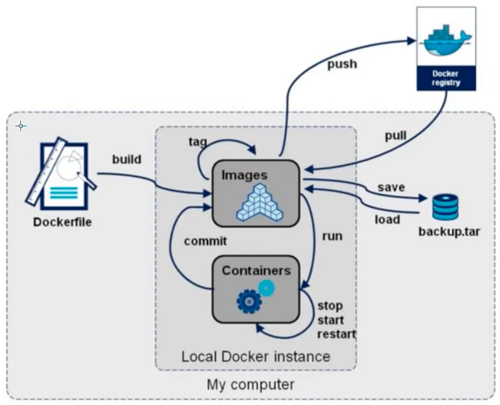


## 九、Docker网络

### 9.1 理解Docker0

测试

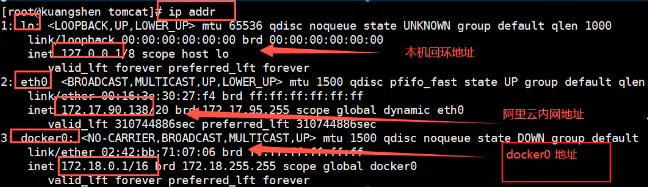

**Docker是如何处理容器间网络访问的？**


```powershell
# 创建tomcat容器
[sugar@iZ749i4volw5sfZ docker-learn]$ docker run -d -P --name tomcat01 tomcat

# 查看容器内部的网络地址  ip addr
# 发现容器启动的时候，会得到一个    eth0@if31:   ip地址，docker分配的！
[sugar@iZ749i4volw5sfZ docker-learn]$ docker exec -it tomcat01 ip addr
1: lo: <LOOPBACK,UP,LOWER_UP> mtu 65536 qdisc noqueue state UNKNOWN group default qlen 1000
    link/loopback 00:00:00:00:00:00 brd 00:00:00:00:00:00
    inet 127.0.0.1/8 scope host lo
       valid_lft forever preferred_lft forever
30: eth0@if31: <BROADCAST,MULTICAST,UP,LOWER_UP> mtu 1500 qdisc noqueue state UP group default 
    link/ether 02:42:ac:11:00:02 brd ff:ff:ff:ff:ff:ff link-netnsid 0
    inet 172.17.0.2/16 brd 172.17.255.255 scope global eth0
       valid_lft forever preferred_lft forever


# 思考，linux能否ping通容器内部！
[sugar@iZ749i4volw5sfZ docker-learn]$ ping 172.17.0.2
PING 172.17.0.2 (172.17.0.2) 56(84) bytes of data.
64 bytes from 172.17.0.2: icmp_seq=1 ttl=64 time=0.053 ms
64 bytes from 172.17.0.2: icmp_seq=2 ttl=64 time=0.072 ms

# linux 可以 ping通 docker 容器内部

# 可见，172.17.0.2与 本机的docker0:172.17.0.1网络在同一网段，是可以ping通的
```


原理

1. 每启动一个docker容器，docker就会给docker容器分配一个ip。只要安装了docker，就会有一个网卡 docker0，桥接模式，使用的技术是 evth-pair 技术！
   再次测试 ip addr，多了一个地址，与容器内的地址一样。
   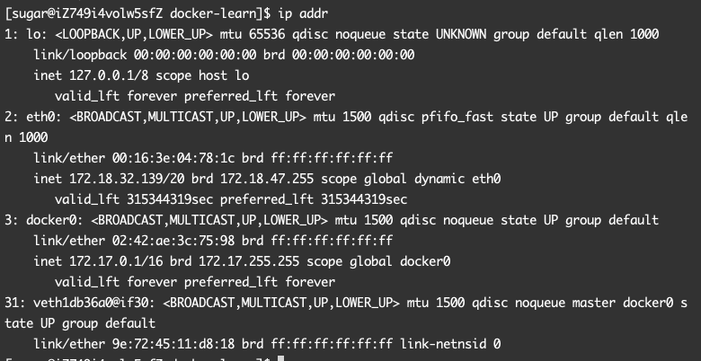
2. 再启动一个容器，就会又多一对网卡
   

```shell
# 这些容器带来的网卡，都是一对一对的
# evth-pair技术，就是一对的虚拟设备接口，成对出现，一端连着协议，一端彼此相连
# 正因为这个特性，通常将 evth-pair 充当一个桥梁，连接各种虚拟网络设备的
# OpenStack、Docker容器之间的链接，OVS的链接，都是使用 evth-pair技术
```

1. 测试 tomcat01 和 tomcat02是否可以ping通
   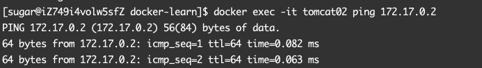

**结论：容器和容器之间是可以互相ping通的。**


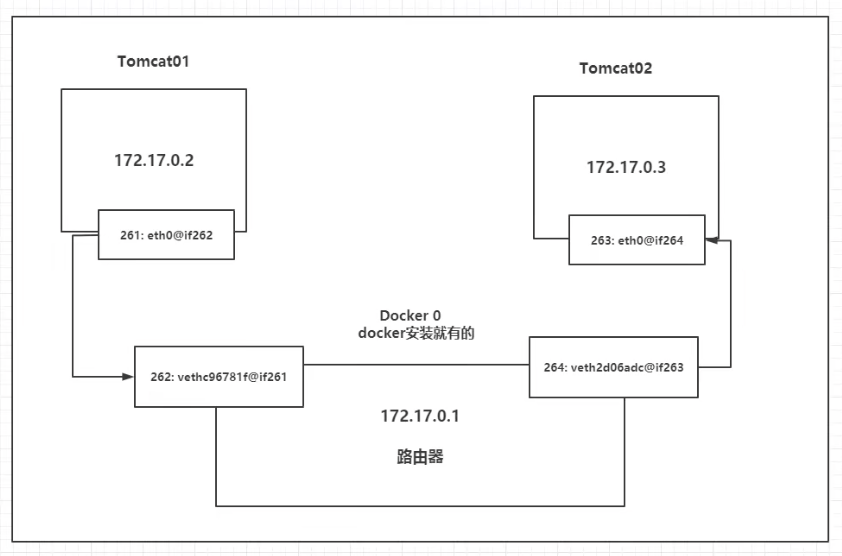

结论：tomcat01 和 tomcat02 是共用同一个路由器（docker0）。

所有的容器在不指定网络的情况下，都是通过 docker0 路由的，docker会给容器分配一个默认的可用IP。


小结

- Docker使用的是Linux的桥接模式，宿主机中是一个Docker容器的网桥 docker0。大约能分配65535个。
- Docker 中的所有网络接口都是虚拟的。因为虚拟的转发效率高。
- 只要容器删除，对应的一对网桥就没了。


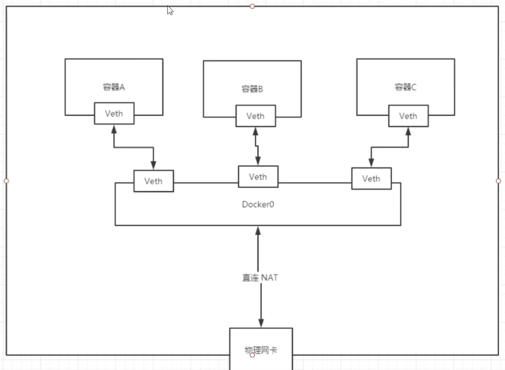


### 9.2 --link

场景：编写了一个微服务，database url=ip:，项目不重启，数据库ip换掉了，希望可以处理这个问题，通过名字来进行访问容器

==> link

```bash
# 直接ping服务名不通
[sugar@iZ749i4volw5sfZ docker-learn]$ docker exec -it tomcat02 ping tomcat01
ping: tomcat01: Name or service not known

# 如何解决？ --link

# 通过 --link解决ping通问题
[sugar@iZ749i4volw5sfZ docker-learn]$ docker run -d -P --name tomcat03 --link tomcat02 tomcat_ip:1.0

[sugar@iZ749i4volw5sfZ docker-learn]$ docker exec -it tomcat03 ping tomcat02
PING tomcat02 (172.17.0.3) 56(84) bytes of data.
64 bytes from tomcat02 (172.17.0.3): icmp_seq=1 ttl=64 time=0.101 ms
64 bytes from tomcat02 (172.17.0.3): icmp_seq=2 ttl=64 time=0.058 ms

# 反向可以ping通吗？不行
[sugar@iZ749i4volw5sfZ docker-learn]$ docker exec -it tomcat02 ping tomcat03
ping: tomcat03: Name or service not known

# 查看docker网络配置
docker network inspect 容器ID
```

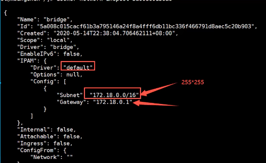

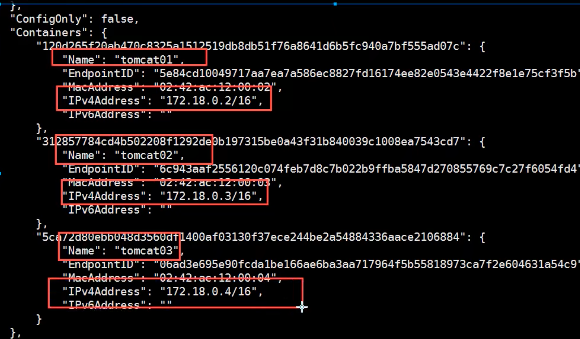

tomcat03在本地配置了tomcat02的地址。

```bash
# 查看hosts配置，发现原理！
# --link就是在hosts配置中，增加了一个172.17.0.3 tomcat028的配置。
[sugar@iZ749i4volw5sfZ docker-learn]$ docker exec -it tomcat03 cat /etc/hosts
127.0.0.1       localhost
::1     localhost ip6-localhost ip6-loopback
fe00::0 ip6-localnet
ff00::0 ip6-mcastprefix
ff02::1 ip6-allnodes
ff02::2 ip6-allrouters
172.17.0.3      tomcat02 f7eeff808d50
172.17.0.4      dfb24685524e
```

目前Docker开发已经不建议使用 --link了。

需要自定义网络！不使用docker0！

**docker0的局限性：**不支持容器名连接访问


### 9.3 自定义网络

查看所有的 docker 网络

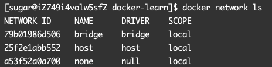

##### 网络模式

- brige：桥接（默认），在docker上搭桥，0.1和0.2通过docker互联
- none：不配置网络
- host：和宿主机共享网络
- container：容器内网络连通（用得少，局限性较大）

**docker0特点**

- 默认
- 域名不能访问
- --link可以打通连接

**测试**

```shell
# 直接启动的命令 --net bridge，这个就是我们的docker0
[sugar@iZ749i4volw5sfZ docker-learn]$ docker run -d -P --name tomcat01 --net bridge tomcat_net:1.0

# 我们可以自定义一个网络！
# --driver bridge  桥接模式
# --subnet 192.168.0.0/16  子网范围:192.168.0.2 ~ 192.168.255.255
# --gateway 192.168.0.1  网关
[sugar@iZ749i4volw5sfZ docker-learn]$ docker network create --driver bridge --subnet 192.168.0.0/16 --gateway 192.168.0.1 mynet
d5fb9a4a2ae701f80d79ffb1046a7ac4eb55ab237d7a0c086abbd394c89f5beb
[sugar@iZ749i4volw5sfZ docker-learn]$ docker network ls
NETWORK ID     NAME      DRIVER    SCOPE
79b01986d506   bridge    bridge    local
25f2e1abb552   host      host      local
d5fb9a4a2ae7   mynet     bridge    local
a53f52a0a700   none      null      local
```

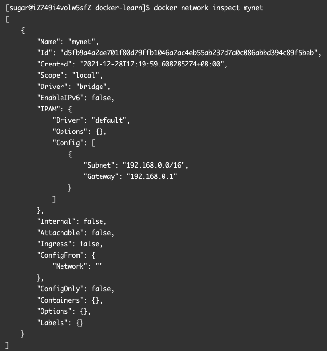

至此，自己的网络就创建好了，后面的服务可以放在自己的网络中。

```shell
[sugar@iZ749i4volw5sfZ docker-learn]$ docker run -d -P --name tomcat-net-01 --net mynet tomcat_net:1.0
a02d180005ee61d2c39448670d9ce5263af5745eb6ce1bb2ca3ccd67aab1299a
[sugar@iZ749i4volw5sfZ docker-learn]$ docker run -d -P --name tomcat-net-02 --net mynet tomcat_net:1.0
63a4d6ca7acc597df926ca9f4c2d9517c3712e55090abd51742d2523e26920a3
# 用mynet新建的两个容器，网络地址都加入到 Containers中。
[sugar@iZ749i4volw5sfZ docker-learn]$ docker network inspect mynet
[
    {
        "Name": "mynet",
        "Id": "d5fb9a4a2ae701f80d79ffb1046a7ac4eb55ab237d7a0c086abbd394c89f5beb",
        "Created": "2021-12-28T17:19:59.608285274+08:00",
        "Scope": "local",
        "Driver": "bridge",
        "EnableIPv6": false,
        "IPAM": {
            "Driver": "default",
            "Options": {},
            "Config": [
                {
                    "Subnet": "192.168.0.0/16",
                    "Gateway": "192.168.0.1"
                }
            ]
        },
        "Internal": false,
        "Attachable": false,
        "Ingress": false,
        "ConfigFrom": {
            "Network": ""
        },
        "ConfigOnly": false,
        "Containers": {
            "63a4d6ca7acc597df926ca9f4c2d9517c3712e55090abd51742d2523e26920a3": {
                "Name": "tomcat-net-02",
                "EndpointID": "ccf1ef6dd04d7ba743f2e73218c0d08a5ee5cefd33ee320da83bc828c18d4a47",
                "MacAddress": "02:42:c0:a8:00:03",
                "IPv4Address": "192.168.0.3/16",
                "IPv6Address": ""
            },
            "a02d180005ee61d2c39448670d9ce5263af5745eb6ce1bb2ca3ccd67aab1299a": {
                "Name": "tomcat-net-01",
                "EndpointID": "5d07a53c9261a2ae006a77189a38ac1f411762dc7f1bd50cb8f3d65214246db9",
                "MacAddress": "02:42:c0:a8:00:02",
                "IPv4Address": "192.168.0.2/16",
                "IPv6Address": ""
            }
        },
        "Options": {},
        "Labels": {}
    }
]

# ping测试
# 现在不使用 --link，也可以ping通容器名
[sugar@iZ749i4volw5sfZ docker-learn]$ docker exec -it tomcat-net-01 ping 192.168.0.3
PING 192.168.0.3 (192.168.0.3) 56(84) bytes of data.
64 bytes from 192.168.0.3: icmp_seq=1 ttl=64 time=0.062 ms
64 bytes from 192.168.0.3: icmp_seq=2 ttl=64 time=0.066 ms

[sugar@iZ749i4volw5sfZ docker-learn]$ docker exec -it tomcat-net-01 ping tomcat-net-02
PING tomcat-net-02 (192.168.0.3) 56(84) bytes of data.
64 bytes from tomcat-net-02.mynet (192.168.0.3): icmp_seq=1 ttl=64 time=0.040 ms
64 bytes from tomcat-net-02.mynet (192.168.0.3): icmp_seq=2 ttl=64 time=0.062 ms
```

自定义的网络docker已经帮我们维护好了对应的关系，推荐这样使用自定义网络。


**好处：**

搭建redis或mysql集群，让不同的集群使用不同的网络，保证集群是安全和健康的。


### 9.4 网络联通

对于不同网段的容器，是无法联通的。

```shell
[sugar@iZ749i4volw5sfZ docker-learn]$ docker exec -it tomcat01 ping tomcat-net-01
ping: tomcat-net-01: Name or service not known
```

解决问题的核心：**connect**

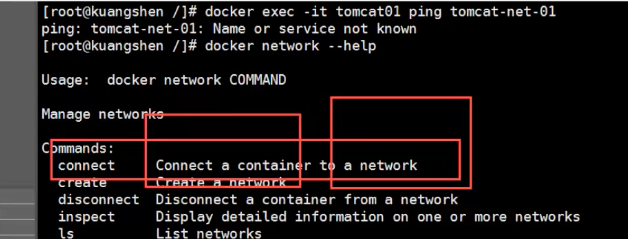

命令：

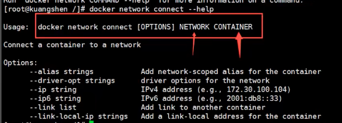

```shell
# 测试，打通 tomcat01 -> mynet
[sugar@iZ749i4volw5sfZ docker-learn]$ docker network connect mynet tomcat01
# 连通之后，将tomcat01加入到 mynet 网络中
# 一个容器两个ip地址！
[sugar@iZ749i4volw5sfZ docker-learn]$ docker network inspect mynet
[
    {
        "Name": "mynet",
        "Id": "d5fb9a4a2ae701f80d79ffb1046a7ac4eb55ab237d7a0c086abbd394c89f5beb",
        "Created": "2021-12-28T17:19:59.608285274+08:00",
        "Scope": "local",
        "Driver": "bridge",
        "EnableIPv6": false,
        "IPAM": {
            "Driver": "default",
            "Options": {},
            "Config": [
                {
                    "Subnet": "192.168.0.0/16",
                    "Gateway": "192.168.0.1"
                }
            ]
        },
        "Internal": false,
        "Attachable": false,
        "Ingress": false,
        "ConfigFrom": {
            "Network": ""
        },
        "ConfigOnly": false,
        "Containers": {
            "63a4d6ca7acc597df926ca9f4c2d9517c3712e55090abd51742d2523e26920a3": {
                "Name": "tomcat-net-02",
                "EndpointID": "ccf1ef6dd04d7ba743f2e73218c0d08a5ee5cefd33ee320da83bc828c18d4a47",
                "MacAddress": "02:42:c0:a8:00:03",
                "IPv4Address": "192.168.0.3/16",
                "IPv6Address": ""
            },
            "a02d180005ee61d2c39448670d9ce5263af5745eb6ce1bb2ca3ccd67aab1299a": {
                "Name": "tomcat-net-01",
                "EndpointID": "5d07a53c9261a2ae006a77189a38ac1f411762dc7f1bd50cb8f3d65214246db9",
                "MacAddress": "02:42:c0:a8:00:02",
                "IPv4Address": "192.168.0.2/16",
                "IPv6Address": ""
            },
            "cd0bcbf7619fbf6f6d1f69b9c525daa810a4e2cb1af433e5e3c1612981670d18": {
                "Name": "tomcat01",
                "EndpointID": "76f992fdc4615f22971ac543f509dda0e41cfaf4859a8e4752bf4d35f8b5ff2a",
                "MacAddress": "02:42:c0:a8:00:04",
                "IPv4Address": "192.168.0.4/16",
                "IPv6Address": ""
            }
        },
        "Options": {},
        "Labels": {}
    }
]
```

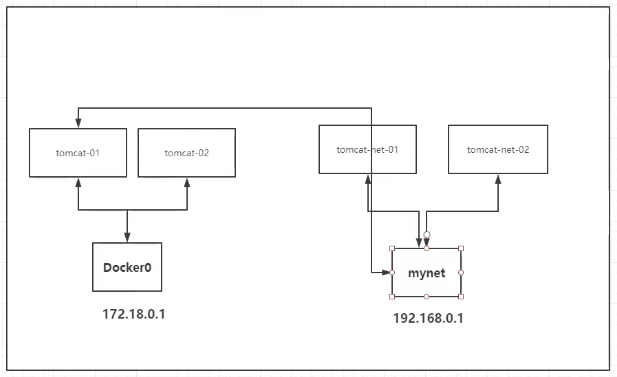

只能将容器与网络打通，无法将网络与网络打通。

```shell
# 测试，tomcat01 打通 tomcat-net-02
[sugar@iZ749i4volw5sfZ docker-learn]$ docker exec -it tomcat01 ping tomcat-net-01
PING tomcat-net-01 (192.168.0.2) 56(84) bytes of data.
64 bytes from tomcat-net-01.mynet (192.168.0.2): icmp_seq=1 ttl=64 time=0.068 ms
64 bytes from tomcat-net-01.mynet (192.168.0.2): icmp_seq=2 ttl=64 time=0.063 ms
```

**结论：假设要跨网络操作，就需要使用 docker network connect 连通。**


### 9.5 实战：部署Redis集群

方案：分片模式，3台master，3台备用机，当master宕机后，备用机自动顶上。

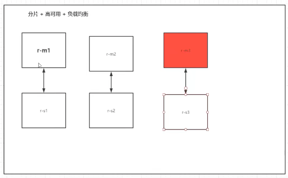

```shell
# 创建 redis 集群网卡
[sugar@iZ749i4volw5sfZ docker-learn]$ docker network create redis --subnet 172.38.0.0/16

# 通过脚本创建六个redis配置
for port in $(seq 1 6); \
do \
mkdir -p /home/sugar/dev/docker-learn/redis-cluster/node-${port}/conf
touch /home/sugar/dev/docker-learn/redis-cluster/node-${port}/conf/redis.conf
cat << EOF >/home/sugar/dev/docker-learn/redis-cluster/node-${port}/conf/redis.conf
port 6379
bind 0.0.0.0
cluster-enabled yes
cluster-config-file nodes.conf
cluster-node-timeout 5000
cluster-announce-ip 172.38.0.1${port}
cluster-announce-port 6379
cluster-announce-bus-port 16379
appendonly yes
EOF
done

# 逐个启动redis
docker run -p 6371:6379 -p 16371:16379 --name redis-1 \
-v /home/sugar/dev/docker-learn/redis-cluster/node-1/data:/data \
-v /home/sugar/dev/docker-learn/redis-cluster/node-1/conf/redis.conf:/etc/redis/redis.conf \
-d --net redis --ip 172.38.0.11 redis:5.0.9-alpine3.11 redis-server /etc/redis/redis.conf

# 创建 集群
# 进入某个redis节点，配置集群  docker exec -it redis-1 /bin/sh，默认进入/data目录
/data # redis-cli --cluster create 172.38.0.11:6379 172.38.0.12:6379 172.38.0.13:6379 172.38.0.1
4:6379 172.38.0.15:6379 172.38.0.16:6379 --cluster-replicas 1
>>> Performing hash slots allocation on 6 nodes...
Master[0] -> Slots 0 - 5460
Master[1] -> Slots 5461 - 10922
Master[2] -> Slots 10923 - 16383
Adding replica 172.38.0.15:6379 to 172.38.0.11:6379
Adding replica 172.38.0.16:6379 to 172.38.0.12:6379
Adding replica 172.38.0.14:6379 to 172.38.0.13:6379
M: f2f7f1f6d2df8e21cfb585a0ef5ba0446fb49032 172.38.0.11:6379
   slots:[0-5460] (5461 slots) master
M: d82e3c2a745fdc05c7f94eba404a025d79369c94 172.38.0.12:6379
   slots:[5461-10922] (5462 slots) master
M: 0c67dbc04019dbd72d8c9cc6cbc6100078f560bf 172.38.0.13:6379
   slots:[10923-16383] (5461 slots) master
S: eec83f149a6c91d0d66d1d4cbec8ce9fc12f0f7f 172.38.0.14:6379
   replicates 0c67dbc04019dbd72d8c9cc6cbc6100078f560bf
S: 09590d4d7a0685ed72386f3a2415f481ac0ee84e 172.38.0.15:6379
   replicates f2f7f1f6d2df8e21cfb585a0ef5ba0446fb49032
S: b351231aabd5328d9a7e9f8a13f29acf0c483cd9 172.38.0.16:6379
   replicates d82e3c2a745fdc05c7f94eba404a025d79369c94
Can I set the above configuration? (type 'yes' to accept): yes
>>> Nodes configuration updated
>>> Assign a different config epoch to each node
>>> Sending CLUSTER MEET messages to join the cluster
Waiting for the cluster to join
....
>>> Performing Cluster Check (using node 172.38.0.11:6379)
M: f2f7f1f6d2df8e21cfb585a0ef5ba0446fb49032 172.38.0.11:6379
   slots:[0-5460] (5461 slots) master
   1 additional replica(s)
M: d82e3c2a745fdc05c7f94eba404a025d79369c94 172.38.0.12:6379
   slots:[5461-10922] (5462 slots) master
   1 additional replica(s)
M: 0c67dbc04019dbd72d8c9cc6cbc6100078f560bf 172.38.0.13:6379
   slots:[10923-16383] (5461 slots) master
   1 additional replica(s)
S: eec83f149a6c91d0d66d1d4cbec8ce9fc12f0f7f 172.38.0.14:6379
   slots: (0 slots) slave
   replicates 0c67dbc04019dbd72d8c9cc6cbc6100078f560bf
S: 09590d4d7a0685ed72386f3a2415f481ac0ee84e 172.38.0.15:6379
   slots: (0 slots) slave
   replicates f2f7f1f6d2df8e21cfb585a0ef5ba0446fb49032
S: b351231aabd5328d9a7e9f8a13f29acf0c483cd9 172.38.0.16:6379
   slots: (0 slots) slave
   replicates d82e3c2a745fdc05c7f94eba404a025d79369c94
[OK] All nodes agree about slots configuration.
>>> Check for open slots...
>>> Check slots coverage...
[OK] All 16384 slots covered.
```

测试Redis集群高可用

```shell
# 查看集群信息，注意 -c 才是集群登录，不加-c是单机登录
/data # redis-cli -c 
127.0.0.1:6379> cluster info
cluster_state:ok
cluster_slots_assigned:16384
cluster_slots_ok:16384
cluster_slots_pfail:0
cluster_slots_fail:0
cluster_known_nodes:6
cluster_size:3
cluster_current_epoch:6
cluster_my_epoch:1
cluster_stats_messages_ping_sent:242
cluster_stats_messages_pong_sent:239
cluster_stats_messages_sent:481
cluster_stats_messages_ping_received:234
cluster_stats_messages_pong_received:242
cluster_stats_messages_meet_received:5
cluster_stats_messages_received:481
127.0.0.1:6379> cluster nodes
d82e3c2a745fdc05c7f94eba404a025d79369c94 172.38.0.12:6379@16379 master - 0 1640686826062 2 connected 5461-10922
0c67dbc04019dbd72d8c9cc6cbc6100078f560bf 172.38.0.13:6379@16379 master - 0 1640686825000 3 connected 10923-16383
f2f7f1f6d2df8e21cfb585a0ef5ba0446fb49032 172.38.0.11:6379@16379 myself,master - 0 1640686826000 1 connected 0-5460
eec83f149a6c91d0d66d1d4cbec8ce9fc12f0f7f 172.38.0.14:6379@16379 slave 0c67dbc04019dbd72d8c9cc6cbc6100078f560bf 0 1640686826000 4 connected
09590d4d7a0685ed72386f3a2415f481ac0ee84e 172.38.0.15:6379@16379 slave f2f7f1f6d2df8e21cfb585a0ef5ba0446fb49032 0 1640686826862 5 connected
b351231aabd5328d9a7e9f8a13f29acf0c483cd9 172.38.0.16:6379@16379 slave d82e3c2a745fdc05c7f94eba404a025d79369c94 0 1640686825862 6 connected

# 添加key，定向到13这台master
127.0.0.1:6379> set a b
-> Redirected to slot [15495] located at 172.38.0.13:6379
OK

# 为了测试高可用，将13这台redis停掉
[sugar@iZ749i4volw5sfZ redis-cluster]$ docker stop redis-3

# 再次获取 key
/data # redis-cli -c
127.0.0.1:6379> get a
-> Redirected to slot [15495] located at 172.38.0.14:6379
"b"

# 可以看到，即使13这台redis被停了，14这台备用redis自动顶上了，证明了集群的高可用性

# 重新查看集群节点信息
# 可见 13 master fail，master转移到 14
172.38.0.14:6379> cluster nodes
b351231aabd5328d9a7e9f8a13f29acf0c483cd9 172.38.0.16:6379@16379 slave d82e3c2a745fdc05c7f94eba404a025d79369c94 0 1640687132344 6 connected
eec83f149a6c91d0d66d1d4cbec8ce9fc12f0f7f 172.38.0.14:6379@16379 myself,master - 0 1640687130000 7 connected 10923-16383
d82e3c2a745fdc05c7f94eba404a025d79369c94 172.38.0.12:6379@16379 master - 0 1640687131000 2 connected 5461-10922
09590d4d7a0685ed72386f3a2415f481ac0ee84e 172.38.0.15:6379@16379 slave f2f7f1f6d2df8e21cfb585a0ef5ba0446fb49032 0 1640687131343 5 connected
f2f7f1f6d2df8e21cfb585a0ef5ba0446fb49032 172.38.0.11:6379@16379 master - 0 1640687131000 1 connected 0-5460
0c67dbc04019dbd72d8c9cc6cbc6100078f560bf 172.38.0.13:6379@16379 master,fail - 1640687040367 1640687038855 3 connected
```

### 9.6 SpringBoot微服务打包Docker镜像

1. 构建springboot项目
2. 打jar包
3. 编写 dockerfile，将jar包和dockerfile同目录上传到服务器

```dockerfile
 FROM java:8
 COPY *.jar /app.jar
 CMD ["--server.port=8080"]
 EXPOSE 8080
 ENTRYPOINT ["java", "-jar", "/app.jar"]
```

1. 构建镜像

```shell
[sugar@iZ749i4volw5sfZ idea]$ docker build -t sugar666 .
```

1. 发布运行

```shell
# 查看镜像
[sugar@iZ749i4volw5sfZ idea]$ docker images
REPOSITORY   TAG                IMAGE ID       CREATED             SIZE
sugar666     latest             001af1d72b6b   5 seconds ago       661MB
tomcat_net   1.0                42b5534d3d6c   About an hour ago   706MB
tomcat_ip    1.0                229b89cf1631   2 hours ago         704MB
tomcat       latest             fb5657adc892   5 days ago          680MB
redis        5.0.9-alpine3.11   3661c84ee9d0   20 months ago       29.8MB
java         8                  d23bdf5b1b1b   4 years ago         643MB
# 启动容器
[sugar@iZ749i4volw5sfZ idea]$ docker run -d -P --name sugar-web sugar666
ed4138e830cb05f6edc7dcec78c7add5f9fb1e8a82b3db822481aaa360f4fe97
# 查看端口
[sugar@iZ749i4volw5sfZ idea]$ docker ps
CONTAINER ID   IMAGE      COMMAND                  CREATED         STATUS         PORTS                     NAMES
ed4138e830cb   sugar666   "java -jar /app.jar …"   9 seconds ago   Up 8 seconds   0.0.0.0:49165->8080/tcp   sugar-web
# 调用接口，成功显示
[sugar@iZ749i4volw5sfZ idea]$ curl localhost:49165/hello
Hello world.
```

**以后交付一个镜像即可！**


**如果有很多很多镜像？？**


## 十、Docker Compose

### 10.1 简介

传统Docker流程：

DockerFile  build  run 手动操作，单个容器！

微服务。100个微服务！存在依赖关系，一个个启动非常麻烦！

Docker Compose 来轻松高效的管理容器。定义运行多个容器。

官方介绍

**定义、运行多个容器。**

**YAML file 配置文件。**

**single command。 命令有哪些？**

Compose is a tool for defining and running multi-container Docker applications. With Compose, you use a YAML file to configure your application’s services. Then, with a single command, you create and start all the services from your configuration. To learn more about all the features of Compose, see [the list of features](https://docs.docker.com/compose/#features).

**所有的环境都可以使用 Compose。**

Compose works in all environments: production, staging, development, testing, as well as CI workflows. You can learn more about each case in [Common Use Cases](https://docs.docker.com/compose/#common-use-cases).

**三步骤：**

Using Compose is basically a three-step process:

1. Define your app’s environment with a Dockerfile so it can be reproduced anywhere.

- - **Dockerfile保证我们的项目在任何地方可以运行。**

1. Define the services that make up your app in docker-compose.yml so they can be run together in an isolated environment.

- - **service 什么是服务。**
  - **docker-compose.yml 这个文件怎么写。**

1. Run docker compose up and the [Docker compose command](https://docs.docker.com/compose/cli-command/) starts and runs your entire app. You can alternatively run docker-compose up using the docker-compose binary.

- - **启动项目**


**作用总结：批量容器编排。**

Compose 是 Docker官方的开源项目，需要安装！

Dockerfile 让程序在任何地方运行。web服务、redis、mysql、nginx...多个容器。

用类似以下的yaml文件，完成打包：

```yaml
version: "3.9"  # optional since v1.27.0
services:
  web:
    build: .
    ports:
      - "5000:5000"
    volumes:
      - .:/code
      - logvolume01:/var/log
    links:
      - redis
  redis:
    image: redis
volumes:
  logvolume01: {}
```

Compose：两个重要的概念。

- 服务service：容器。应用。（web、redis、mysql...）
- 项目project：一组关联的容器。


### 10.2 Compose安装

下载地址：https://docs.docker.com/compose/install/


1. 下载

```shell
sudo curl -L "https://github.com/docker/compose/releases/download/1.29.2/docker-compose-$(uname -s)-$(uname -m)" -o /usr/local/bin/docker-compose

# 上面官方地址很慢，下面国内镜像要快
sudo curl -L https://get.daocloud.io/docker/compose/releases/download/1.29.2/docker-compose-`uname -s`-`uname -m` > /usr/local/bin/docker-compose
```

1. 获取执行权限

```shell
sudo chmod +x /usr/local/bin/docker-compose
```

1. 验证安装成功

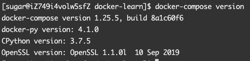


### 10.3 Docker-Compose功能测试

官方文档地址：https://docs.docker.com/compose/gettingstarted/

测试场景：Python Web，使用Redis做计数器。

##### 3.1 编写Python应用

1. 创建项目文件夹

```shell
mkdir composetest
cd composetest
```

1. 创建 app.py 文件

```python
import time

import redis
from flask import Flask

app = Flask(__name__)
cache = redis.Redis(host='redis', port=6379)

def get_hit_count():
    retries = 5
    while True:
        try:
            return cache.incr('hits')
        except redis.exceptions.ConnectionError as exc:
            if retries == 0:
                raise exc
            retries -= 1
            time.sleep(0.5)

@app.route('/')
def hello():
    count = get_hit_count()
    return 'Hello World! I have been seen {} times.\n'.format(count)
```

1. 创建 requirements.txt 文件

```shell
flask
redis
```


##### 3.2 创建 Dockerfile

必须命名为 `Dockerfile`的文件。

```shell
# syntax=docker/dockerfile:1
FROM python:3.7-alpine
WORKDIR /code
ENV FLASK_APP=app.py
ENV FLASK_RUN_HOST=0.0.0.0
RUN apk add --no-cache gcc musl-dev linux-headers
COPY requirements.txt requirements.txt
RUN pip install -r requirements.txt
EXPOSE 5000
COPY . .
CMD ["flask", "run"]
```


##### 3.3 在Compose文件中定义服务

`docker-compose.yml` 文件

```yaml
version: "3.9"
services:
  web:
    build: .
    ports:
      - "5000:5000"
  redis:
    image: "redis:alpine"
```

定义两个服务：web 和 redis。

web服务：使用从Dockerfile构建的镜像，将容器与本机暴露的5000端口绑定，示例服务将使用Flask Web默认端口5000.

redis服务：redis使用从Docker Hub公开的镜像。


##### 3.4 使用Compose构建和运行app 

1. 从项目目录，通过 `docker-compose up`命令启动应用
   Compose拉取Redis镜像，由代码构建镜像，启动定义的服务。为了以防万一，在构建时代码被完全复制到镜像中。

```shell
[sugar@iZ749i4volw5sfZ composetest]$ docker-compose up
Building web
Sending build context to Docker daemon  6.656kB
Step 1/10 : FROM python:3.7-alpine
 ---> a1034fd13493
Step 2/10 : WORKDIR /code
 ---> Using cache
 ---> 0b88cb2d3d8a
Step 3/10 : ENV FLASK_APP=app.py
 ---> Using cache
 ---> 8d77274a8b7c
Step 4/10 : ENV FLASK_RUN_HOST=0.0.0.0
 ---> Using cache
 ---> 2290dee335fa
Step 5/10 : RUN apk add --no-cache gcc musl-dev linux-headers
 ---> Running in 85123fe029dc
fetch https://dl-cdn.alpinelinux.org/alpine/v3.15/main/x86_64/APKINDEX.tar.gz
fetch https://dl-cdn.alpinelinux.org/alpine/v3.15/community/x86_64/APKINDEX.tar.gz
(1/13) Installing libgcc (10.3.1_git20211027-r0)
(2/13) Installing libstdc++ (10.3.1_git20211027-r0)
(3/13) Installing binutils (2.37-r3)
(4/13) Installing libgomp (10.3.1_git20211027-r0)
(5/13) Installing libatomic (10.3.1_git20211027-r0)
(6/13) Installing libgphobos (10.3.1_git20211027-r0)
(7/13) Installing gmp (6.2.1-r0)
(8/13) Installing isl22 (0.22-r0)
(9/13) Installing mpfr4 (4.1.0-r0)
(10/13) Installing mpc1 (1.2.1-r0)
(11/13) Installing gcc (10.3.1_git20211027-r0)
(12/13) Installing linux-headers (5.10.41-r0)
(13/13) Installing musl-dev (1.2.2-r7)
Executing busybox-1.34.1-r3.trigger
OK: 139 MiB in 48 packages
Removing intermediate container 85123fe029dc
 ---> f8a3ef932a5a
Step 6/10 : COPY requirements.txt requirements.txt
 ---> 7fae14aad5df
Step 7/10 : RUN pip install -r requirements.txt
 ---> Running in 6fb5f723430c
Collecting flask
  Downloading Flask-2.0.2-py3-none-any.whl (95 kB)
Collecting redis
  Downloading redis-4.1.0-py3-none-any.whl (171 kB)
Collecting click>=7.1.2
  Downloading click-8.0.3-py3-none-any.whl (97 kB)
Collecting Werkzeug>=2.0
  Downloading Werkzeug-2.0.2-py3-none-any.whl (288 kB)
Collecting itsdangerous>=2.0
  Downloading itsdangerous-2.0.1-py3-none-any.whl (18 kB)
Collecting Jinja2>=3.0
  Downloading Jinja2-3.0.3-py3-none-any.whl (133 kB)
Collecting packaging>=21.3
  Downloading packaging-21.3-py3-none-any.whl (40 kB)
Collecting importlib-metadata>=1.0
  Downloading importlib_metadata-4.10.0-py3-none-any.whl (17 kB)
Collecting deprecated>=1.2.3
  Downloading Deprecated-1.2.13-py2.py3-none-any.whl (9.6 kB)
Collecting wrapt<2,>=1.10
  Downloading wrapt-1.13.3-cp37-cp37m-musllinux_1_1_x86_64.whl (78 kB)
Collecting zipp>=0.5
  Downloading zipp-3.7.0-py3-none-any.whl (5.3 kB)
Collecting typing-extensions>=3.6.4
  Downloading typing_extensions-4.0.1-py3-none-any.whl (22 kB)
Collecting MarkupSafe>=2.0
  Downloading MarkupSafe-2.0.1-cp37-cp37m-musllinux_1_1_x86_64.whl (30 kB)
Collecting pyparsing!=3.0.5,>=2.0.2
  Downloading pyparsing-3.0.6-py3-none-any.whl (97 kB)
Installing collected packages: zipp, typing-extensions, wrapt, pyparsing, MarkupSafe, importlib-metadata, Werkzeug, packaging, Jinja2, itsdangerous, deprecated, click, redis, flask
Successfully installed Jinja2-3.0.3 MarkupSafe-2.0.1 Werkzeug-2.0.2 click-8.0.3 deprecated-1.2.13 flask-2.0.2 importlib-metadata-4.10.0 itsdangerous-2.0.1 packaging-21.3 pyparsing-3.0.6 redis-4.1.0 typing-extensions-4.0.1 wrapt-1.13.3 zipp-3.7.0
WARNING: Running pip as the 'root' user can result in broken permissions and conflicting behaviour with the system package manager. It is recommended to use a virtual environment instead: https://pip.pypa.io/warnings/venv
WARNING: You are using pip version 21.2.4; however, version 21.3.1 is available.
You should consider upgrading via the '/usr/local/bin/python -m pip install --upgrade pip' command.
Removing intermediate container 6fb5f723430c
 ---> 23dddc65fd92
Step 8/10 : EXPOSE 5000
 ---> Running in ef9576f86f85
Removing intermediate container ef9576f86f85
 ---> 6205c2925c4c
Step 9/10 : COPY . .
 ---> 3a1781bd2ead
Step 10/10 : CMD ["flask", "run"]
 ---> Running in 61f5c8a68de7
Removing intermediate container 61f5c8a68de7
 ---> d4444b48f108
Successfully built d4444b48f108
Successfully tagged composetest_web:latest
WARNING: Image for service web was built because it did not already exist. To rebuild this image you must use `docker-compose build` or `docker-compose up --build`.
Pulling redis (redis:alpine)...
alpine: Pulling from library/redis
59bf1c3509f3: Already exists
719adce26c52: Pull complete
b8f35e378c31: Pull complete
d034517f789c: Pull complete
3772d4d76753: Pull complete
211a7f52febb: Pull complete
Digest: sha256:4bed291aa5efb9f0d77b76ff7d4ab71eee410962965d052552db1fb80576431d
Status: Downloaded newer image for redis:alpine
Creating composetest_web_1   ... done
Creating composetest_redis_1 ... done
Attaching to composetest_redis_1, composetest_web_1
redis_1  | 1:C 05 Jan 2022 13:10:34.927 # oO0OoO0OoO0Oo Redis is starting oO0OoO0OoO0Oo
redis_1  | 1:C 05 Jan 2022 13:10:34.927 # Redis version=6.2.6, bits=64, commit=00000000, modified=0, pid=1, just started
redis_1  | 1:C 05 Jan 2022 13:10:34.927 # Warning: no config file specified, using the default config. In order to specify a config file use redis-server /path/to/redis.conf
redis_1  | 1:M 05 Jan 2022 13:10:34.931 * monotonic clock: POSIX clock_gettime
redis_1  | 1:M 05 Jan 2022 13:10:34.932 * Running mode=standalone, port=6379.
redis_1  | 1:M 05 Jan 2022 13:10:34.932 # WARNING: The TCP backlog setting of 511 cannot be enforced because /proc/sys/net/core/somaxconn is set to the lower value of 128.
redis_1  | 1:M 05 Jan 2022 13:10:34.932 # Server initialized
redis_1  | 1:M 05 Jan 2022 13:10:34.932 # WARNING overcommit_memory is set to 0! Background save may fail under low memory condition. To fix this issue add 'vm.overcommit_memory = 1' to /etc/sysctl.conf and then reboot or run the command 'sysctl vm.overcommit_memory=1' for this to take effect.
redis_1  | 1:M 05 Jan 2022 13:10:34.932 * Ready to accept connections
web_1    |  * Serving Flask app 'app.py' (lazy loading)
web_1    |  * Environment: production
web_1    |    WARNING: This is a development server. Do not use it in a production deployment.
web_1    |    Use a production WSGI server instead.
web_1    |  * Debug mode: off
web_1    |  * Running on all addresses.
web_1    |    WARNING: This is a development server. Do not use it in a production deployment.
web_1    |  * Running on http://172.19.0.3:5000/ (Press CTRL+C to quit)
```

自动的默认规则：

- 根据yml的service配置，自动拉取镜像，运行容器
  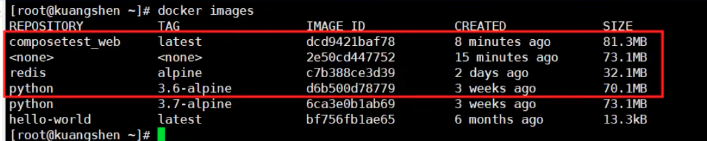
- 默认的服务名：文件名_服务器_number（副本数量，在集群状态下，服务有多个运行实例）
- 项目中的内容默认在同一个网络下，可以通过域名访问（这也是app.py中，redis的host写为redis的原因，其通过域名访问）
  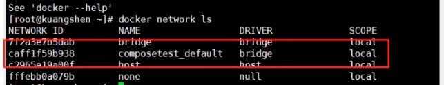
  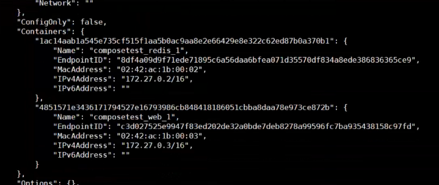


1. 访问  http://ip:5000 地址，看到应用正在执行。

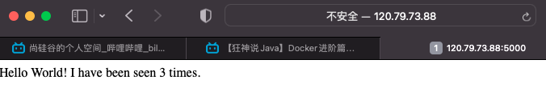

1. 刷新页面，计数器更新。
2. 新启终端，通过 `docker image ls`查看本地镜像
3. 可在项目目录通过 `docker-compose down`命令或终端界面`CTRL+C`关闭app。


##### 3.5 编辑 Compose 文件，增加数据卷绑定

- `volumes`关键词：将本机项目目录与容器内 /code目录做数据卷绑定，允许动态修改代码，而不用重新构建镜像。
- `enviroment`关键词：设置 FLASK_ENV 环境变量，告诉 flask run以开发模式启动，随时重载代码。

```yaml
version: "3.9"
services:
  web:
    build: .
    ports:
      - "5000:5000"
    volumes:
      - .:/code
    environment:
      FLASK_ENV: development
  redis:
    image: "redis:alpine"
```

##### 3.6 使用Compose重新构建和运行app

使用 `docker-compose up`命令

```shell
[sugar@iZ749i4volw5sfZ composetest]$ docker-compose up
Recreating composetest_web_1 ... done
Starting composetest_redis_1 ... done
Attaching to composetest_redis_1, composetest_web_1
redis_1  | 1:C 05 Jan 2022 13:25:25.273 # oO0OoO0OoO0Oo Redis is starting oO0OoO0OoO0Oo
redis_1  | 1:C 05 Jan 2022 13:25:25.273 # Redis version=6.2.6, bits=64, commit=00000000, modified=0, pid=1, just started
redis_1  | 1:C 05 Jan 2022 13:25:25.273 # Warning: no config file specified, using the default config. In order to specify a config file use redis-server /path/to/redis.conf
redis_1  | 1:M 05 Jan 2022 13:25:25.274 * monotonic clock: POSIX clock_gettime
redis_1  | 1:M 05 Jan 2022 13:25:25.275 * Running mode=standalone, port=6379.
redis_1  | 1:M 05 Jan 2022 13:25:25.275 # WARNING: The TCP backlog setting of 511 cannot be enforced because /proc/sys/net/core/somaxconn is set to the lower value of 128.
redis_1  | 1:M 05 Jan 2022 13:25:25.275 # Server initialized
redis_1  | 1:M 05 Jan 2022 13:25:25.275 # WARNING overcommit_memory is set to 0! Background save may fail under low memory condition. To fix this issue add 'vm.overcommit_memory = 1' to /etc/sysctl.conf and then reboot or run the command 'sysctl vm.overcommit_memory=1' for this to take effect.
redis_1  | 1:M 05 Jan 2022 13:25:25.275 * Loading RDB produced by version 6.2.6
redis_1  | 1:M 05 Jan 2022 13:25:25.275 * RDB age 77 seconds
redis_1  | 1:M 05 Jan 2022 13:25:25.275 * RDB memory usage when created 0.79 Mb
redis_1  | 1:M 05 Jan 2022 13:25:25.275 # Done loading RDB, keys loaded: 1, keys expired: 0.
redis_1  | 1:M 05 Jan 2022 13:25:25.275 * DB loaded from disk: 0.000 seconds
redis_1  | 1:M 05 Jan 2022 13:25:25.275 * Ready to accept connections
web_1    |  * Serving Flask app 'app.py' (lazy loading)
web_1    |  * Environment: development
web_1    |  * Debug mode: on
web_1    |  * Running on all addresses.
web_1    |    WARNING: This is a development server. Do not use it in a production deployment.
web_1    |  * Running on http://172.19.0.3:5000/ (Press CTRL+C to quit)
web_1    |  * Restarting with stat
web_1    |  * Debugger is active!
web_1    |  * Debugger PIN: 139-520-616
```


##### 3.7 更新app

由于应用代码已通过数据卷做了绑定，所以可以修改代码，并即时看见变化，而不需要重新构建镜像。

修改 `app.py`文件，重新访问页面。

```python
return 'Hello World! I have been seen {} times.\n'.format(count)

修改为 

return 'Hello World Docker! I have been seen {} times.\n'.format(count)
```

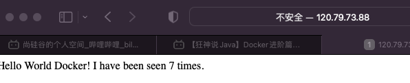

##### 3.8 其他命令

- 后台运行：`docker compose up -d`
- 查看正在运行的：`docker-compose ps`
- 启动服务中的一次性命令：`docker-compose run`

- - 查看 web 服务可用的环境变量：`docker-compose run web env`

- 关闭后台运行：`docker-compose stop`
- 移除整个容器：`docker-compose down --volumes`，--volumes参数移除了redis容器的数据卷


### 10.4 Docker小结

1. Docker镜像 run ==> 容器
2. DockerFile 构建镜像（服务打包）
3. docker-compose 启动项目（编排、多个微服务/环境）
4. Docker网络


### 10.5 Compose配置编写规则（YAML规则）

官方文档：https://docs.docker.com/compose/compose-file/compose-file-v3/

```yaml
# 3层
 
# 第一层：版本 
version: ‘’  # 与Docker版本对应
# 第二层：服务
services: 
  服务1: web
  	# 服务配置，docker容器的配置，都可以写在这里
    images
    build
    network
    ...
  服务2: redis
  	...
  服务3: redis
  	...
# 第三层：其他配置，网络/卷、全局规划
volumes:
networks:
configs:
  
```

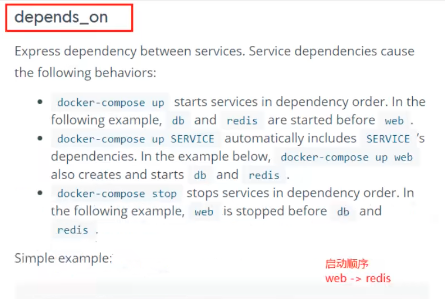


### 10.6 Compose一键启动wordpress

官方文档：https://docs.docker.com/samples/wordpress/

1. 创建空项目文件夹 `my_wordpress`
2. 进入文件夹 `cd my_wordpress`
3. 创建 `docker-compose.yml`
   独立一个mysql实例，使用数据卷使数据持久化

```yaml
version: "3.9"
    
services:
  db:
    image: mysql:5.7
    volumes:
      - db_data:/var/lib/mysql
    restart: always
    environment:
      MYSQL_ROOT_PASSWORD: somewordpress
      MYSQL_DATABASE: wordpress
      MYSQL_USER: wordpress
      MYSQL_PASSWORD: wordpress
    
  wordpress:
    depends_on:
      - db
    image: wordpress:latest
    volumes:
      - wordpress_data:/var/www/html
    ports:
      - "8000:80"
    restart: always
    environment:
      WORDPRESS_DB_HOST: db
      WORDPRESS_DB_USER: wordpress
      WORDPRESS_DB_PASSWORD: wordpress
      WORDPRESS_DB_NAME: wordpress
volumes:
  db_data: {}
  wordpress_data: {}
```

1. 启动项目 `docker-compose up -d`
2. 访问地址 ip:8000，查看并安装 wordpress
3. 关闭项目

1. 1. 移除容器和默认网络，保留数据：`docker-compose down`
   2. 移除容器、默认网络和数据：`docker-compose down --volumes`


### 10.7 Compose部署Springboot计数器项目

1. 新建Springboot项目`docker-counter`（编写微服务项目）

新建 `HelloController.java`

```java
@RestController
public class HelloContoller {

    @Autowired
    StringRedisTemplate redisTemplate;

    @GetMapping
    public String hello() {
        Long views = redisTemplate.opsForValue().increment("views");
        return "Hello world, views : " + views;
    }
}
```

修改配置文件 `application.yml`

注意，redis.host为redis，容器内通过域名访问

```yaml
server:
  port: 9000
spring:
  redis:
    host: redis
```

1. 编写 `Dockerfile`（dockerfile构建镜像）

```shell
FROM java:8

COPY *.jar /app.jar

CMD ["--server.port=9000"]

EXPOSE 9000

ENTRYPOINT ["java", "-jar", "/app.jar"]
```

1. 编写 `docker-compose.yml`（docker-compose.yml编排项目）

```yaml
version: "3.9"
services:
  sugarapp:
    build: .
    image: sugarapp
    depends_on:
      - redis
    ports:
      - "9000:9000"  
  redis:
    image: "library/redis:alpine"
    
```

1. 打包jar包，将（jar包，Dockerfile，docker-compose.yml）丢到服务器，启动 `docker-compose up`

```shell
[sugar@iZ749i4volw5sfZ sugarapp]$ docker-compose up
Creating network "sugarapp_default" with the default driver
Building sugarapp
Sending build context to Docker daemon  27.55MB
Step 1/5 : FROM java:8
 ---> d23bdf5b1b1b
Step 2/5 : COPY *.jar /app.jar
 ---> 791acc81e0b1
Step 3/5 : CMD ["--server.port=9000"]
 ---> Running in e11d4615124f
Removing intermediate container e11d4615124f
 ---> 2e51253ddec8
Step 4/5 : EXPOSE 9000
 ---> Running in e20a4f2c37e6
Removing intermediate container e20a4f2c37e6
 ---> 829e8ca7c7d5
Step 5/5 : ENTRYPOINT ["java", "-jar", "/app.jar"]
 ---> Running in 32271fc3a680
Removing intermediate container 32271fc3a680
 ---> 6c2ae8d050b6
Successfully built 6c2ae8d050b6
Successfully tagged sugarapp:latest
WARNING: Image for service sugarapp was built because it did not already exist. To rebuild this image you must use `docker-compose build` or `docker-compose up --build`.
Creating sugarapp_redis_1 ... done
Creating sugarapp_sugarapp_1 ... done
Attaching to sugarapp_redis_1, sugarapp_sugarapp_1
redis_1     | 1:C 05 Jan 2022 13:21:00.405 # oO0OoO0OoO0Oo Redis is starting oO0OoO0OoO0Oo
redis_1     | 1:C 05 Jan 2022 13:21:00.405 # Redis version=6.2.6, bits=64, commit=00000000, modified=0, pid=1, just started
redis_1     | 1:C 05 Jan 2022 13:21:00.405 # Warning: no config file specified, using the default config. In order to specify a config file use redis-server /path/to/redis.conf
redis_1     | 1:M 05 Jan 2022 13:21:00.406 * monotonic clock: POSIX clock_gettime
redis_1     | 1:M 05 Jan 2022 13:21:00.407 * Running mode=standalone, port=6379.
redis_1     | 1:M 05 Jan 2022 13:21:00.407 # WARNING: The TCP backlog setting of 511 cannot be enforced because /proc/sys/net/core/somaxconn is set to the lower value of 128.
redis_1     | 1:M 05 Jan 2022 13:21:00.407 # Server initialized
redis_1     | 1:M 05 Jan 2022 13:21:00.408 # WARNING overcommit_memory is set to 0! Background save may fail under low memory condition. To fix this issue add 'vm.overcommit_memory = 1' to /etc/sysctl.conf and then reboot or run the command 'sysctl vm.overcommit_memory=1' for this to take effect.
redis_1     | 1:M 05 Jan 2022 13:21:00.408 * Ready to accept connections
sugarapp_1  | 
sugarapp_1  |   .   ____          _            __ _ _
sugarapp_1  |  /\\ / ___'_ __ _ _(_)_ __  __ _ \ \ \ \
sugarapp_1  | ( ( )\___ | '_ | '_| | '_ \/ _` | \ \ \ \
sugarapp_1  |  \\/  ___)| |_)| | | | | || (_| |  ) ) ) )
sugarapp_1  |   '  |____| .__|_| |_|_| |_\__, | / / / /
sugarapp_1  |  =========|_|==============|___/=/_/_/_/
sugarapp_1  |  :: Spring Boot ::                (v2.6.2)
sugarapp_1  | 
sugarapp_1  | 2022-01-05 13:21:04.236  INFO 1 --- [           main] c.e.d.DockerCounterApplication           : Starting DockerCounterApplication v0.0.1-SNAPSHOT using Java 1.8.0_111 on 9a361107742e with PID 1 (/app.jar started by root in /)
sugarapp_1  | 2022-01-05 13:21:04.243  INFO 1 --- [           main] c.e.d.DockerCounterApplication           : No active profile set, falling back to default profiles: default
sugarapp_1  | 2022-01-05 13:21:06.496  INFO 1 --- [           main] .s.d.r.c.RepositoryConfigurationDelegate : Multiple Spring Data modules found, entering strict repository configuration mode!
```

1. 访问地址 ip:9000，显示正常


**项目重新部署打包：**

- `docker-compose up --build`重新部署


**小结**：

- 未来项目有 docker-compose 文件，可以按照这个规则，启动编排容器。
- 公司：docker-compose，直接启动。
- 开源项目：docker-compose，直接启动。


**总结：**

**工程、服务、容器**

- 工程 Project
- 服务 Services，通过Dockerfile构建工程镜像
- 容器 Container，由镜像运行实例


## 十一、Docker Swarm


### 11.1 购买服务器

以集群方式部署，需要4台阿里云服务器。


### 11.2 4台机器安装Docker


### 11.3 工作模式

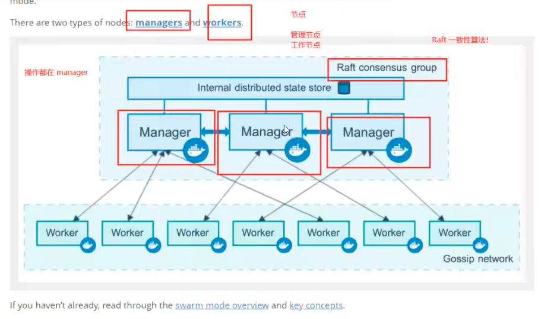

要在管理节点上操作，至少要有三个管理节点。

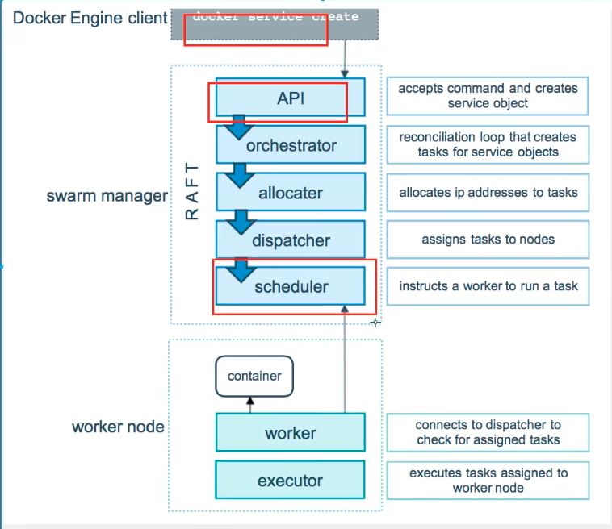


### 11.4 配置

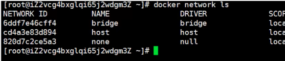

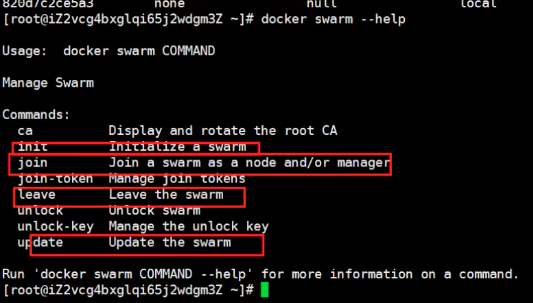

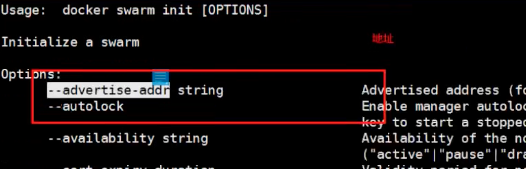


```shell
# 查看本机网络地址 
ip addr

# 将某一台服务器设为主机
docker swarm init --advertise-addr ip地址
```


将一台机器设为主节点

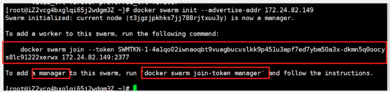


加入节点：`docker swarm join`

```shell
# 获取令牌，生成加入命令（执行后，得到现成命令，从节点可直接执行以加入swarm）
docker swarm join-token manager
docker swarm join-token worker
```

w将其他机器设为从节点（加入swarm）

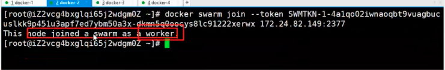

查看节点信息（两主两从结构）

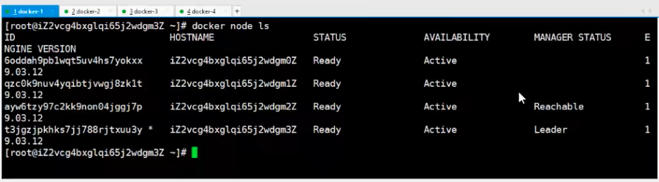


步骤：

1. 生成主节点 `docker swarm init`
2. 加入（manager、worker）


### 11.5 Raft一致性协议

双主双从”假设一个节点挂了，其他节点是否可以用？

Raft协议：保证大多数节点存活才可以用，即配置的集群管理节点数量至少大于3台，存活的管理节点至少大于1台！

实验：

1. 将docker1机器停止，宕机！双主，另外一个主节点也不能使用了！
   将docker1恢复后，Leader变成了docker3，docker1变成了Reachable，不再是Leader。

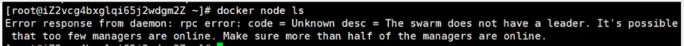

1. 将其他节点离开

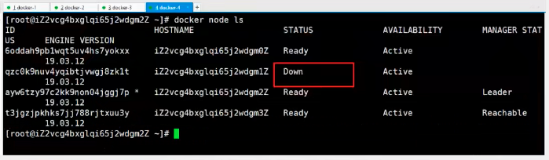

1. worker仅工作，无法使用管理节点命令！
2. 设置3台机器为管理节点，挂掉其中一个管理节点，集群依然可以使用。挂掉其中两个管理节点，则集群不能使用。


### 11.6 体验

告别 docker run！

单机：docker-compose up！启动一个项目。

集群：swarm  `docker service`

容器 ==> 服务 ==> 副本！

redis服务 => 10个副本（同时开启10个redis容器）

体验：创建服务、动态扩展服务、动态更新服务。

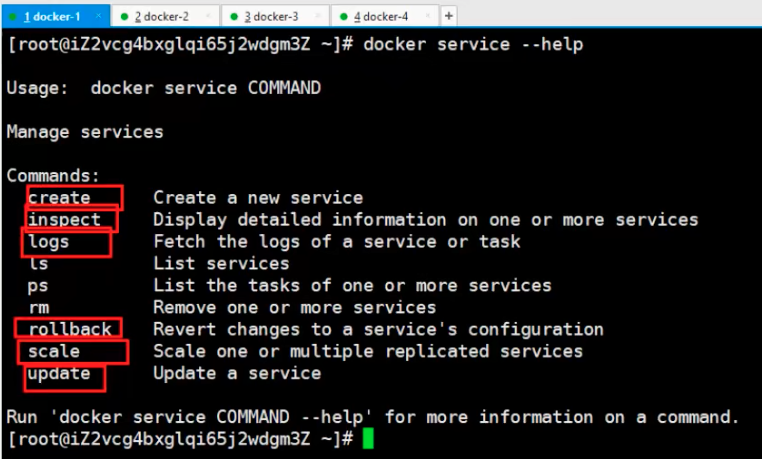

灰度发布：金丝雀发布！

```shell
# 启动nginx服务，docker service和docker run类似，但是启动的是服务
docker service create -p 8888:80 --name my-nginx nginx

# docker run 容器启动，不具有扩缩容功能。
# docker service 服务启动，具有扩缩容功能，滚动更新！

docker service ps my-nginx
docker service ls
```

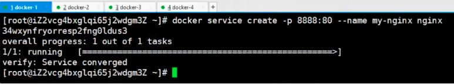

服务有REPLICAS的概念，副本！

此时副本数为 1，在不同机器上查看 `docker ps`，发现该服务跑在docker3上，而不是在启动的docker1熵。

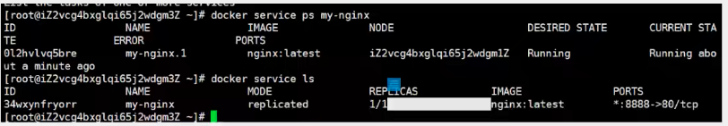

将 my-nginx 服务的副本数设置为3，将自动创建副本到其他机器上。

无论访问四台机器中的哪一台，都能够访问到服务。

即虽然docker1没有运行服务，但访问docker1的地址，依然能访问到nginx。

四台机器作为一个集群整体，对外提供服务。

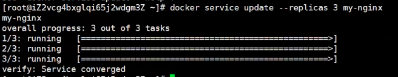

动态扩缩容，配置10个副本，每台机器上跑多个服务。

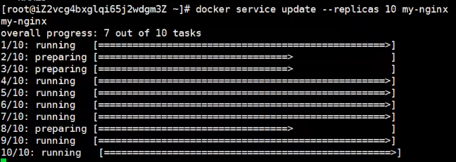

也可以动态配置为只有1个副本，其他副本就会被remove。


也可以通过 `docker service scale`命令实现动态扩缩容，等价于 `docker service update --replicas`

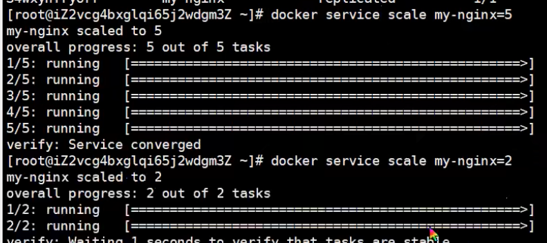


通过 `docker service rm my-nginx`移除服务。


### 11.7 概念总结

**swarm**

集群的管理和编排，docker可以初始化一个swarm集群，其他节点可以加入。（Manager和Worker）

**Node**

是一个docker多个节点组成一个网络集群。

**Service**

任务，可以在管理节点或者工作节点来运行，核心！用户访问！

**Task**

容器内的命令，细节任务！

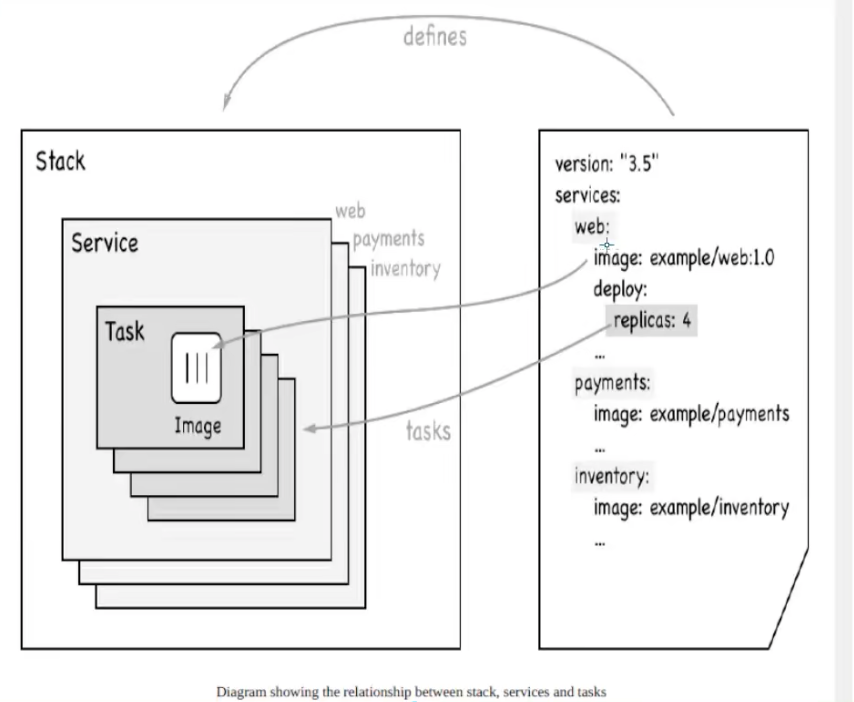

命令 -》 管理 -》 api -》 调度 -》 工作节点（创建Task容器维护创建）


扩展：网络模式：“PublishMode”：“ingress”

Swarm

Overlay

ingress：特殊的 Overlay 网络，负载均衡的功能！IPVS VIP！


通过inspect命令可得，虽然docker在4台机器上，实际网络是同一个！ingress网络是一个特殊的Overlay 网络

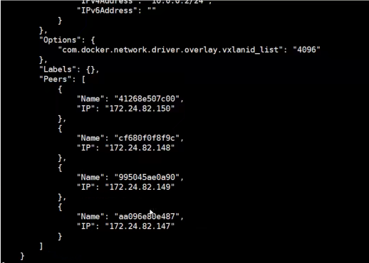


## 12 Docker Stack

单机部署项目：docker-compose

集群部署项目：docker Stack

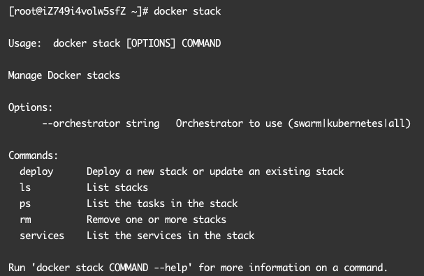

```shell
# 单机
docker-compose up -d wordpress.yaml
# 集群
docker stack deploy wordpress.yaml
```

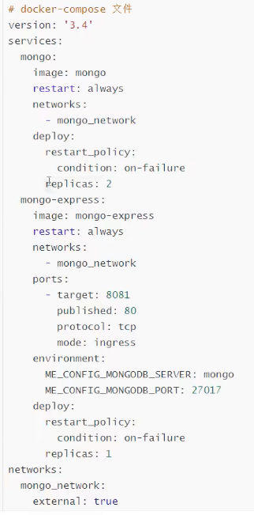


## 13 Docker Secret

安装！配置密码，证书！

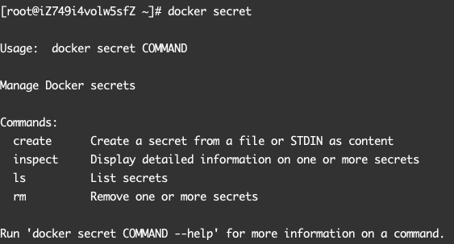


## 14 Docker Config

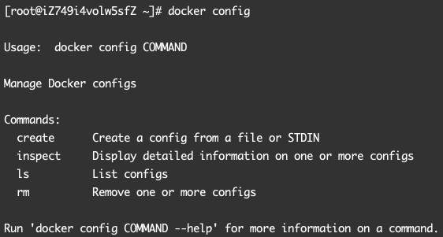


## 15 K8s

云原生时代，Go语言


