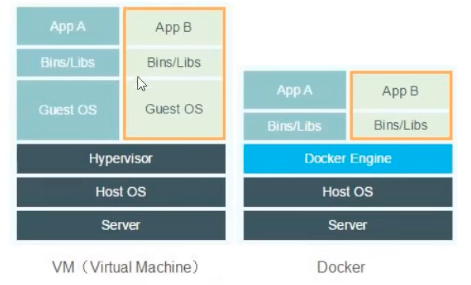

# Docker

> 学前准备

- linux（常用命令如：cd  mkdir）
- SpringBoot

> 学习内容

基础内容：

- Docker概述
- Docker安装
- Docker命令
  - 镜像命令
  - 容器命令
  - 操作命令
  - ...
- Docker镜像
- 容器数据卷
- DockerFile
- Docker网络原理
- IDEA整合Docker

企业级内容：

- Docker Compose
- Docker Swarm
- CI\CD Jenkins

------

## 一、Docker概述

### 1.1 Docker为什么出现？

常规来说，一款产品从开发到上线，一般需要两套应用环境。在不同的环境下需要进行不同的应用配置。

开发和运维工作过程中常遇到问题：

- 软件在自己的电脑上可以运行但在别的电脑环境下不能运行。
- 版本更新，导致服务不可用。

这对运维工作来说考验很大。

此外：

- 环境配置十分麻烦，每一台机器都要部署环境（集群、ES、Hadoop），费时费力！
- 例如在服务器配置一个应用环境：Redis MySQL jdk ES Hadoop，配置超麻烦，而且不能跨平台

**因此，能否有一种方案使得项目在发布的时候带上环境安装打包？**

传统开发模式：开发人员开发jar，运维人员来进行部署

现在开发模式：开发人员直接打包部署上线，一套流程做完！

例如：

原来：Java -- apk -- 发布（应用商店） --- 张三使用apk -- 安装即可用

现在：Java -- jar(环境) ---- 打包项目带上环境（镜像） -- （Docker仓库：商店） -- 下载我们发布的镜像，直接运行即可！


**Docker给以上问题，提出了解决方案！**

Docker 的思想就来源于集装箱！他是一种隔离的思想：

将各种应用的环境进行隔离，然后打包装箱，因此每个箱子都是隔离的！

Docker通过隔离机制，可以将服务器利用到极致！


**本质：所有的技术都是因为出现了一些问题需要解决，才去学习！**


### 1.2 Docker的历史

> 历史介绍

2020年，几个搞IT的年轻人在美国成立了一家公司`dotCloud`。主要做pass的云计算服务！LXC有关的容器技术！他们将自己的容器化技术命名为Docker！Docker刚诞生的时候，没有引起行业的注意！dotCloud就无法生存！


2013年，Docker开源。越来越多的人发现了 docker的优点。docker火了，每个月都会更新一个版本！


2014年4月9日，Docker1.0版本发布！


Docker为什么这么火？因为它十分轻巧！

在容器技术出现之前，开发者都用的虚拟机技术！


对比：

虚拟机：在window中装一个Vmvare，通过这个软件我们可以虚拟一台或者多台电脑。但这样十分笨重！

虚拟机也属于虚拟化技术，Docker容器技术，也是一种虚拟化技术！

```
vm： linux cenntos 原生镜像（一个电脑！） 隔离，需要开启多个 虚拟！通常需要几个G，消耗几分钟开启！
docker：隔离 ，镜像（只包含最核心的环境：4m+jdk+mysql）,十分小巧，运行镜像就可以了！可能只需要几M，KB！秒级启动！
```


到现在，所有的开发人员都需要docker！


> 聊聊Docker

Docker是基于 Go语言开发的！是一个开源项目！

官网：https://www.docker.com/

Docker的文档在官网的最下方：


文档地址：https://docs.docker.com/

Docker的文档超级详细，好好研读！

Docker远程仓库：https://hub.docker.com/


### 1.3 Docker的功能

> 之前的虚拟机技术

 

虚拟机技术的缺点：

- 资源占用十分的多
- 冗余步骤多
- 启动很慢


> 容器化技术

**容器化技术不是模拟一个完整的操作系统**


> 比较虚拟机技术和Docker技术的不同：

- 传统虚拟机，虚拟出一条硬件，运行一个完整的操作系统，然后在这个系统上安装和运行软件
- 同期内的应用直接运行在宿主机内，容器没有自己的内核，也没有虚拟我们的硬件，所以就轻便了
- 每个容器间是相互隔离的，每个容器都有一个属于自己的文件系统，互不影响


> DevOps（开发和运维）

**应用更快速的交付和部署**

传统：一堆帮助文档，安装程序

Docker：打包镜像发布测试，一键运行

**更便捷的升级和扩容缩容**

使用了Docker之后，我们部署应用就和搭积木一样

项目打包为一个镜像，扩展服务器A，服务器B！

**更便捷的运维**

在容器化之后，我们的开发、测试环境都是高度一致的。

**更高效的计算资源利用**

Docker是内核级别的虚拟化，可以在一个物理机上运行很多的容器实例！服务器的性能可以被压榨到极致。


------

## 二、Docker安装

### 2.1 Docker的基本组成

架构图如下：


下面先来简单了解以下几个名词。


**镜像(Image):**

docker镜像就好比是一个模板，可以通过这个模板来创建容器服务，例如一个Tomcat镜像===》run===》tomcat01容器（提供服务器），通过这个镜像可以创建多个容器（最终服务运行或者项目运行就是在容器中的）。

**容器(container):**

Docker利用容器技术，独立运行一个或者一个组应用，通过镜像来创建的。

启动，停止，删除，基本命令！

目前就可以把这个容器理解为一个简易的linux系统。

**仓库(repository):**

仓库就是存放镜像的地方！

仓库分为公有仓库和私有仓库！

Docker hub这个仓库默认是国外的。

阿里云...都有容器服务器（配置镜像加速！）


### 2.2 安装Docker

> 环境准备

1. 需要会一些Linux基础
2. CentOS 7：将Docker安装到云服务器中
3. 使用远程控制软件，连接远程服务器进行操作!  (Xshell在macos不能使用，因此下载FinallShell)

> 环境查看

查看云服务器系统内核版本信息：

```
3.10.0-1160.11.1.el7.x86_64   #系统内核是3.10以上的
```

系统版本：

```
[root@VM-24-12-centos ~]# cat /etc/os-release
NAME="CentOS Linux"
VERSION="7 (Core)"
ID="centos"
ID_LIKE="rhel fedora"
VERSION_ID="7"
PRETTY_NAME="CentOS Linux 7 (Core)"
ANSI_COLOR="0;31"
CPE_NAME="cpe:/o:centos:centos:7"
HOME_URL="https://www.centos.org/"
BUG_REPORT_URL="https://bugs.centos.org/"

CENTOS_MANTISBT_PROJECT="CentOS-7"
CENTOS_MANTISBT_PROJECT_VERSION="7"
REDHAT_SUPPORT_PRODUCT="centos"
REDHAT_SUPPORT_PRODUCT_VERSION="7"
```

> 具体安装

将Docker安装到自己的云服务器中，帮助文档中有详细的安装步骤。


上面这张图像开始就是正式的安装过程了。根据其说明，步骤总结如下：

1. 首先卸载旧的版本 Uninstall old versions。下面的命令中我们实际操作时不加sudo：

   ```
   sudo yum remove docker \
                     docker-client \
                     docker-client-latest \
                     docker-common \
                     docker-latest \
                     docker-latest-logrotate \
                     docker-logrotat
   ```

2. 然后选择一种方法进行安装。文档中目前有三种安装方法，我们选择其中通过仓库安装的方法：Install using the repository：

   - 首先安装基本环境——仓库：

     ```cmake
     安装仓库需要的安装包：
     (sudo) yum install -y yum-utils
     
     设置仓库的镜像：
     yum-config-manager \
         --add-repo \ https://download.docker.com/linux/centos/docker-ce.repo    # [这个地址是国外的，不推荐]
     
      yum-config-manager --add-repo http://mirrors.aliyun.com/docker-ce/linux/centos/docker-ce.repo  #[这个镜像是国内的可以使用，这我们使用这个]
     ```

     

   - 然后更新yum软件包索引

     ```
     yum makecache fast
     ```

   - 接下来安装docker—— Install Docker Engine：

     ```cmake
     # PS：docker-ce是社区版，ee是企业版。这里我们安装社区版
     yum install docker-ce docker-ce-cli containerd.io
     ```

3. 安装完毕，下面启动docker并测试：

   启动：

   ```cmake
   # 启动docker
   systemctl start docker
   # 查看版本信息
   docker version
   ```

   测试“hello world”：

   ```cmake
   docker run hello-world
   ```

   

   在上面的运行结果图中：

   - 红色的表示运行命令
   - 蓝色的表示没有在本地找到图像，所以去拉取镜像
   - 黄色的表示成功执行的结果（此时就表示docker安装成功了）

   下面验证镜像是否被下载成功？即查看一下下载的hello-world镜像：

   ```
   docker images
   ```

   


### 2.3 阿里云镜像加速

- 进入阿里云官网，注册并登录阿里云账号。找到“容器镜像服务”。

- 然后在此服务的控制台处找到镜像加速器地址。

  

- 然后用上图中的四个命令进行配置:

  ```cmake
  sudo mkdir -p /etc/docker
  
  sudo tee /etc/docker/daemon.json <<-'EOF'
  {
   "registry-mirrors": ["https://d109z3as.mirror.aliyuncs.com"]
  }
  EOF
  
  sudo systemctl daemon-reload
  
  sudo systemctl restart docker
  ```
  
  第一个命令：创建一个docker目录；
  
  第二个文件：在docker目录中有一个.json文件，给这个文件配置了一个阿里云的地址
  
  第三个命令：重启镜像
  
  第四个命令：重启docker
  
  
  
  这样就配置好了！
  
   

### 2.4 卸载docker

完全卸载docker需要以下手动操作。

```
# 第一步：卸载依赖
yum remove docker-ce docker-ce-cli containerd.io

# 第二步：卸载资源环境
rm -rf /var/lib/docker
rm -rf /var/lib/containerd
```

上面的命令中：`/var/lib/docker` 是docker的默认工作路径。


### 2.5 回顾HelloWorld


`docker run helloworld` 后，是怎么一步步启动寻找镜像的呢？我们来理清楚：


### 2.6 docker底层原理

**- docker 是怎么工作的？**

Docker 是一个 Client - Server 结构的系统，Docker 的守护进程(服务)运行在主机上。通过Scoket从客户端访问！

Docker Server 接收到 Docker Client的指令，就会执行这个命令！


**- Docker 为什么比 VM 快？**

1. Docker有比虚拟机更少的抽象层
2. Docker 利用的是宿主机的内核，VM 需要 Guest OS。



所以，新建一个容器的时候，Docker 不需要像虚拟机一样重新加载一个操作系统内核，避免引导操作；虚拟机是加载 Guest OS，分钟级别的，而Docker是利用宿主机的操作系统，省略了复杂的过程，秒级！


------

## 三、Docker 常用命令

### 3.1 帮助命令

```shell
docker version  # 显示docker的版本信息
docker info     # docker系统信息，包括镜像和容器的数量
docker 命令 --help  # 帮助命令（万能命令）	
```

帮助文档的地址：https://docs.docker.com/engine/reference


### 3.2 镜像命令

#### **docker images : 查看所有本地主机上的镜像**

```shell
[root@VM-24-12-centos ~]# docker images
REPOSITORY    TAG       IMAGE ID       CREATED        SIZE
hello-world   latest    feb5d9fea6a5   5 months ago   13.3kB
==================================解释===============================
# 解释
REPOSITORY	镜像的仓库源(镜像的名字、搜索时镜像的名字)
TAG					镜像标签（版本信息）
IMAGE ID		镜像的id
CREATED			镜像的创建时间
SIZE				镜像大小

# 可选项
 -a, --all             # 列出所有镜像
      --digests         Show digests
  -f, --filter filter   Filter output based on conditions provided
      --format string   Pretty-print images using a Go template
      --no-trunc        Don't truncate output
  -q, --quiet           # 只显示镜像id
=================================举例=================================
[root@VM-24-12-centos ~]# docker images -a
REPOSITORY    TAG       IMAGE ID       CREATED        SIZE
hello-world   latest    feb5d9fea6a5   5 months ago   13.3kB
[root@VM-24-12-centos ~]# docker images --all
REPOSITORY    TAG       IMAGE ID       CREATED        SIZE
hello-world   latest    feb5d9fea6a5   5 months ago   13.3kB
[root@VM-24-12-centos ~]# docker images --quiet
feb5d9fea6a5
[root@VM-24-12-centos ~]# docker images -q
feb5d9fea6a5

```


#### **docker search 搜索镜像**

```shell
[root@VM-24-12-centos ~]# docker search mysql
NAME                             DESCRIPTION                                     STARS     OFFICIAL   AUTOMATED
mysql                            MySQL is a widely used, open-source relation…   12218     [OK]       
mariadb                          MariaDB Server is a high performing open sou…   4690      [OK]       
mysql/mysql-server               Optimized MySQL Server Docker images. Create…   907                  [OK]
percona                          Percona Server is a fork of the MySQL relati…   571       [OK]       
phpmyadmin                       phpMyAdmin - A web interface for MySQL and M…   465       [OK]       
====================================================================  
搜索mysql镜像可以得到以上结果。
# 可选项
-f, --filter filter   Filter output based on conditions provided
      --format string   Pretty-print search using a Go template
      --limit int       Max number of search results (default 25)
      --no-trunc        Don't truncate output
====================================================================
# 通过收藏数stars来过滤，比如搜索收藏数大于3000的镜像： --filter=stars=3000
[root@VM-24-12-centos ~]# docker search mysql --filter=stars=3000
NAME      DESCRIPTION                                     STARS     OFFICIAL   AUTOMATED
mysql     MySQL is a widely used, open-source relation…   12218     [OK]       
mariadb   MariaDB Server is a high performing open sou…   4690      [OK]   
```


#### **docker pull 下载镜像**

```shell
# 下载镜像 docker pull 镜像名[:tag]
[root@VM-0-17-centos docker-learn]# docker pull mysql
Using default tag: latest  # 如果不写 tag，默认就是latest
latest: Pulling from library/mysql
a10c77af2613: Pull complete  # 分层下载，docker images的核心！联合文件系统！
b76a7eb51ffd: Pull complete 
258223f927e4: Pull complete 
2d2c75386df9: Pull complete 
63e92e4046c9: Pull complete 
f5845c731544: Pull complete 
bd0401123a9b: Pull complete 
3ef07ec35f1a: Pull complete 
c93a31315089: Pull complete 
3349ed800d44: Pull complete 
6d01857ca4c1: Pull complete 
4cc13890eda8: Pull complete 
Digest: sha256:aeecae58035f3868bf4f00e5fc623630d8b438db9d05f4d8c6538deb14d4c31b  # 签名(防伪)
Status: Downloaded newer image for mysql:latest
docker.io/library/mysql:latest  # Docker Hub上的真实地址


# 下载镜像的名字  等价于  直接从 Hub上真实地址下载
docker pull mysql == docker pull docker.io/library/mysql:latest 

# 下载指定版本（这个版本必须是Docker Hub上有的版本）
[root@VM-0-17-centos docker-learn]# docker pull mysql:5.7
5.7: Pulling from library/mysql
a10c77af2613: Already exists 
b76a7eb51ffd: Already exists 
258223f927e4: Already exists 
2d2c75386df9: Already exists 
63e92e4046c9: Already exists 
f5845c731544: Already exists 
bd0401123a9b: Already exists  # 分层下载的优势，已下载(Already)的不会重复下载，节省空间
2724b2da64fd: Pull complete 
d10a7e9e325c: Pull complete 
1c5fd9c3683d: Pull complete 
2e35f83a12e9: Pull complete 
Digest: sha256:7a3a7b7a29e6fbff433c339fc52245435fa2c308586481f2f92ab1df239d6a29 # 签名
Status: Downloaded newer image for mysql:5.7      # 下载状态成功                          
docker.io/library/mysql:5.7                       # 镜像的下载地址
```


#### **docker rmi 删除镜像**

说明：这里rmi可以理解为remove images

```shell
docker rmi -f 镜像id  						 	# 通过镜像id来删除指定镜像
docker rmi -f 镜像id 镜像id 镜像id   	# 删除多个镜像
docker rmi -f $(docker images -aq)  # 删除全部镜像，$()是一个查询语句表示查询所有镜像，然后再使用rmi命令递归删除所有的镜像
```

```shell
[root@VM-24-12-centos ~]# docker images         【查看下载到本地的所有镜像】
REPOSITORY    TAG       IMAGE ID       CREATED        SIZE
mysql         5.7       c20987f18b13   2 months ago   448MB
mysql         latest    3218b38490ce   2 months ago   516MB
hello-world   latest    feb5d9fea6a5   5 months ago   13.3kB
[root@VM-24-12-centos ~]# docker rmi -f c20987f18b13  【根据ID删除镜像】
Untagged: mysql:5.7
Untagged: mysql@sha256:f2ad209efe9c67104167fc609cca6973c8422939491c9345270175a300419f94
Deleted: sha256:c20987f18b130f9d144c9828df630417e2a9523148930dc3963e9d0dab302a76
Deleted: sha256:6567396b065ee734fb2dbb80c8923324a778426dfd01969f091f1ab2d52c7989
Deleted: sha256:0910f12649d514b471f1583a16f672ab67e3d29d9833a15dc2df50dd5536e40f
Deleted: sha256:6682af2fb40555c448b84711c7302d0f86fc716bbe9c7dc7dbd739ef9d757150
Deleted: sha256:5c062c3ac20f576d24454e74781511a5f96739f289edaadf2de934d06e910b92
[root@VM-24-12-centos ~]# docker images               【验证是否真的删除】
REPOSITORY    TAG       IMAGE ID       CREATED        SIZE
mysql         latest    3218b38490ce   2 months ago   516MB
hello-world   latest    feb5d9fea6a5   5 months ago   13.3kB
[root@VM-24-12-centos ~]# docker rmi -f $(docker images -aq) 【递归删除下载到本地的所有镜像】
Untagged: mysql:latest
Untagged: mysql@sha256:e9027fe4d91c0153429607251656806cc784e914937271037f7738bd5b8e7709
Deleted: sha256:3218b38490cec8d31976a40b92e09d61377359eab878db49f025e5d464367f3b
Deleted: sha256:aa81ca46575069829fe1b3c654d9e8feb43b4373932159fe2cad1ac13524a2f5
Deleted: sha256:0558823b9fbe967ea6d7174999be3cc9250b3423036370dc1a6888168cbd224d
Deleted: sha256:a46013db1d31231a0e1bac7eeda5ad4786dea0b1773927b45f92ea352a6d7ff9
Deleted: sha256:af161a47bb22852e9e3caf39f1dcd590b64bb8fae54315f9c2e7dc35b025e4e3
Deleted: sha256:feff1495e6982a7e91edc59b96ea74fd80e03674d92c7ec8a502b417268822ff
Deleted: sha256:8805862fcb6ef9deb32d4218e9e6377f35fb351a8be7abafdf1da358b2b287ba
Deleted: sha256:872d2f24c4c64a6795e86958fde075a273c35c82815f0a5025cce41edfef50c7
Deleted: sha256:6fdb3143b79e1be7181d32748dd9d4a845056dfe16ee4c827410e0edef5ad3da
Deleted: sha256:b0527c827c82a8f8f37f706fcb86c420819bb7d707a8de7b664b9ca491c96838
Deleted: sha256:75147f61f29796d6528486d8b1f9fb5d122709ea35620f8ffcea0e0ad2ab0cd0
Deleted: sha256:2938c71ddf01643685879bf182b626f0a53b1356138ef73c40496182e84548aa
Deleted: sha256:ad6b69b549193f81b039a1d478bc896f6e460c77c1849a4374ab95f9a3d2cea2
Untagged: hello-world:latest
Untagged: hello-world@sha256:97a379f4f88575512824f3b352bc03cd75e239179eea0fecc38e597b2209f49a
Deleted: sha256:feb5d9fea6a5e9606aa995e879d862b825965ba48de054caab5ef356dc6b3412
[root@VM-24-12-centos ~]# docker images                【查看并验证是否所有的镜像都删除了】
REPOSITORY   TAG       IMAGE ID   CREATED   SIZE
```


### 3.3 容器命令

*说明：有了镜像才可以创建容器，下载一个 centos 镜像作为例子进行测试学习*

```shell
docker pull centos
```


#### **1: 新建容器并启动**

> 镜像和容器的区别：可以理解为1对多的关系，基于一个镜像可以创建多个容器，容器与容器之间相互隔离。镜像包括具体的应用及环境，容器是镜像安装后的结果，只不过不同的容器之间互不干扰。

创建容器并启动的命令公式：

```shell
# 命令公式（容器来源于image）:
docker run [可选参数] image名字

# [可选参数]说明
--name="Name"  容器名字，用来区分容器，比如 tomcat01,tomcat02
-d						 后台方式运行，nohup
-it						 使用交互方式运行，进入容器查看内容(常用这个)
-p						 指定容器的端口
	-p  主机端口:容器端口（常用）
  -p  容器端口
	-p  ip:主机端口:容器端口  
-P						 随机指定端口
```

测试创建镜像centos的容器：

```shell
# 启动并进入容器（启动后主机名称变化，变成了docker ID！）
# run启动docker， -it以交互方式打开一个终端， /bin/bash表示shell工具运行地址或Linux控制台地址
[root@VM-24-12-centos ~]# docker run -it centos /bin/bash
[root@e711af76d16f /]# 

# 查看容器内的centos系统（此时的centos是基础版本，很多命令都不完善）
[root@0f5722faa978 /]# ls
bin  etc   lib    lost+found  mnt  proc  run   srv  tmp  var dev  home  lib64  media  opt  root  sbin  sys  usr

# 从容器退回主机,主机名称
[root@0f5722faa978 /]# exit
exit
[root@VM-24-12-centos ~]# 
```


#### **2: 列出所有容器**

命令公式：

```shell
docker ps [可选参数]
# docker ps： 列出当前正在运行的容器
# [可选参数]
#  -a    列出当前正在运行的容器 + 带出历史运行过的容器
#  -n=？ 显示最近创建的容器,例如-n=2表示最近运行过的2个容器
#  -q    只显示容器的编号
```

命令测试及结果：

```shell
[root@VM-24-12-centos ~]# docker ps
CONTAINER ID   IMAGE     COMMAND   CREATED   STATUS    PORTS     NAMES

[root@VM-24-12-centos ~]# docker ps -a
CONTAINER ID   IMAGE          COMMAND       CREATED         STATUS                       PORTS     NAMES
47d7257f28eb   centos         "/bin/bash"   4 minutes ago   Exited (127) 4 minutes ago             n1
0f5722faa978   centos         "/bin/bash"   7 minutes ago   Exited (0) 7 minutes ago               wizardly_ritchie
e711af76d16f   centos         "/bin/bash"   2 hours ago     Exited (0) 2 hours ago                 trusting_einstein
0e591d9ac45a   feb5d9fea6a5   "/hello"      3 days ago      Exited (0) 3 days ago                  objective_davinci

# 先查找所有运行过的容器，然后选择其中前1个显示
[root@VM-24-12-centos ~]# docker ps -a -n=1
CONTAINER ID   IMAGE     COMMAND       CREATED          STATUS                        PORTS     NAMES
47d7257f28eb   centos    "/bin/bash"   59 minutes ago   Exited (127) 59 minutes ago             n1

# 查找容器编号，只使用-q啥都没查到，因此需要和其他可选参数组合使用
[root@VM-24-12-centos ~]# docker ps -q
[root@VM-24-12-centos ~]# 

# 查找所有容器编号，以下命令等价于 docker ps -aq
[root@VM-24-12-centos ~]# docker ps -a -q
47d7257f28eb
0f5722faa978
e711af76d16f
0e591d9ac45a

# 查找前两个历史容器的编号
[root@VM-24-12-centos ~]# docker ps -aq -n=2
47d7257f28eb
0f5722faa978
[root@VM-24-12-centos ~]# docker ps -q -n=2
47d7257f28eb
0f5722faa978
```


#### **3: 退出容器**

命令或操作：

```shell
exit  # 直接容器停止并退出
Ctrl + P + Q # 容器不停止，退出
```

测试命令及操作：

```shell
# 1、查看现有运行容器：没有
[root@VM-24-12-centos ~]# docker ps
CONTAINER ID   IMAGE     COMMAND   CREATED   STATUS    PORTS     NAMES
# 2、创建并启动一个容器
[root@VM-24-12-centos ~]# docker run -it centos /bin/bash
# 3、使用exit命令停止容器并退出
[root@786fe3aa5d8a /]# exit
exit
# 4、查看此时正在运行的容器：没有
[root@VM-24-12-centos ~]# docker ps
CONTAINER ID   IMAGE     COMMAND   CREATED   STATUS    PORTS     NAMES
# 5、重新创建并启动一个容器
[root@VM-24-12-centos ~]# docker run -it centos /bin/bash
# 6、使用Ctrl+P+Q的方式退出容器（但不停止容器），直接查看现有运行容器
[root@44f67d9ee8f2 /]# [root@VM-24-12-centos ~]# docker ps
CONTAINER ID   IMAGE     COMMAND       CREATED          STATUS          PORTS     NAMES
44f67d9ee8f2   centos    "/bin/bash"   11 seconds ago   Up 11 seconds             sweet_swanson
[root@VM-24-12-centos ~]# 
```


#### **4: 删除容器** 

命令公式：

```shell
docker rm 容器id  # 删除指定容器，不能删除正在运行的容器，如要强制删除 rm -f
docker rm -f $(docker ps -aq)  # 删除所有容器
docker ps -a -q|xargs docker rm  # 删除所有容器
```

测试命令：

```shell
======================测试第一个删除命令======================
# 1、先查看所有容器的编号：其中第一个是正在运行的容器，第二个是已经停止的容器
[root@VM-24-12-centos ~]# docker ps -aq
44f67d9ee8f2
786fe3aa5d8a
# 2、删除第一个正在运行的容器，删除失败，说明只使用rm删除无效
[root@VM-24-12-centos ~]# docker rm 44f67d9ee8f2
Error response from daemon: You cannot remove a running container 44f67d9ee8f2ca34f857e1fd1375d84add79ae10430012e58adaa8be0ee4143d. Stop the container before attempting removal or force remove
# 3、删除第二个停止运行的容器
[root@VM-24-12-centos ~]# docker rm 786fe3aa5d8a
786fe3aa5d8a
# 4、查看正在运行的容器：只有一个
[root@VM-24-12-centos ~]# docker ps
CONTAINER ID   IMAGE     COMMAND       CREATED         STATUS         PORTS     NAMES
44f67d9ee8f2   centos    "/bin/bash"   8 minutes ago   Up 8 minutes             sweet_swanson
# 5、查看所有容器：停止运行的已经被删除了
[root@VM-24-12-centos ~]# docker ps -aq
44f67d9ee8f2
======================测试第二个删除命令======================
# 1、查看所有正在运行的容器编号
[root@VM-24-12-centos ~]# docker ps -q
7f22e5b75e7c
44f67d9ee8f2
# 2、查看所有容器编号：运行+停止运行的
[root@VM-24-12-centos ~]# docker ps -aq
7f22e5b75e7c
71bd115cf6e5
44f67d9ee8f2
# 3、使用第二个命令删除所有的容器
[root@VM-24-12-centos ~]# docker rm -f $(docker ps -aq)
7f22e5b75e7c
71bd115cf6e5
44f67d9ee8f2
# 4、查看删除操作后存在的容器：没有了
[root@VM-24-12-centos ~]# docker ps -aq
[root@VM-24-12-centos ~]# 
======================测试第三个删除命令======================
# 1、查看所有正在运行的容器编号：没有
[root@VM-24-12-centos ~]# docker ps -q
# 2、查看所有容器编号,包括运行和停止运行的：2个
[root@VM-24-12-centos ~]# docker ps -aq
c59ce4749a88
e55b42b0f46a
# 3、使用第三个命令删除所有的容器
[root@VM-24-12-centos ~]# docker ps -a -q|xargs docker rm
c59ce4749a88
e55b42b0f46a
# 4、查看删除操作后所有的容器编号：都没有了
[root@VM-24-12-centos ~]# docker ps -aq
[root@VM-24-12-centos ~]#
```


#### **5: 启动和停止容器**

命令公式：

```shell
docker start 容器id    # 启动
docker restart 容器id  # 重启
docker stop 容器id     # 停止当前正在运行的
docker kill 容器id     # 强制停止
```

测试命令：

```shell
# 1、查看正在运行的容器编号：无
[root@VM-24-12-centos ~]# docker ps -q
# 2、查看所有容器编号：有1个停止的
[root@VM-24-12-centos ~]# docker ps -aq
480d92e31e35
# 3、启动这个停止的容器编号
[root@VM-24-12-centos ~]# docker start 480d92e31e35
480d92e31e35
# 4、查看正在运行的容器：判断id说明停止的容器开始运行了
[root@VM-24-12-centos ~]# docker ps
CONTAINER ID   IMAGE     COMMAND       CREATED         STATUS         PORTS     NAMES
480d92e31e35   centos    "/bin/bash"   3 minutes ago   Up 7 seconds             hardcore_yalow
# 5、停止上面正在运行的容器
[root@VM-24-12-centos ~]# docker stop 480d92e31e35
480d92e31e35
# 6、重新查看正在运行的容器：没有查到，说明容器成功停止运行了
[root@VM-24-12-centos ~]# docker ps
CONTAINER ID   IMAGE     COMMAND   CREATED   STATUS    PORTS     NAMES
[root@VM-24-12-centos ~]# 
```


### 3.4 常用其他命令

#### **1: 后台启动容器**

命令公式：

```shell
docker run -d 镜像名
```

命令测试：

```shell
# 1、查看所有的容器id：0个
[root@VM-24-12-centos ~]# docker ps -aq
# 2、使用后台创建容器的命令创建一个新的容器：返回值啥意思没查到
[root@VM-24-12-centos ~]# docker run -d centos
2ede706765d3fe0c2de04b17a7f4a91670a78fd3bb76fc4bb8c81383b1e6368f
# 3、查看此时正在运行的容器：竟然没有！！！！
[root@VM-24-12-centos ~]# docker ps
CONTAINER ID   IMAGE     COMMAND   CREATED   STATUS    PORTS     NAMES
# 4、查看所有容器id：有一个，说明后台创建的容器停止运行了
[root@VM-24-12-centos ~]# docker ps -aq
2ede706765d3
[root@VM-24-12-centos ~]# 

========================
# 问题：我们会发现以上第2步->第3步存在问题：后台创建容器后没有手动退出或停止时，容器竟然自动停止了

# 原因：docker 容器使用后台运行，就必须要有一个前台进程，如果docker发现没有应用，就会自动停止
# nginx，容器启动后，发现自己没有提供服务，就会立刻停止，就是没有程序了
```


#### **2: 查看日志**

命令公式：

```shell
docker logs --help  # 使用万能公式查看logs命令的使用方法和可选参数
docker logs -f -t --tail 10 容器ID   # 显示某个容器的10条日志

# 显示日志
 -tf
 --tail number # 显示日志的条数
```

命令测试：

```shell
==============================案例一=================================
# 1、创建一个容器
[root@VM-24-12-centos ~]# docker run -it centos /bin/bash
# 2、停止运行容器
[root@d234bdacc6c7 /]# exit  
exit
# 3、查看所有容器的id：可以看到刚刚创建的容器id
[root@VM-24-12-centos ~]# docker ps -aq
d234bdacc6c7
# 4、查看上面这个容器的一条日志
[root@VM-24-12-centos ~]# docker logs -f -t --tail 1 d234bdacc6c7
2022-03-08T07:29:20.937540945Z exit

==============================案例二=================================
# 写一段shell脚本造日志，让系统每秒都打印输出
[root@VM-24-12-centos ~]# docker run -d centos /bin/sh -c "while true;do echo nini;sleep 1;done"
923678468c6495d25448e86b4ee129319327d2e7464655284e7626ed257b5944

# 查看容器进程
[root@VM-24-12-centos ~]# docker ps
CONTAINER ID   IMAGE     COMMAND                  CREATED         STATUS         PORTS     NAMES
923678468c64   centos    "/bin/sh -c 'while t…"   7 seconds ago   Up 6 seconds             optimistic_newton

# 显示日志
# -tf 等价于 -t -f
# --tail number # 显示日志的条数
[root@VM-24-12-centos ~]# docker logs -t -f --tail 10 923678468c64
2022-03-08T07:45:14.937767622Z nini
2022-03-08T07:45:15.939084958Z nini
2022-03-08T07:45:16.940490740Z nini
2022-03-08T07:45:17.942026414Z nini
2022-03-08T07:45:18.943536170Z nini
2022-03-08T07:45:19.945165678Z nini
2022-03-08T07:45:20.946529752Z nini
2022-03-08T07:45:21.947905478Z nini
2022-03-08T07:45:22.949281865Z nini
2022-03-08T07:45:23.950678739Z nini
```


#### **3: 查看容器内的进程信息**

命令公式：

```shell
# 命令：docker top 容器ID
[root@VM-0-17-centos docker-learn]# docker top 容器id
```

命令测试：

```shell
# 1、创建一个新的容器
[root@VM-24-12-centos ~]# docker run -it centos /bin/bash
# 2、停止并退出容器
[root@513d500cc743 /]# exit  
exit
# 3、查看容器id
[root@VM-24-12-centos ~]# docker ps -aq
513d500cc743
# 4、top命令根据id查看这个容器进行的信息：没有查到，说明容器进程必须运行中才行
[root@VM-24-12-centos ~]# docker top 513d500cc743
Error response from daemon: Container 513d500cc743f0c358b3e566d385390b9235a5ec529e17790970fee4cfa9c862 is not running
# 5、启动这个容器：此时容器是运行的，可以看做一个进程
[root@VM-24-12-centos ~]# docker start 513d500cc743
513d500cc743
# 6、使用top命令查看容器中的进程信息
[root@VM-24-12-centos ~]# docker top 513d500cc743
UID     PID     PPID     C     STIME     TTY     TIME     CMD
root    21147   21126    0     15:53     pts/0   00:00:00 /bin/bash
```


#### **4: 查看镜像的元数据**

命令公式：

```shell
# 命令
docker inspect 容器ID
```

命令测试：

```shell
# 查看正在运行的容器
[root@VM-24-12-centos ~]# docker ps
CONTAINER ID  IMAGE   COMMAND     CREATED         STATUS         PORTS  NAMES
513d500cc743  centos  "/bin/bash" 11 minutes ago  Up 10 minutes         reverent_cray

# 根据容器id查看镜像的元数据
[root@VM-24-12-centos ~]# docker inspect 513d500cc743
[
    {
        "Id": "513d500cc743f0c358b3e566d385390b9235a5ec529e17790970fee4cfa9c862",
        "Created": "2022-03-08T07:52:01.305514169Z",
        "Path": "/bin/bash",
        "Args": [],
        "State": {
            "Status": "running",
            "Running": true,
            "Paused": false,
            "Restarting": false,
            "OOMKilled": false,
            "Dead": false,
            "Pid": 21147,
            "ExitCode": 0,
            "Error": "",
            "StartedAt": "2022-03-08T07:53:11.7798336Z",
            "FinishedAt": "2022-03-08T07:52:11.624987369Z"
        },
        "Image": "sha256:5d0da3dc976460b72c77d94c8a1ad043720b0416bfc16c52c45d4847e53fadb6",
        "ResolvConfPath": "/var/lib/docker/containers/513d500cc743f0c358b3e566d385390b9235a5ec529e17790970fee4cfa9c862/resolv.conf",
        "HostnamePath": "/var/lib/docker/containers/513d500cc743f0c358b3e566d385390b9235a5ec529e17790970fee4cfa9c862/hostname",
        "HostsPath": "/var/lib/docker/containers/513d500cc743f0c358b3e566d385390b9235a5ec529e17790970fee4cfa9c862/hosts",
        "LogPath": "/var/lib/docker/containers/513d500cc743f0c358b3e566d385390b9235a5ec529e17790970fee4cfa9c862/513d500cc743f0c358b3e566d385390b9235a5ec529e17790970fee4cfa9c862-json.log",
        "Name": "/reverent_cray",
        "RestartCount": 0,
        "Driver": "overlay2",
        "Platform": "linux",
        "MountLabel": "",
        "ProcessLabel": "",
        "AppArmorProfile": "",
        "ExecIDs": null,
        "HostConfig": {
            "Binds": null,
            "ContainerIDFile": "",
            "LogConfig": {
                "Type": "json-file",
                "Config": {}
            },
            "NetworkMode": "default",
            "PortBindings": {},
            "RestartPolicy": {
                "Name": "no",
                "MaximumRetryCount": 0
            },
            "AutoRemove": false,
            "VolumeDriver": "",
            "VolumesFrom": null,
            "CapAdd": null,
            "CapDrop": null,
            "CgroupnsMode": "host",
            "Dns": [],
            "DnsOptions": [],
            "DnsSearch": [],
            "ExtraHosts": null,
            "GroupAdd": null,
            "IpcMode": "private",
            "Cgroup": "",
            "Links": null,
            "OomScoreAdj": 0,
            "PidMode": "",
            "Privileged": false,
            "PublishAllPorts": false,
            "ReadonlyRootfs": false,
            "SecurityOpt": null,
            "UTSMode": "",
            "UsernsMode": "",
            "ShmSize": 67108864,
            "Runtime": "runc",
            "ConsoleSize": [
                0,
                0
            ],
            "Isolation": "",
            "CpuShares": 0,
            "Memory": 0,
            "NanoCpus": 0,
            "CgroupParent": "",
            "BlkioWeight": 0,
            "BlkioWeightDevice": [],
            "BlkioDeviceReadBps": null,
            "BlkioDeviceWriteBps": null,
            "BlkioDeviceReadIOps": null,
            "BlkioDeviceWriteIOps": null,
            "CpuPeriod": 0,
            "CpuQuota": 0,
            "CpuRealtimePeriod": 0,
            "CpuRealtimeRuntime": 0,
            "CpusetCpus": "",
            "CpusetMems": "",
            "Devices": [],
            "DeviceCgroupRules": null,
            "DeviceRequests": null,
            "KernelMemory": 0,
            "KernelMemoryTCP": 0,
            "MemoryReservation": 0,
            "MemorySwap": 0,
            "MemorySwappiness": null,
            "OomKillDisable": false,
            "PidsLimit": null,
            "Ulimits": null,
            "CpuCount": 0,
            "CpuPercent": 0,
            "IOMaximumIOps": 0,
            "IOMaximumBandwidth": 0,
            "MaskedPaths": [
                "/proc/asound",
                "/proc/acpi",
                "/proc/kcore",
                "/proc/keys",
                "/proc/latency_stats",
                "/proc/timer_list",
                "/proc/timer_stats",
                "/proc/sched_debug",
                "/proc/scsi",
                "/sys/firmware"
            ],
            "ReadonlyPaths": [
                "/proc/bus",
                "/proc/fs",
                "/proc/irq",
                "/proc/sys",
                "/proc/sysrq-trigger"
            ]
        },
        "GraphDriver": {
            "Data": {
                "LowerDir": "/var/lib/docker/overlay2/1fab3489287d213023b3203cf9e33fa7b14f86f70e35bff492407f78cc98b270-init/diff:/var/lib/docker/overlay2/38894aaa355a60161a07dcc9afc07c642d90295c2b46527ee6eef00e619f1b61/diff",
                "MergedDir": "/var/lib/docker/overlay2/1fab3489287d213023b3203cf9e33fa7b14f86f70e35bff492407f78cc98b270/merged",
                "UpperDir": "/var/lib/docker/overlay2/1fab3489287d213023b3203cf9e33fa7b14f86f70e35bff492407f78cc98b270/diff",
                "WorkDir": "/var/lib/docker/overlay2/1fab3489287d213023b3203cf9e33fa7b14f86f70e35bff492407f78cc98b270/work"
            },
            "Name": "overlay2"
        },
        "Mounts": [],
        "Config": {
            "Hostname": "513d500cc743",
            "Domainname": "",
            "User": "",
            "AttachStdin": true,
            "AttachStdout": true,
            "AttachStderr": true,
            "Tty": true,
            "OpenStdin": true,
            "StdinOnce": true,
            "Env": [
                "PATH=/usr/local/sbin:/usr/local/bin:/usr/sbin:/usr/bin:/sbin:/bin"
            ],
            "Cmd": [
                "/bin/bash"
            ],
            "Image": "centos",
            "Volumes": null,
            "WorkingDir": "",
            "Entrypoint": null,
            "OnBuild": null,
            "Labels": {
                "org.label-schema.build-date": "20210915",
                "org.label-schema.license": "GPLv2",
                "org.label-schema.name": "CentOS Base Image",
                "org.label-schema.schema-version": "1.0",
                "org.label-schema.vendor": "CentOS"
            }
        },
        "NetworkSettings": {
            "Bridge": "",
            "SandboxID": "7474d5c2dfeb9910862f8d143e6d8b760db3ff7179cfa9f9c2a5cb66acfe7f73",
            "HairpinMode": false,
            "LinkLocalIPv6Address": "",
            "LinkLocalIPv6PrefixLen": 0,
            "Ports": {},
            "SandboxKey": "/var/run/docker/netns/7474d5c2dfeb",
            "SecondaryIPAddresses": null,
            "SecondaryIPv6Addresses": null,
            "EndpointID": "f3bd31288c8256d5a016b64fd404b794fa24df0246fd79dff521a432c844dd96",
            "Gateway": "172.17.0.1",
            "GlobalIPv6Address": "",
            "GlobalIPv6PrefixLen": 0,
            "IPAddress": "172.17.0.2",
            "IPPrefixLen": 16,
            "IPv6Gateway": "",
            "MacAddress": "02:42:ac:11:00:02",
            "Networks": {
                "bridge": {
                    "IPAMConfig": null,
                    "Links": null,
                    "Aliases": null,
                    "NetworkID": "5759c613bf374fc13dd5c7c97e092e24c0873fb63b2c9a270d3aafa0d27f2f84",
                    "EndpointID": "f3bd31288c8256d5a016b64fd404b794fa24df0246fd79dff521a432c844dd96",
                    "Gateway": "172.17.0.1",
                    "IPAddress": "172.17.0.2",
                    "IPPrefixLen": 16,
                    "IPv6Gateway": "",
                    "GlobalIPv6Address": "",
                    "GlobalIPv6PrefixLen": 0,
                    "MacAddress": "02:42:ac:11:00:02",
                    "DriverOpts": null
                }
            }
        }
    }
]
[root@VM-24-12-centos ~]# 
```


#### **5: 进入当前正在运行的容器**

有两种方式可以进入当前正在运行的容器，`docker exec` 和 `docker attach`，区别：

- exec：进入容器后开启一个新的终端，可以在里面操作（常用）
- attach：进入容器正在执行的终端，不会启动新的进程

> 第一种方式

exec命令公式：

```shell
# 通常容器都是使用后台方式运行的，需要进入容器，修改一些配置
docker exec -it 容器ID bashShell
# bashShell: 如/bin/bash
```

测试命令：

```shell
# 1、首先查看正在运行的容器
[root@VM-24-12-centos ~]# docker ps
CONTAINER ID   IMAGE     COMMAND       CREATED          STATUS          PORTS     NAMES
513d500cc743   centos    "/bin/bash"   42 minutes ago   Up 41 minutes             reverent_cray

# 2、使用exec -it以交互的方式进入这个容器
[root@VM-24-12-centos ~]# docker exec -it 513d500cc743 /bin/bash

# 3、此时发现主机名变了，成功进入容器。查看容器目录
[root@513d500cc743 /]# ls
bin  etc   lib    lost+found  mnt  proc  run   srv  tmp  var
dev  home  lib64  media       opt  root  sbin  sys  usr

# 4、容器内的操作
[root@513d500cc743 /]# ps -ef
UID        PID  PPID  C STIME TTY          TIME CMD
root         1     0  0 07:53 pts/0    00:00:00 /bin/bash
root        16     0  0 08:35 pts/1    00:00:00 /bin/bash
root        31    16  0 08:35 pts/1    00:00:00 ps -ef
```

> 第二种方式

命令公式：

```shell
docker attach 容器ID
```

命令测试：

```shell
# 1、查看正在运行的容器
[root@VM-24-12-centos ~]# docker ps
CONTAINER ID   IMAGE     COMMAND       CREATED          STATUS          PORTS     NAMES
513d500cc743   centos    "/bin/bash"   48 minutes ago   Up 47 minutes             reverent_cray
# 2、用attach命令进入容器：主机号变化了
[root@VM-24-12-centos ~]# docker attach 513d500cc743
[root@513d500cc743 /]# 
```


#### **6: 从容器拷贝文件到主机**

命令公式:

```shell
docker cp 容器ID:容器内路径 目的主机路径
# 拷贝是一个手动过程，未来可以使用 -v 卷的技术，实现自动同步。
```

命令测试：

```shell
# 1、查看安装的镜像：centos
[root@VM-24-12-centos ~]# docker images
REPOSITORY   TAG       IMAGE ID       CREATED        SIZE
centos       latest    5d0da3dc9764   5 months ago   231MB
# 2、在镜像中创建一个容器
[root@VM-24-12-centos ~]# docker run -it centos /bin/bash
# 3、使用ctrl+P+Q操作退出容器但不结束容器运行，然后查看正在运行的容器
[root@06d8501403aa /]# [root@VM-24-12-centos ~]# docker ps
CONTAINER ID  IMAGE   COMMAND     CREATED         STATUS        PORTS   NAMES
06d8501403aa  centos  "/bin/bash" 29 seconds ago  Up 28 seconds         suspicious_ritchie

# 4、在本地电脑创建一个 nini.java 文件
[root@VM-24-12-centos ~]# cd /home
[root@VM-24-12-centos home]# ls
lighthouse
[root@VM-24-12-centos home]# touch nini.java
[root@VM-24-12-centos home]# ls
lighthouse  nini.java

# 5、进入容器内部并在home目录下创建一个test.java文件
[root@VM-24-12-centos home]# docker ps
CONTAINER ID  IMAGE  COMMAND     CREATED       STATUS     PORTS NAMES
06d8501403aa  centos "/bin/bash" 3 minutes ago Up 3 minutes     suspicious_ritchie
[root@VM-24-12-centos home]# docker attach 06d8501403aa
[root@06d8501403aa /]# cd /home
[root@06d8501403aa home]# ls
[root@06d8501403aa home]# touch test.java
[root@06d8501403aa home]# ls
test.java

# 6、退出容器
[root@06d8501403aa home]# exit
exit

# 7、将容器home目录下的test.java文件下载到本地home目录下
[root@VM-24-12-centos home]# docker cp 06d8501403aa:/home/test.java /home
[root@VM-24-12-centos home]# ls
lighthouse  nini.java  test.java
```


#### **7: 查看容器内存占用**

```shell
命令：docker stats
```


### 3.5 小结


上述学的都是最常用的容器和镜像命令，还有很多其他命令需要学习！


------

## 四、实践练习

### 4.1 安装Nginx

```shell
# 1、搜索镜像 seach，建议docker hub看版本号


# 2、下载镜像 pull
docker pull nginx

# 3、运行测试
[root@VM-0-17-centos docker-learn]# docker images
REPOSITORY   TAG       IMAGE ID       CREATED        SIZE
nginx        latest    ea335eea17ab   7 days ago     141MB
centos       latest    5d0da3dc9764   2 months ago   231MB

# -d 后台运行
# --name 给容器命名
# -p 宿主机端口：容器内部端口，建立映射
[root@VM-0-17-centos docker-learn]# docker run -d --name nginx01 -p 3344:80 nginx
823afc203db781304da10e5293c58e940f5dc101034d07b91517d34891220fc4

[root@VM-0-17-centos docker-learn]# docker ps
CONTAINER ID   IMAGE     COMMAND                  CREATED         STATUS         PORTS                                   NAMES
823afc203db7   nginx     "/docker-entrypoint.…"   3 seconds ago   Up 2 seconds   0.0.0.0:3344->80/tcp, :::3344->80/tcp   nginx01

[root@VM-0-17-centos docker-learn]# curl localhost:3344

# 4、进入容器
[root@VM-0-17-centos docker-learn]# docker exec -t nginx01 /bin/bash
root@823afc203db7:/# whereis nginx
```

端口暴露的概念


**问题：每次修改nginx配置文件，都需要进入容器内部？十分麻烦，可以在容器外部提供一个映射路径，达到在容器外部修改文件，容器内部自动修改 ===>> 数据卷！**

**挂载出来** `**-v /usr/share/nginx /usr/nginx**` **，只需要在本地修改科技，容器内会自动同步。**

**Nginx配置文件在 /etc/nginx/nginx.conf**


